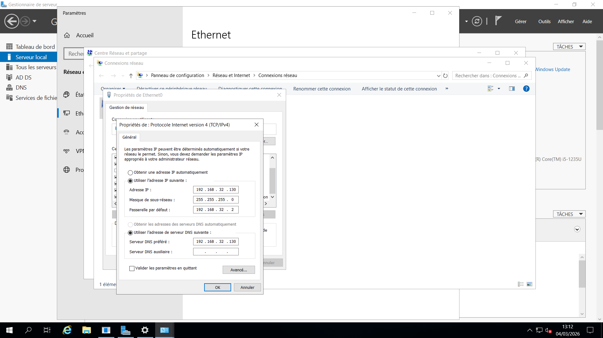
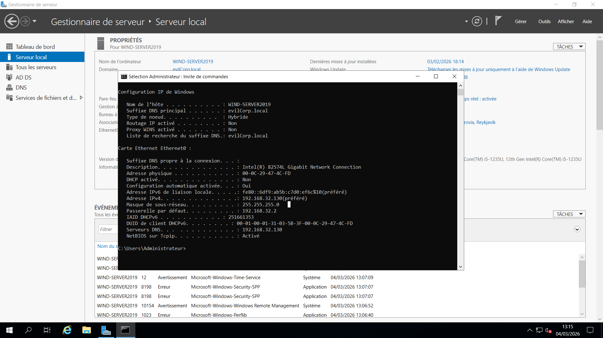

# 01 - Network Configuration

## 📌 Objective

Configure a static IP address for the Domain Controller before Active Directory deployment.

Active Directory requires a stable IP configuration to ensure proper DNS resolution and domain services functionality.

---

## 🌐 Network Design

- Network Range: 192.168.32.0/24
- Domain Controller IP: 192.168.32.130
- Subnet Mask: 255.255.255.0
- Preferred DNS Server: 192.168.32.130

---

## 🔧 Configuration Steps

1. Open **Network and Sharing Center**
2. Click on **Change adapter settings**
3. Open Ethernet adapter properties
4. Select **Internet Protocol Version 4 (TCP/IPv4)**
5. Configure static IP settings

---

## 📷 Screenshots

---

## ✅ Verification

The configuration was verified using:
ipconfig /all

Key points verified:

- IPv4 address correctly assigned
- DNS server pointing to itself
- No APIPA address detected

---

## 🔍 Why Static IP is Critical for a Domain Controller

- Prevents DNS resolution failures
- Ensures consistent domain services availability
- Avoids replication and authentication issues
