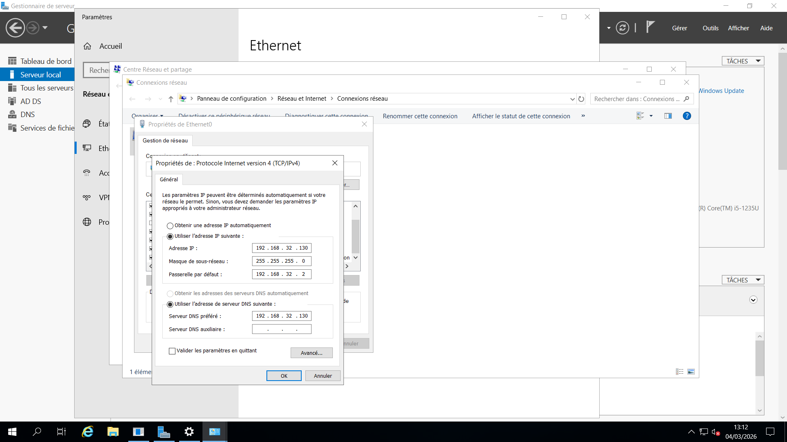
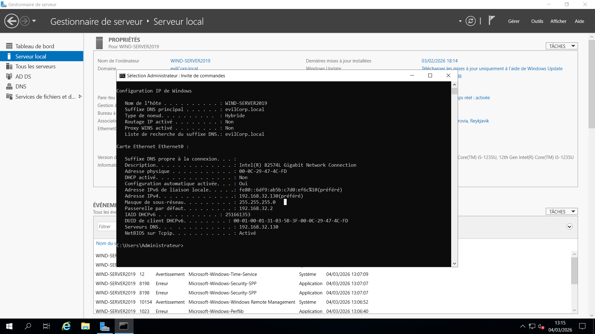

# 01 - Configuration réseau

## 📌 Objectif

Configurer une adresse IP statique pour le contrôleur de domaine avant le déploiement d’Active Directory.

Active Directory nécessite une configuration IP stable afin de garantir une résolution DNS correcte et le bon fonctionnement des services de domaine.

---

## 🌐 Conception du réseau

- **Plage réseau :** 192.168.32.0/24
- **Adresse IP du contrôleur de domaine :** 192.168.32.130
- **Masque de sous-réseau :** 255.255.255.0
- **Serveur DNS préféré :** 192.168.32.130

---

## 🔧 Étapes de configuration

1. Ouvrir le **Centre Réseau et partage**.
2. Cliquer sur **Modifier les paramètres de la carte**.
3. Ouvrir les propriétés de la carte **Ethernet**.
4. Sélectionner **Protocole Internet version 4 (TCP/IPv4)**.
5. Configurer les paramètres IP statiques.

---

## 📷 Captures d’écran



---

## ✅ Vérification

La configuration a été vérifiée à l’aide de la commande suivante :

```powershell
ipconfig /all
```

### 📷 Capture d’écran



### Points clés vérifiés

- ✅ Adresse IPv4 correctement attribuée
- ✅ Serveur DNS pointant vers lui-même
- ✅ Aucune adresse APIPA détectée

---

## 🔍 Pourquoi une adresse IP statique est essentielle pour un contrôleur de domaine

Une adresse IP statique est indispensable pour un contrôleur de domaine car elle :

- Garantit une résolution DNS fiable.
- Assure la disponibilité constante des services de domaine.
- Évite les problèmes de réplication entre contrôleurs de domaine.
- Réduit les risques d’échec d’authentification des utilisateurs et des machines.

> **Bonnes pratiques :**
> Un contrôleur de domaine doit toujours utiliser une adresse IP fixe afin d’éviter tout changement d’adresse susceptible d’interrompre les services Active Directory.
