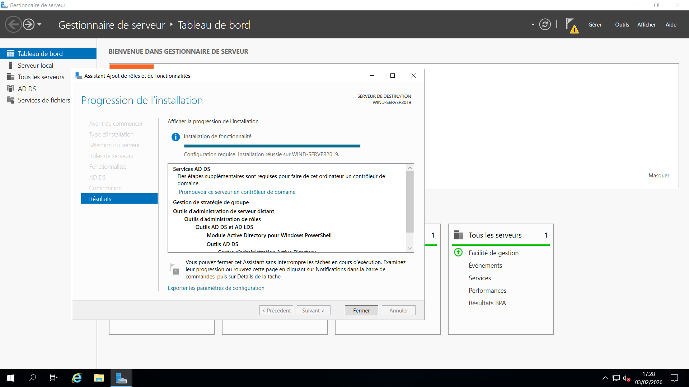
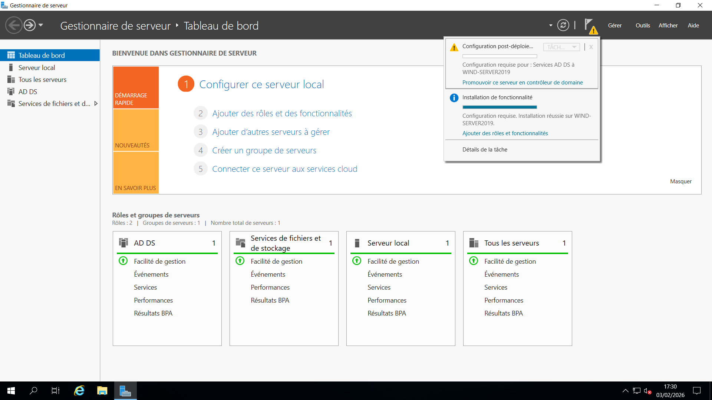
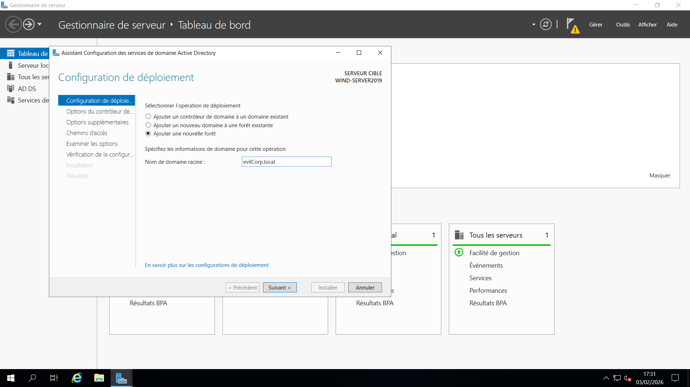
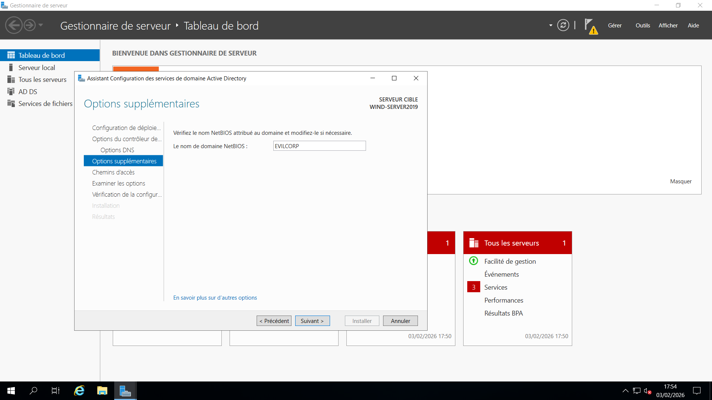
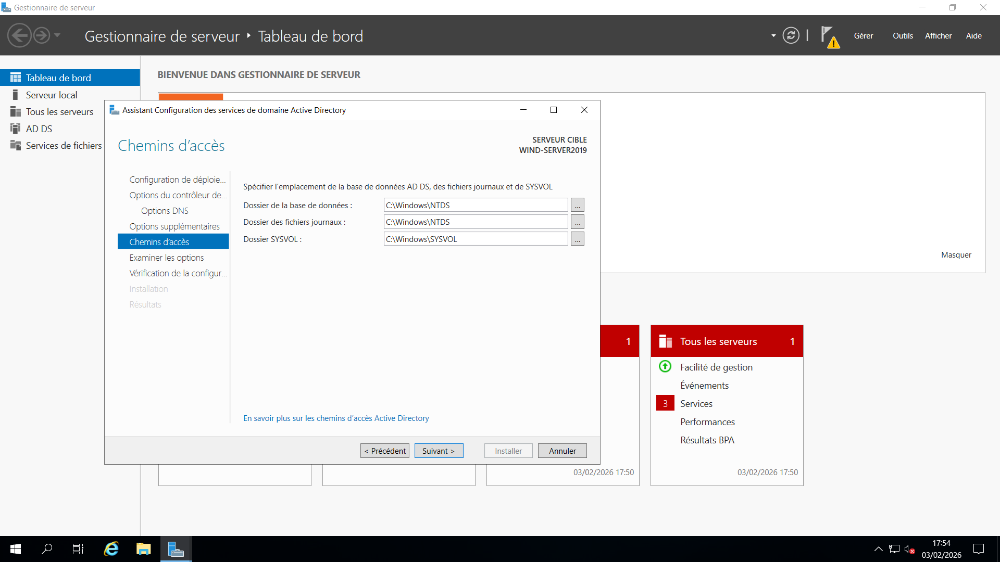
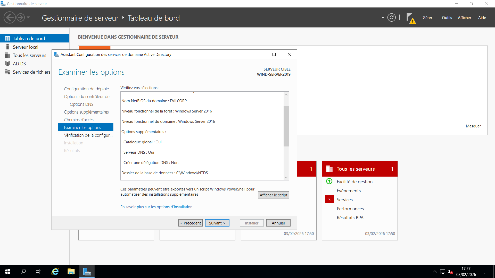
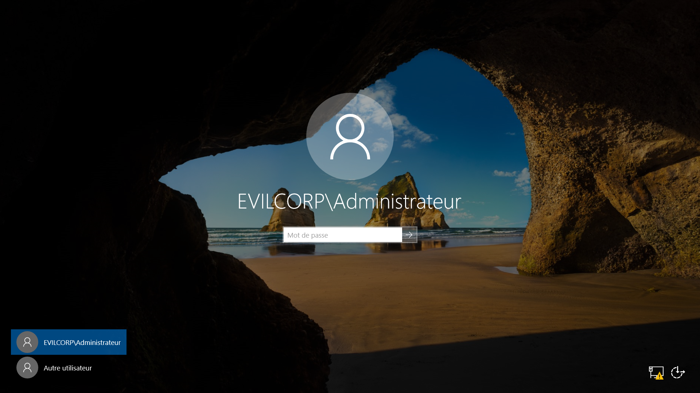
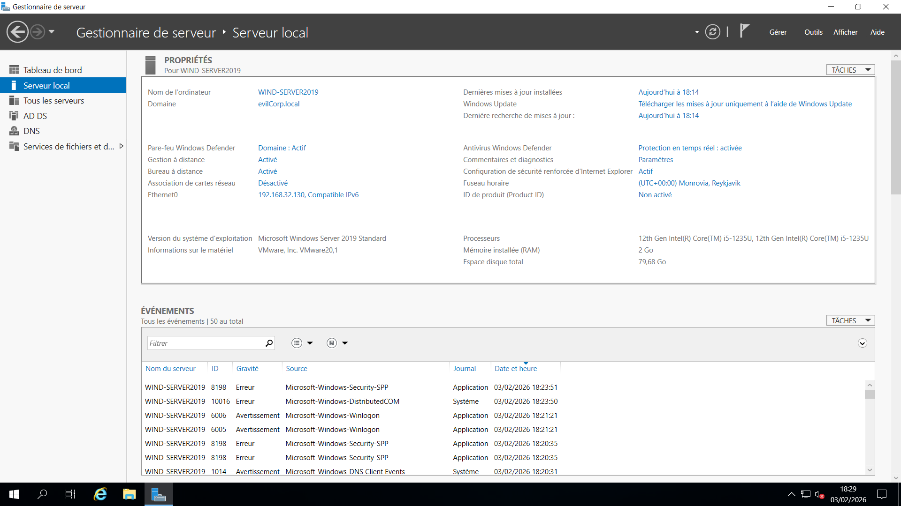

# 🌐 Domain Controller Setup – Windows Server 2019

## 📌 Objective
Install and promote **Windows Server 2019** as a **Domain Controller** with a new Active Directory forest.

---

## 🏢 Domain Information

- **Domain Name:** evilcorp.local  
- **Functional Level:** Windows Server 2019  
- **DNS:** Integrated with Active Directory  

---

## 🔧 Installation Steps

### 1️⃣ Install Active Directory Domain Services (AD DS)  
- Open **Server Manager → Add Roles and Features → AD DS**  
- Follow the wizard to install the role  

#### 📷 Screenshot

---

### 2️⃣ Promote Server to Domain Controller  
- In **Server Manager → AD DS**, select **Promote this server to a domain controller**

#### 📷 Screenshot

---

### 3️⃣ Create New Forest  
- Choose **Add a new forest**  
- Enter the **Root Domain Name:** `evilcorp.local`  
- Set the **Forest Functional Level** and **Domain Functional Level** to **Windows Server 2019**  
- Configure the **DSRM password**

#### 📷 Screenshots
  
  
  

---

### 4️⃣ Reboot Server  
- After promotion, the server will automatically restart  

#### 📷 Screenshot

---

## ✅ Post-Installation Verification

- ✔ Domain **evilcorp.local** successfully created  
- ✔ Static IP configured successfully  
- ✔ RDP activated (important for administration and security)  
- ✔ DNS zone automatically created  
- ✔ SYSVOL and NETLOGON shares verified  
- ✔ `dcdiag` executed successfully  

---

## 🔐 RDP Best Practices (Future Improvements)

1. Limit access to **administrators only**  
2. Enable **Network Level Authentication (NLA)**  
3. Use a **VPN** for remote external access  
4. Enable **auditing and logging** for RDP sessions  
5. Avoid using the **default Administrator account** for direct login  

---

## 📝 Next Steps

- Add **users and groups** in Active Directory  
- Configure **Group Policy Objects (GPOs)**  
- Configure **DNS forwarders**  
- Implement **Active Directory backup strategy**  
- Harden server security  

---

## 📷 Additional Screenshot

