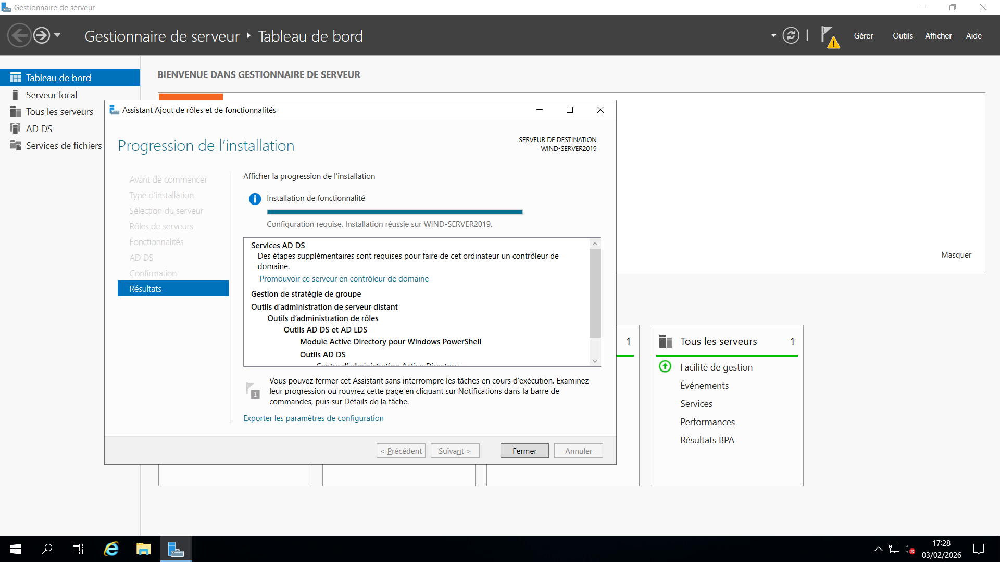
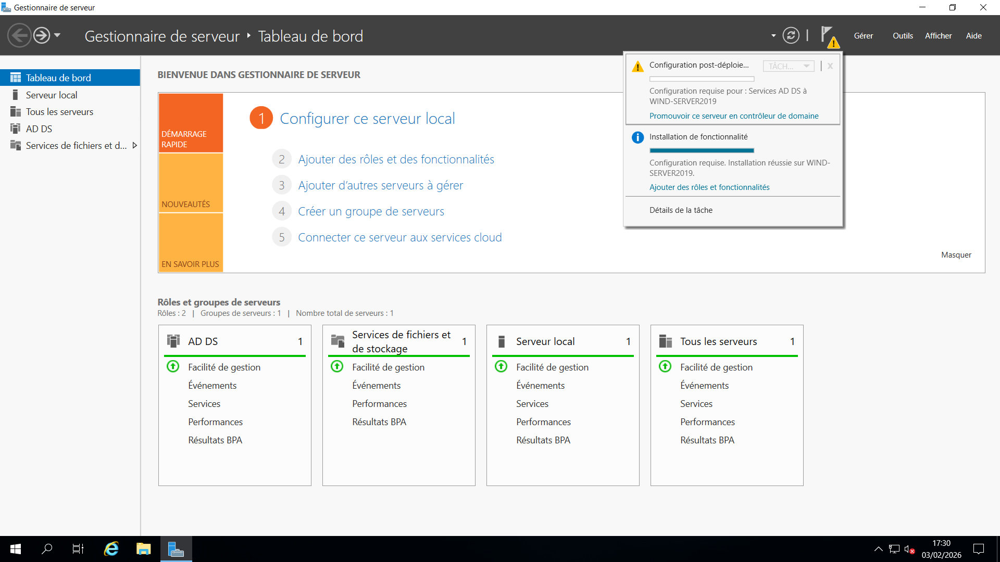
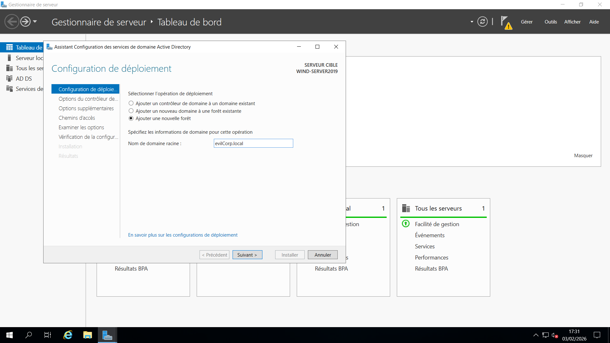
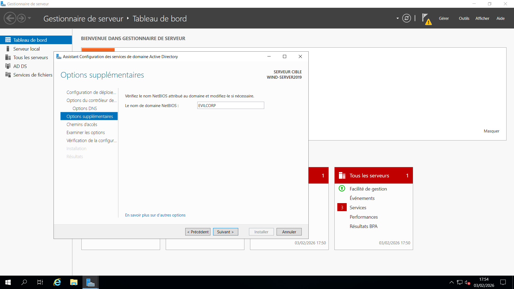
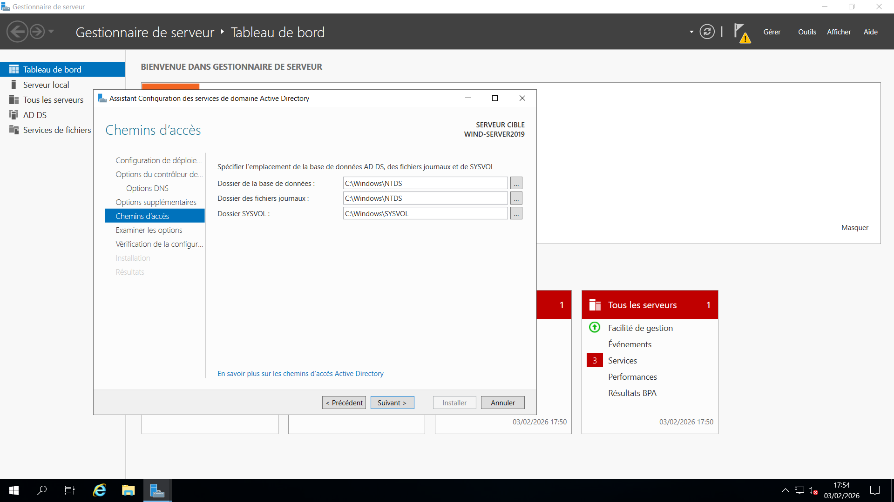
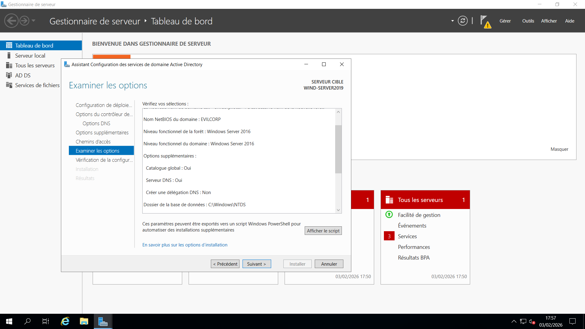
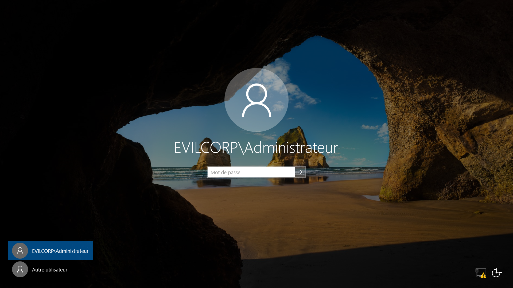
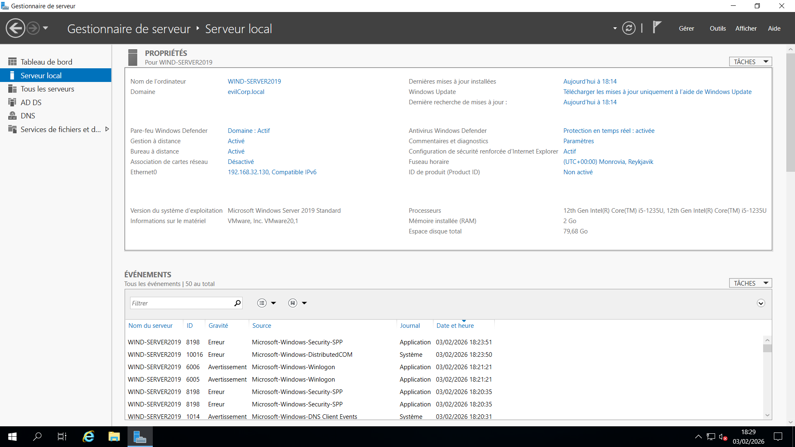

# 🌐 Installation du contrôleur de domaine – Windows Server 2019

## 📌 Objectif

Installer et promouvoir **Windows Server 2019** en tant que **contrôleur de domaine (Domain Controller)** avec une nouvelle forêt Active Directory.

---

## 🏢 Informations sur le domaine

- **Nom du domaine :** `evilcorp.local`
- **Niveau fonctionnel de la forêt :** Windows Server 2019
- **DNS :** Intégré à Active Directory
- **Adresse IP du contrôleur de domaine :** 192.168.32.130

---

## 🔧 Étapes d’installation

### 1️⃣ Installation des services de domaine Active Directory (AD DS)

- Ouvrir **Gestionnaire de serveur (Server Manager)** → **Ajouter des rôles et fonctionnalités**
- Sélectionner le rôle **Services de domaine Active Directory (AD DS)**
- Suivre l’assistant jusqu’à la fin de l’installation

#### 📷 Capture d’écran

---

### 2️⃣ Promotion du serveur en contrôleur de domaine

- Dans **Gestionnaire de serveur** → **AD DS**, cliquer sur **Promouvoir ce serveur en contrôleur de domaine**

#### 📷 Capture d’écran

---

### 3️⃣ Création d’une nouvelle forêt

- Sélectionner **Ajouter une nouvelle forêt**
- Saisir le **nom du domaine racine :** `evilcorp.local`
- Définir le **niveau fonctionnel de la forêt** et le **niveau fonctionnel du domaine** sur **Windows Server 2019**
- Configurer le **mot de passe DSRM (Directory Services Restore Mode)**

#### 📷 Captures d’écran

---

### 4️⃣ Redémarrage du serveur

- Après la promotion, le serveur redémarre automatiquement afin d’appliquer la configuration du contrôleur de domaine.

#### 📷 Capture d’écran

---

## ✅ Vérifications après l’installation

Les éléments suivants ont été validés avec succès :

- ✅ Domaine **`evilcorp.local`** créé avec succès
- ✅ Adresse IP statique configurée correctement
- ✅ Accès **RDP** activé (important pour l’administration à distance)
- ✅ Zone DNS créée automatiquement
- ✅ Partages **SYSVOL** et **NETLOGON** présents et fonctionnels
- ✅ Outil de diagnostic **`dcdiag`** exécuté avec succès

---

## 🔐 Bonnes pratiques RDP (améliorations futures)

Pour renforcer la sécurité de l’administration à distance :

1. Limiter l’accès aux **administrateurs autorisés uniquement**
2. Activer l’**authentification au niveau du réseau (NLA)**
3. Mettre en place l’**audit et la journalisation** des connexions RDP
4. Éviter l’utilisation directe du compte **Administrator** par défaut

---

## 📝 Prochaines étapes

- Créer les **utilisateurs et groupes** dans Active Directory
- Configurer les **objets de stratégie de groupe (GPO)**
- Configurer les **redirecteurs DNS**
- Mettre en place une **stratégie de sauvegarde Active Directory**
- Déployer des postes clients dans le domaine
- Renforcer la sécurité de l’infrastructure
- ...

---

## 📷 Capture d’écran finale

---

## 🎯 Résultat

Le serveur **Windows Server 2019** est désormais opérationnel en tant que **contrôleur de domaine principal** pour le domaine **`evilcorp.local`**, avec les services **Active Directory**, **DNS**, **SYSVOL** et **NETLOGON** correctement configurés.
