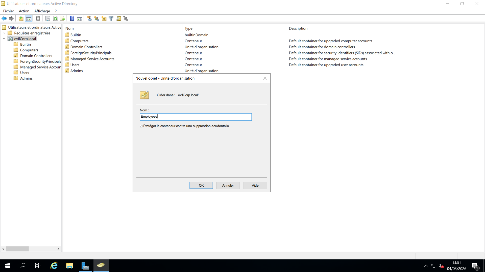
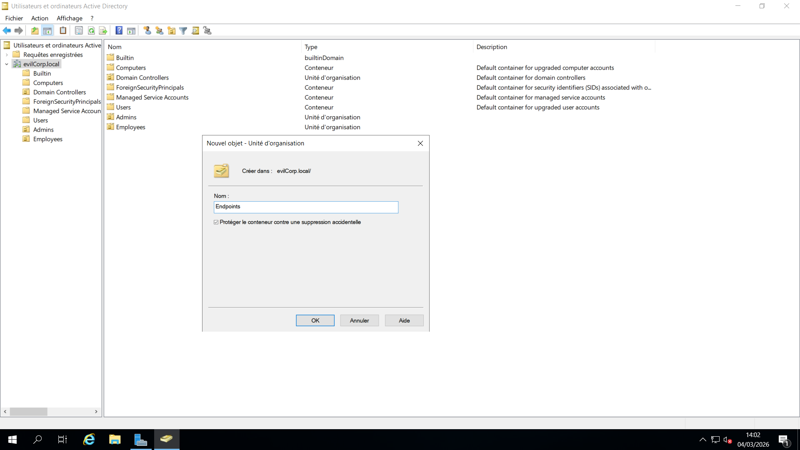
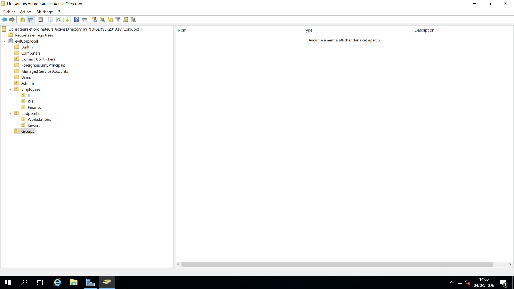

# 03 - Conception de la structure des unités d’organisation (OU)

## 📌 Objectif

Concevoir et mettre en place une hiérarchie structurée d’**Unités d’Organisation (OU)** au sein du domaine `evilcorp.local`.

Cette structure a été créée afin de garantir :

- Une séparation logique des comptes
- Une segmentation de la sécurité
- Une application cohérente des stratégies de groupe (GPO)
- Une préparation aux futurs tests de sécurité et exercices de pentest Active Directory

---

## 🏢 Structure du domaine

Les unités d’organisation suivantes ont été créées dans le domaine **`evilcorp.local`** :

```text
evilcorp.local
│
├── OU=Admins
│
├── OU=Employees
│   ├── OU=IT
│   ├── OU=RH
│   └── OU=Finance
│
├── OU=Endpoints
│   ├── OU=Workstations
│   └── OU=Servers
│
└── OU=Groups
```

---

## 🔐 OU = Admins

Cette unité d’organisation contient les comptes administratifs et privilégiés.

### Objectifs

- Isoler les utilisateurs administrateurs
- Appliquer des politiques de sécurité plus strictes
- Réduire les risques d’élévation de privilèges
- Respecter les bonnes pratiques de sécurité Active Directory
- Faciliter la gestion des comptes à privilèges

---

## 👨‍💼 OU = Employees

Cette unité d’organisation contient les utilisateurs standards du domaine, répartis par département :

- **IT**
- **RH**
- **Finance**

### Objectifs

- Segmenter les utilisateurs par service
- Appliquer des GPO spécifiques à chaque département
- Reproduire une structure d’entreprise réaliste
- Simplifier l’administration des utilisateurs

---

## 🖥️ OU = Endpoints

Cette unité d’organisation regroupe l’ensemble des machines intégrées au domaine.

### Sous-unités d’organisation

- **Workstations** (postes de travail Windows 10/11)
- **Servers** (serveurs)

### Objectifs

- Appliquer des GPO orientées machine
- Séparer les politiques des postes utilisateurs de celles des serveurs
- Renforcer la sécurité des systèmes
- Standardiser la configuration des équipements du domaine

---

## 👥 OU = Groups

Cette unité d’organisation contient l’ensemble des groupes de sécurité utilisés dans l’environnement Active Directory.

### Utilisations

- Contrôle d’accès basé sur les rôles (RBAC)
- Attribution de privilèges administratifs secondaires
- Gestion des accès aux ressources
- Administration simplifiée des permissions

Cette organisation facilite la mise en œuvre de modèles de contrôle d’accès tels que **AGDLP** (*Accounts → Global Groups → Domain Local Groups → Permissions*).

---

## 🔧 Notes d’implémentation

Les bonnes pratiques suivantes ont été appliquées :

- Activation de l’option **« Protéger l’objet contre toute suppression accidentelle »** sur les OU critiques
- Activation des **Fonctionnalités avancées** dans *Utilisateurs et ordinateurs Active Directory*
- Création de la structure OU avant le déploiement des utilisateurs et des groupes
- Préparation de l’environnement pour l’application future des GPO

---

## 📷 Captures d’écran

### Structure des utilisateurs



### Structure des équipements



### Structure complète des OU



---

## 🧠 Justification de l’architecture

Cette hiérarchie d’OU permet :

- Une séparation claire des niveaux de privilèges
- Un ciblage précis des stratégies de groupe (GPO)
- Une meilleure organisation administrative
- Une évolution simple et scalable de l’infrastructure
- Une préparation optimale aux audits et tests de sécurité
- Une gestion plus efficace des utilisateurs, groupes et équipements

---

## 🎯 Résultat

Une structure Active Directory claire, évolutive et conforme aux bonnes pratiques a été mise en place dans le domaine **`evilcorp.local`**. Cette organisation facilite l’administration quotidienne, le déploiement des stratégies de sécurité et les futurs scénarios de tests et de simulation d’entreprise.
