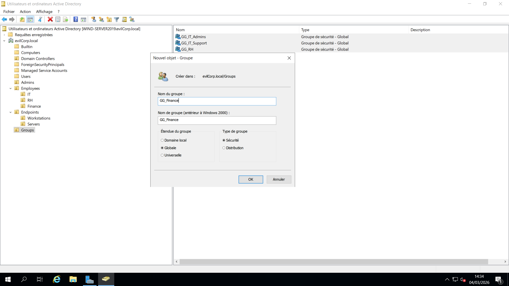
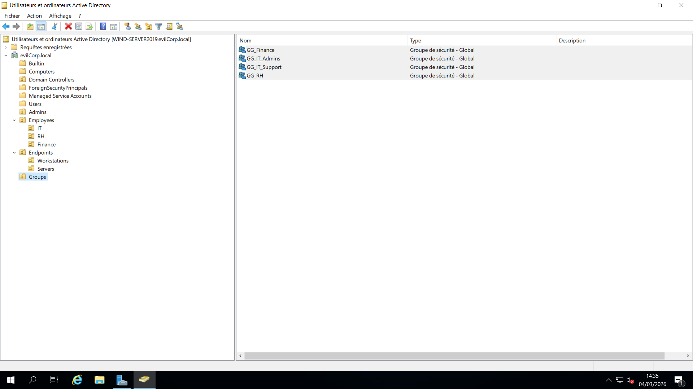
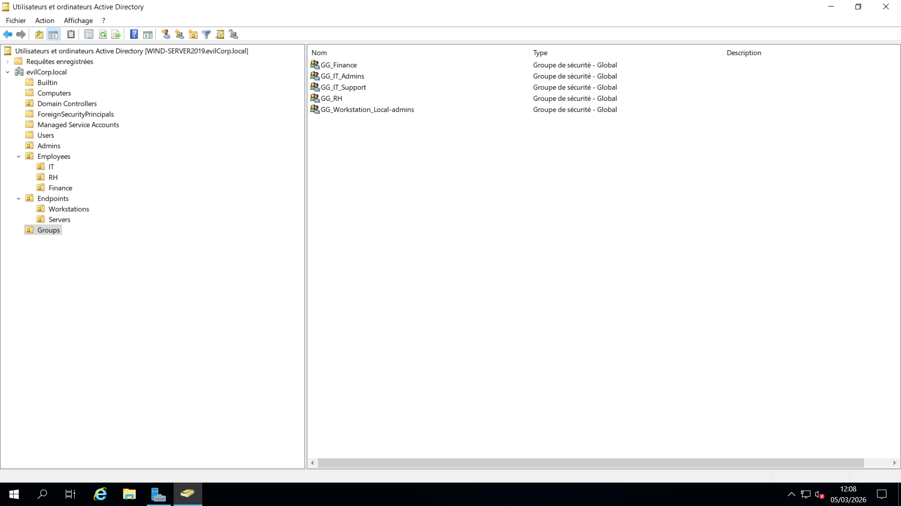

# 04 - Group Management

## 📌 Objective

Design and implement security groups to manage access control using a structured Role-Based Access Control (RBAC) model.

All groups created in this phase:

- Type: Security
- Scope: Global
- Naming Convention: GG_<Department>_<Role>

---

## 🧠 Why Create Security Groups?

Creating security groups is a fundamental best practice in Active Directory environments.

Instead of assigning permissions directly to users, permissions are assigned to groups, and users are added to those groups.

This approach provides:

- Centralized access management
- Easier onboarding and offboarding
- Reduced configuration errors
- Improved scalability
- Clear separation of responsibilities
- Simplified auditing
- ...

If a user changes department or role, access can be modified simply by changing group membership.

---

## 🏷️ Naming Convention

All groups follow this structure:

GG = Global Group  
GG_IT_Admins

This naming standard ensures:

- Immediate identification of group scope
- Consistency across the domain
- Easier long-term maintenance

---

## 👥 Groups Created

### 🔐 IT Department

- **GG_IT_Admins**  
  Administrative accounts within the IT department.

- **GG_IT_Support**  
  Technical support team members.

---

### 🏢 Human Resources Department

- **GG_RH**  
  HR department users.

---

### 💰 Finance Department

- **GG_Finance**  
  Finance department users.

---

### 🖥️ Workstation Administration

- **GG_Workstation_Local-Admin**  
  Users delegated with local administrative rights on workstations.

---

## 🌍 Why Global Scope?

Global Groups are used to group users from the same domain based on role or department.

They are ideal for:

- Grouping users by business function
- Structuring access logically
- Delegating permissions efficiently

Global groups can later be nested into other groups if needed.

---

## 🔐 Access Control Model

The following layered access control model is applied:

Accounts → Global Groups → Resource Permissions

This ensures:

- Structured delegation
- Controlled privilege assignment
- Reduced direct user-level permission assignment

---

## 📷 Screenshots

