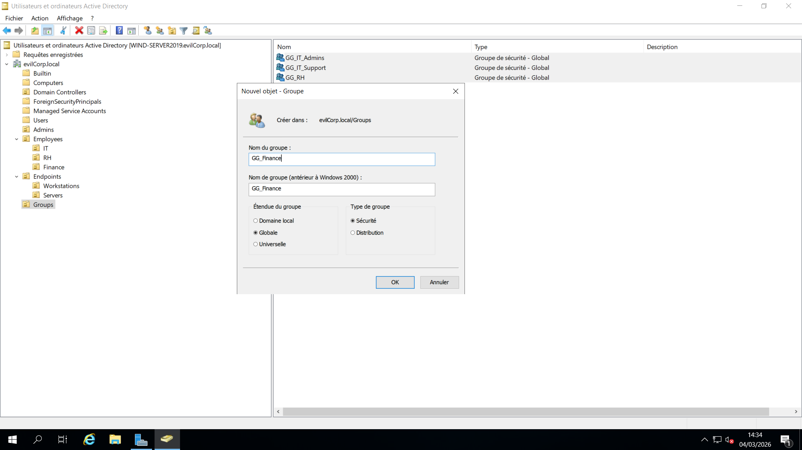
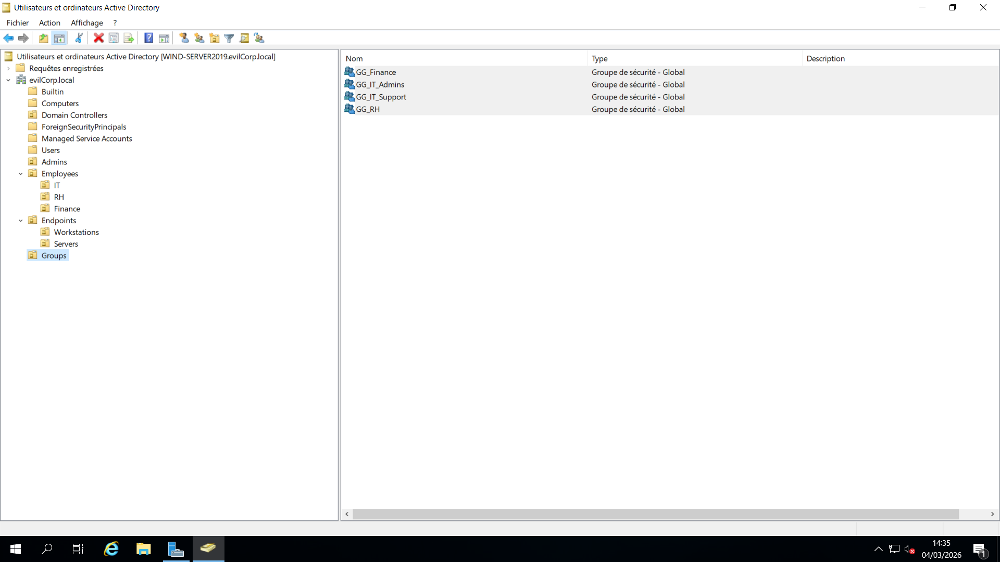
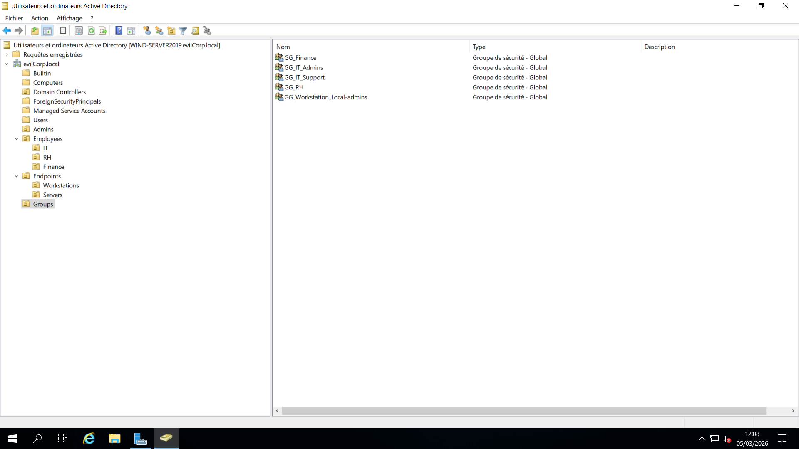

# 04 - Gestion des groupes

## 📌 Objectif

Concevoir et mettre en place des groupes de sécurité afin de gérer les droits d’accès selon un modèle structuré de **contrôle d’accès basé sur les rôles (RBAC – Role-Based Access Control)**.

Tous les groupes créés dans cette phase possèdent les caractéristiques suivantes :

- **Type :** Sécurité (*Security*)
- **Étendue :** Globale (*Global*)
- **Convention de nommage :** `GG_<Département>_<Rôle>`

---

## 🧠 Pourquoi créer des groupes de sécurité ?

La création de groupes de sécurité constitue une bonne pratique essentielle dans un environnement Active Directory.

Plutôt que d’attribuer directement des permissions aux utilisateurs, les droits sont attribués à des groupes, puis les utilisateurs sont ajoutés aux groupes appropriés.

Cette approche apporte plusieurs avantages :

- Gestion centralisée des accès
- Simplification de l’intégration (*onboarding*) et du départ (*offboarding*) des utilisateurs
- Réduction des erreurs de configuration
- Meilleure évolutivité de l’infrastructure
- Séparation claire des responsabilités
- Simplification des audits et contrôles de sécurité
- Administration plus efficace des permissions

Lorsqu’un utilisateur change de service ou de fonction, il suffit de modifier son appartenance aux groupes pour adapter ses droits d’accès.

---

## 🏷️ Convention de nommage

Tous les groupes respectent la structure suivante :

```text
GG = Global Group

Exemple :
GG_IT_Admins
```

Cette convention permet :

- D’identifier immédiatement l’étendue du groupe
- D’assurer une cohérence dans tout le domaine
- De faciliter la maintenance à long terme
- D’améliorer la lisibilité de l’environnement Active Directory

---

## 👥 Groupes créés

### 🔐 Département Informatique (IT)

#### **GG_IT_Admins**

Comptes administratifs du département informatique.

**Utilisation :**

- Administration des systèmes
- Gestion de l’infrastructure Active Directory
- Tâches nécessitant des privilèges élevés

#### **GG_IT_Support**

Membres de l’équipe de support technique.

**Utilisation :**

- Assistance aux utilisateurs
- Support de premier et second niveau
- Gestion des postes de travail

---

### 🏢 Département Ressources Humaines (RH)

#### **GG_RH**

Utilisateurs du département Ressources Humaines.

**Utilisation :**

- Accès aux ressources RH
- Gestion des dossiers administratifs
- Application de GPO spécifiques au service RH

---

### 💰 Département Finance

#### **GG_Finance**

Utilisateurs du département Finance.

**Utilisation :**

- Accès aux ressources financières
- Gestion des documents comptables
- Application de politiques spécifiques au service Finance

---

### 🖥️ Administration des postes de travail

#### **GG_Workstation_Local-Admin**

Utilisateurs disposant de privilèges administratifs locaux sur les postes de travail.

**Utilisation :**

- Installation de logiciels autorisés
- Maintenance locale des postes
- Dépannage nécessitant des droits élevés

> ⚠️ Les membres de ce groupe disposent uniquement de privilèges administratifs locaux sur les postes concernés et ne possèdent pas de droits d’administration sur le domaine.

---

## 🌍 Pourquoi utiliser une étendue globale ?

Les **groupes globaux (Global Groups)** sont conçus pour regrouper les utilisateurs d’un même domaine selon leur fonction ou leur département.

Ils sont particulièrement adaptés pour :

- Regrouper les utilisateurs selon leur rôle métier
- Structurer les accès de manière logique
- Faciliter la délégation des permissions
- Simplifier l’administration des accès

Les groupes globaux peuvent ensuite être intégrés dans d’autres groupes (par exemple des groupes locaux de domaine) afin d’appliquer les permissions selon le modèle **AGDLP**.

---

## 🔐 Modèle de contrôle d’accès

Le modèle suivant est appliqué dans l’environnement :

```text
Comptes utilisateurs
        ↓
Groupes globaux
        ↓
Permissions sur les ressources
```

Ou selon la terminologie Microsoft :

```text
Accounts → Global Groups → Resource Permissions
```

Cette architecture garantit :

- Une délégation structurée des accès
- Une attribution contrôlée des privilèges
- Une réduction des permissions attribuées directement aux utilisateurs
- Une meilleure traçabilité des droits

---

## 📷 Captures d’écran

### Création des groupes de sécurité



### Configuration des groupes



### Vue d’ensemble des groupes



---

## 🎯 Résultat

L’infrastructure dispose désormais d’une base solide de groupes de sécurité respectant les bonnes pratiques Active Directory et le modèle **RBAC**. Cette organisation permettra d’administrer efficacement les accès, de simplifier les futures délégations de permissions et de préparer la mise en œuvre des stratégies de sécurité avancées.
