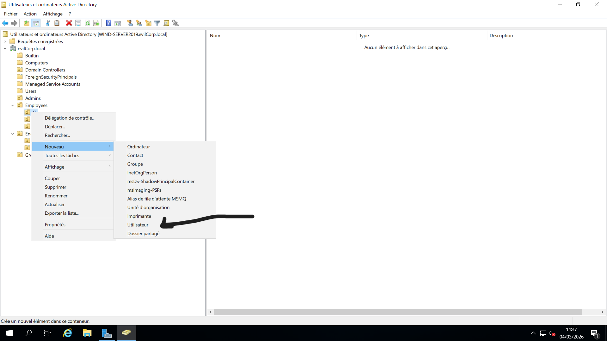
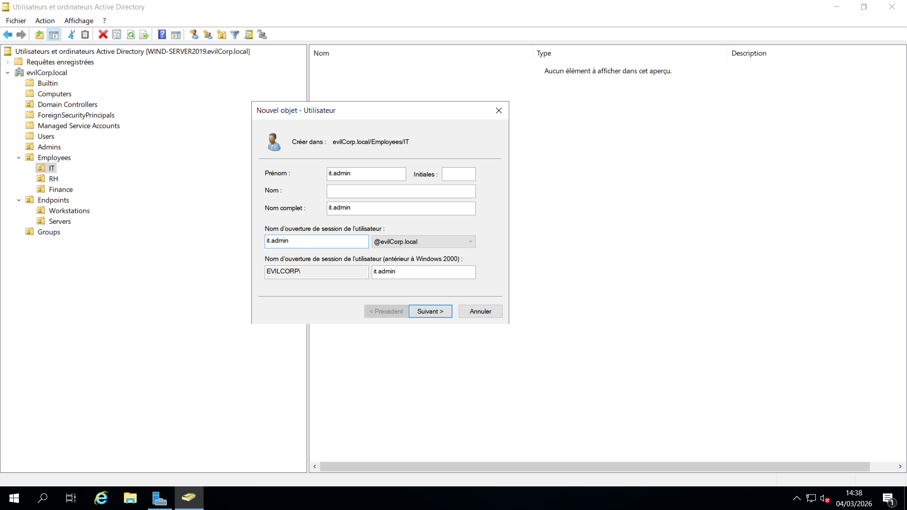
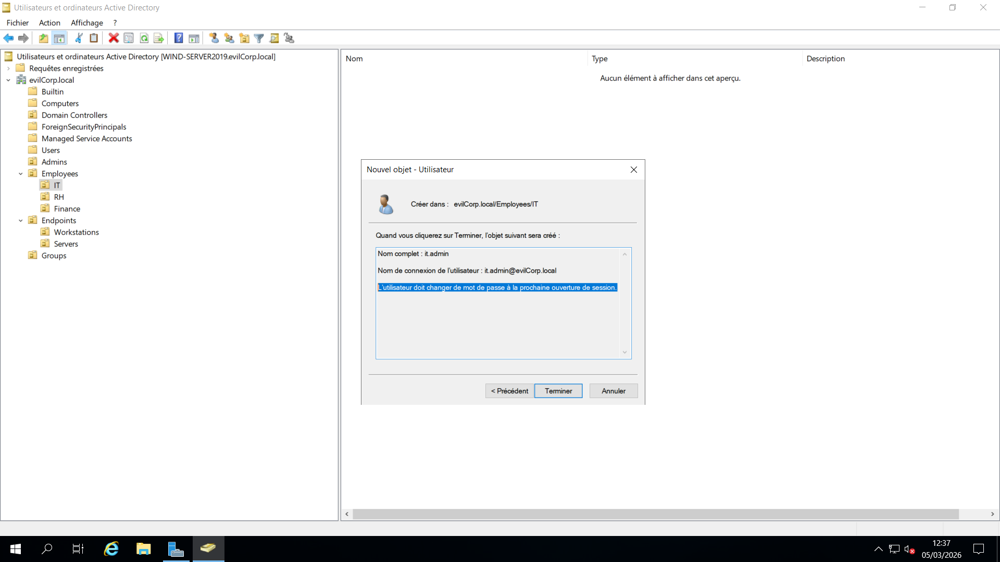
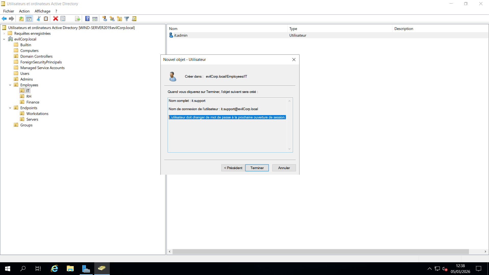
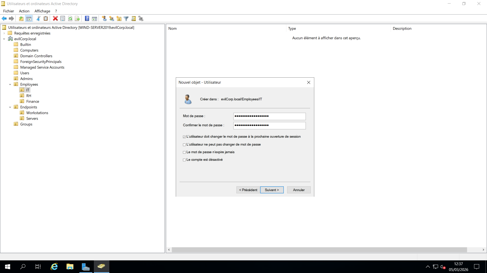
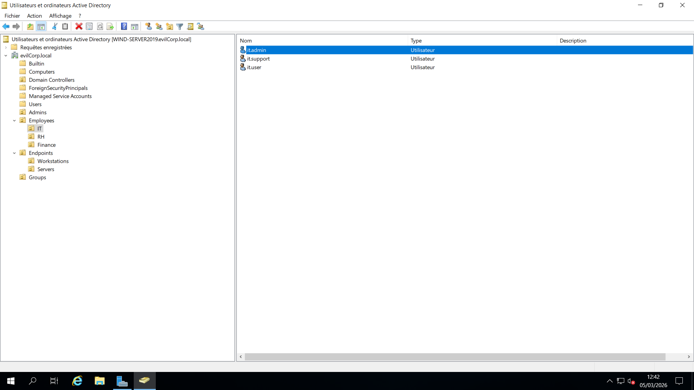

## 🔑 Account Creation Standards

To ensure consistency and administrative control, user accounts were created following a standardized provisioning process.

### 📌 Account Creation Policy

Accounts are created by department and placed in their corresponding Organizational Units.

Each department’s users are provisioned together to maintain structural consistency and simplify administration.

---

## 🔐 Default Password Policy

To simulate a controlled enterprise onboarding process:

- All standard user accounts are assigned a default password:
  
  EvilCorp2026!

- Users are required to change their password at first logon.

The option **"User must change password at next logon"** is enabled for all standard users.

---

## 🔒 Privileged Account Exception

The account:

- **it.admin**

Is assigned a different initial password:

Adm1n-EvilCorp-2026!

This reflects a common enterprise practice where privileged accounts:

- Are provisioned separately
- Follow stricter password standards
- Are managed with additional oversight

---

## 🧠 Why This Approach Is Important

This structured provisioning ensures:

- Controlled onboarding
- Reduced password mismanagement
- Clear separation between standard and privileged accounts
- Improved administrative consistency

Using a default onboarding password simplifies bulk account creation while enforcing immediate password rotation ensures security compliance.

---

## ⚠️ Administrative Notes

- Password complexity requirements are enforced by domain policy.
- Accounts remain disabled until properly configured (if applicable).
- Passwords are documented only for lab setup purposes.

## 📷 Screenshots

The following screenshots document the user account creation process, organized by department.

---

### 👨‍💻 IT Department

Users created:
- it.admin
- it.support
- it.user

#### Account Creation

#### Password Configuration

(Default password for standard users and specific password for it.admin)

#### OU Placement Verification

(Users placed inside OU=IT, OU=Employees)

---

### 🏢 Human Resources (RH)

Users created:
- rh.manager
- rh.user

#### Account Creation

#### Password Configuration

(Default password with forced change at next logon)

#### OU Placement Verification

(Users placed inside OU=RH, OU=Employees)

---

### 💰 Finance Department

Users created:
- fin.manager
- fin.user

#### Account Creation

#### Password Configuration

(Default password with forced change at next logon)

#### OU Placement Verification

(Users placed inside OU=Finance, OU=Employees)

