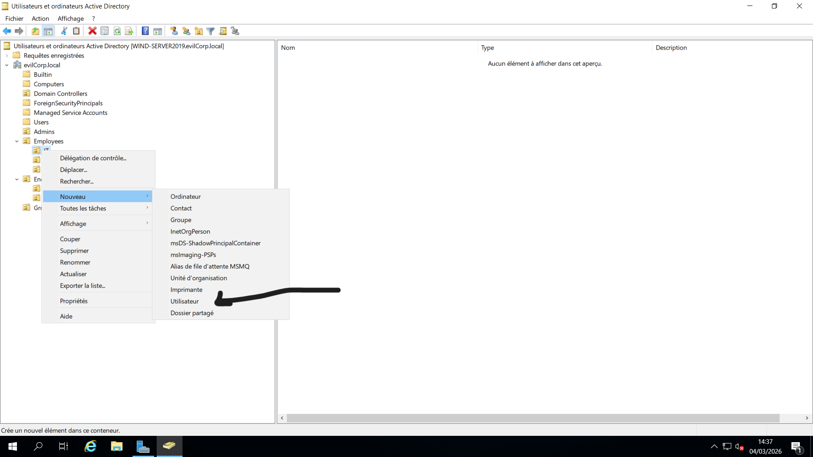
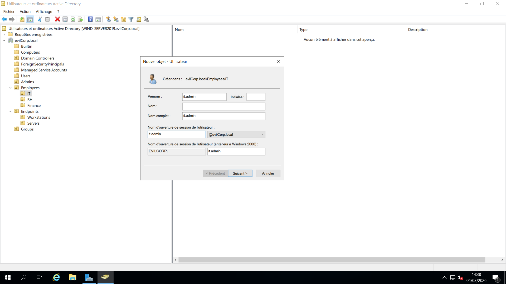
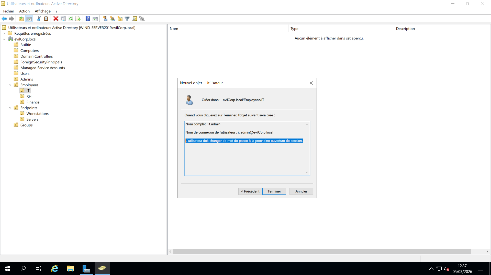
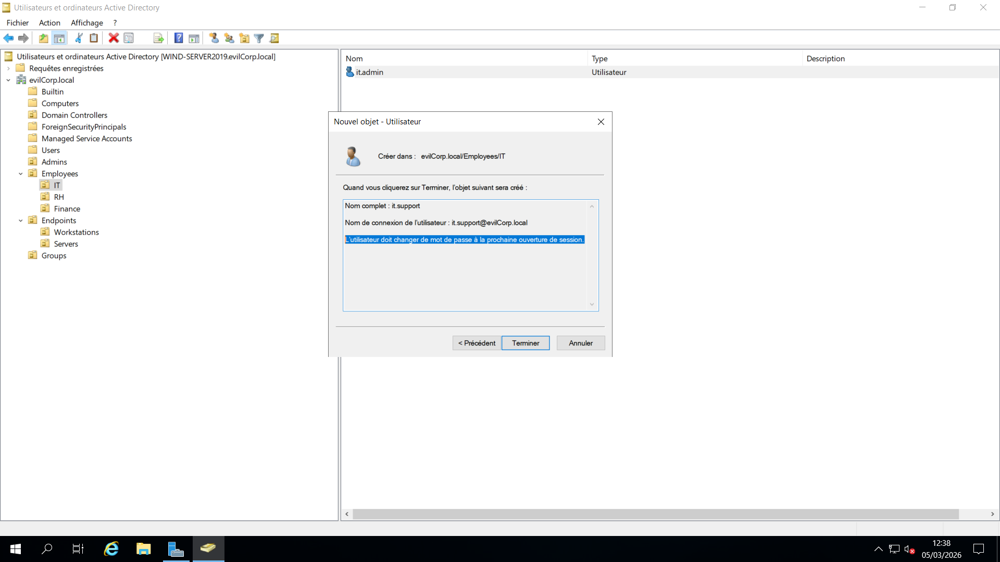
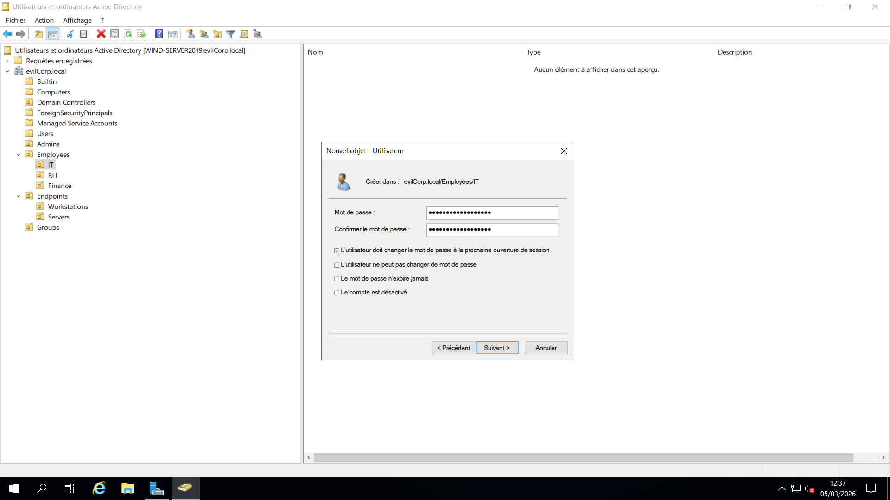
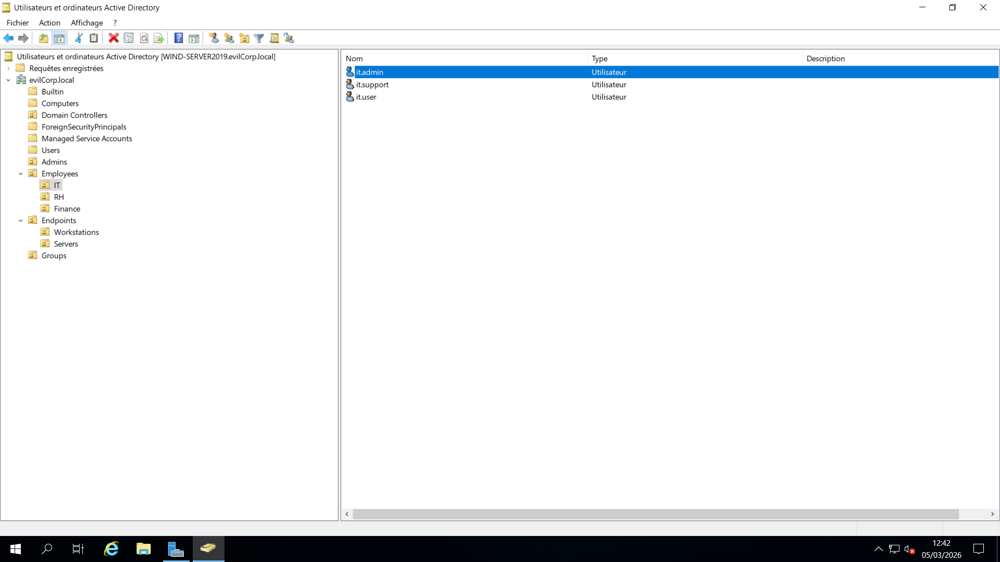
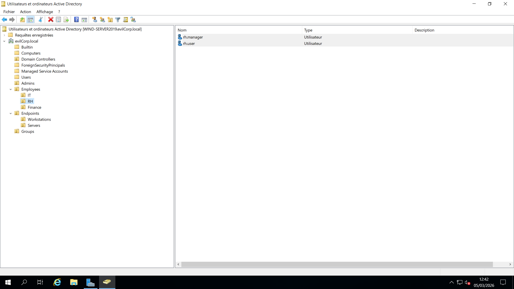
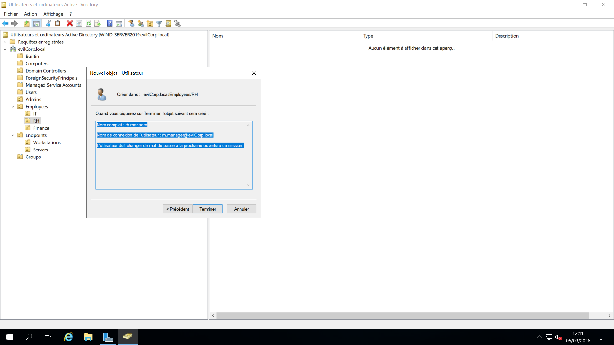
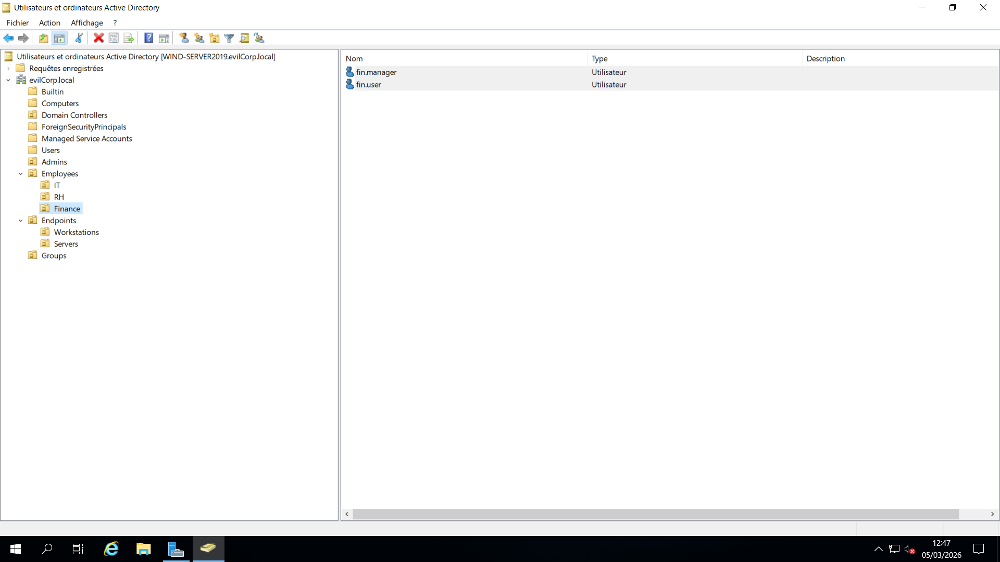
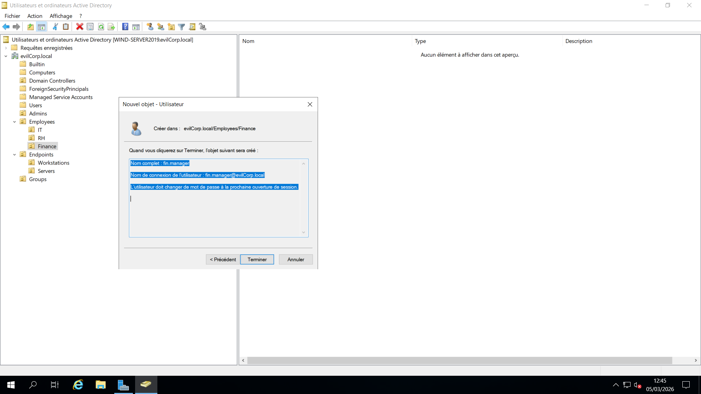

# 05 - Création et gestion des comptes utilisateurs

## 📌 Objectif

Mettre en place une procédure standardisée de création des comptes utilisateurs afin d'assurer la cohérence, la sécurité et la facilité d'administration au sein du domaine **`evilcorp.local`**.

---

## 🔑 Normes de création des comptes

Afin de garantir une gestion homogène des utilisateurs, les comptes ont été créés selon un processus de provisionnement standardisé.

### 📌 Politique de création des comptes

Les comptes sont créés par département et placés dans leurs unités d'organisation (OU) respectives.

Chaque groupe d'utilisateurs est provisionné par service afin de :

- Maintenir une structure Active Directory cohérente
- Faciliter l'administration quotidienne
- Simplifier l'application des stratégies de groupe (GPO)
- Garantir une séparation logique des utilisateurs

---

## 🔐 Politique de mot de passe par défaut

Afin de simuler un processus d'intégration utilisateur (*onboarding*) en environnement d'entreprise :

Tous les comptes utilisateurs standards reçoivent le mot de passe initial suivant :

```text
EvilCorp2026!
```

Les utilisateurs sont obligés de modifier leur mot de passe lors de leur première connexion.

L'option suivante est activée pour tous les comptes standards :

> **L'utilisateur doit changer son mot de passe à la prochaine ouverture de session**

---

## 🔒 Exception pour les comptes privilégiés

Le compte administratif suivant :

```text
it.admin
```

reçoit un mot de passe initial spécifique :

```text
Adm1n-EvilCorp-2026!
```

Cette approche reflète les pratiques courantes en entreprise où les comptes à privilèges :

- Sont créés séparément des comptes standards
- Respectent des exigences de sécurité renforcées
- Font l'objet d'un contrôle administratif accru
- Bénéficient d'une gestion spécifique des accès

---

## 🧠 Pourquoi cette approche est importante

Cette méthode de provisionnement permet :

- Un processus d'intégration contrôlé
- Une réduction des erreurs liées à la gestion des mots de passe
- Une séparation claire entre comptes standards et comptes privilégiés
- Une meilleure cohérence administrative
- Une administration simplifiée des utilisateurs

L'utilisation d'un mot de passe temporaire facilite la création en masse des comptes, tandis que l'obligation de changement lors de la première connexion garantit le respect des bonnes pratiques de sécurité.

---

## ⚠️ Notes administratives

- Les exigences de complexité des mots de passe sont appliquées par la stratégie de domaine.
- Les comptes peuvent rester désactivés jusqu'à leur configuration complète, si nécessaire.
- Les mots de passe présentés dans cette documentation sont utilisés uniquement dans le cadre du laboratoire de test.

---

## 📷 Captures d'écran

Les captures suivantes documentent le processus de création des comptes utilisateurs par département.

---

## 👨‍💻 Département Informatique (IT)

### Utilisateurs créés

- `it.admin`
- `it.support`
- `it.user`

### Création des comptes









### Configuration des mots de passe

- Mot de passe par défaut : `EvilCorp2026!`
- Mot de passe spécifique pour `it.admin` : `Adm1n-EvilCorp-2026!`



### Vérification du placement dans l'OU

Utilisateurs placés dans :

```text
OU=IT
└── OU=Employees
```



---

## 🏢 Département Ressources Humaines (RH)

### Utilisateurs créés

- `rh.manager`
- `rh.user`

### Création des comptes



### Configuration des mots de passe

Mot de passe par défaut avec changement obligatoire à la prochaine connexion.



### Vérification du placement dans l'OU

Utilisateurs placés dans :

```text
OU=RH
└── OU=Employees
```


---

## 💰 Département Finance

### Utilisateurs créés

- `fin.manager`
- `fin.user`

### Création des comptes



### Configuration des mots de passe

Mot de passe par défaut avec changement obligatoire à la prochaine connexion.



### Vérification du placement dans l'OU

Utilisateurs placés dans :

```text
OU=Finance
└── OU=Employees
```


---

## 🎯 Résultat

L'ensemble des comptes utilisateurs a été créé avec succès selon les standards définis pour le domaine **`evilcorp.local`**.

La structure mise en place garantit :

- Une organisation cohérente des utilisateurs
- Une séparation claire des privilèges
- Une administration simplifiée
- Une meilleure application des politiques de sécurité
- Une préparation optimale aux futures configurations Active Directory et aux exercices de sécurité
