# 06 - Windows 10 Domain Join

## 📌 Objective

Join a Windows 10 client machine to the domain `evilcorp.local` and ensure proper integration within the Active Directory infrastructure.

---

## 🖥️ Environment Details

- Domain Controller IP: 192.168.32.130  
- Domain Name: evilcorp.local  
- Client Machine: Windows 10  
- Client IP Address: 192.168.32.131  
- Network Range: 192.168.32.0/24  

---

## 🌐 Step 1 - Client Network Configuration

The Windows 10 client was configured with a static network configuration:

- IP Address: 192.168.32.131  
- Subnet Mask: 255.255.255.0  
- Preferred DNS Server: 192.168.32.130  

⚠️ **Important:**  
The DNS server must point to the Domain Controller.  
Without proper DNS configuration, the domain join process will fail.

### 📷 Screenshot
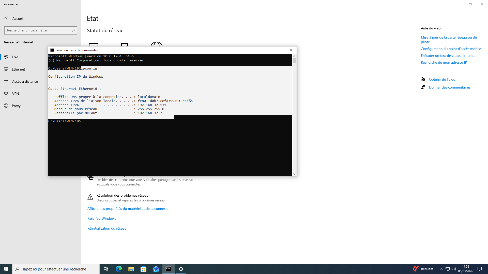

---

## 🔎 Step 2 - DNS Verification

DNS configuration was verified to ensure proper name resolution for the domain `evilcorp.local`.

### 📷 Screenshots
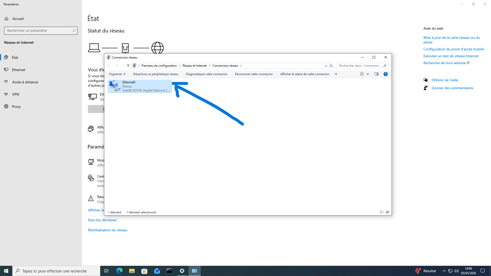  
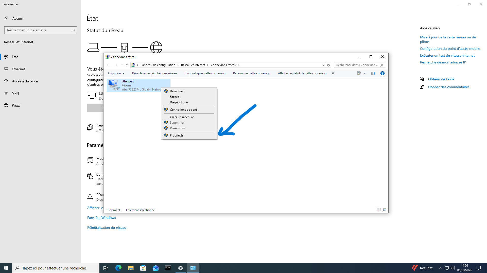  
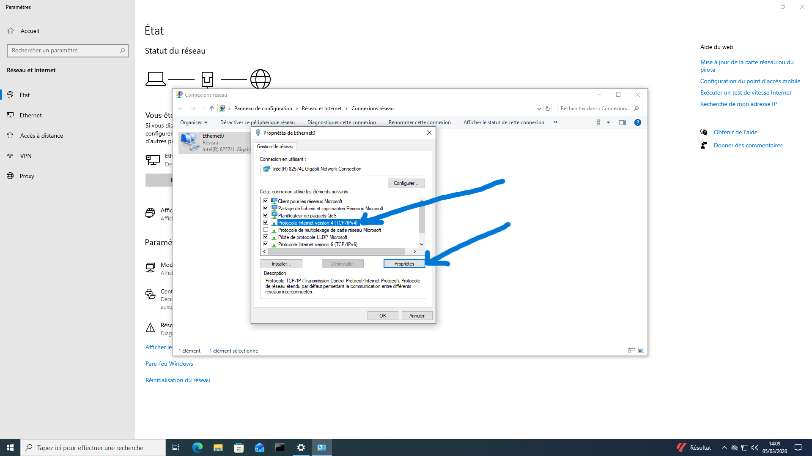  
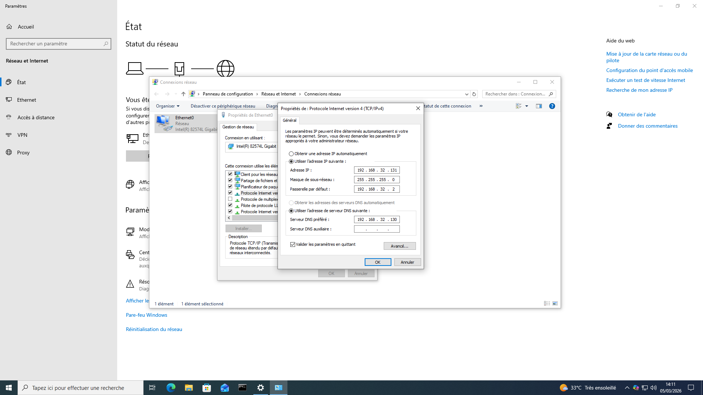

---

## 🔐 Step 3 - Join the Domain

The following procedure was performed:

1. Open **This PC**
   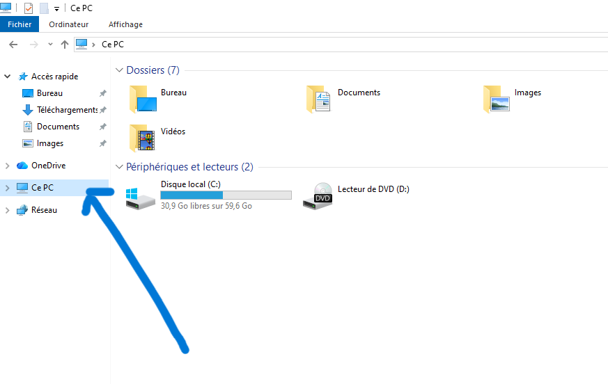

2. Click **Properties**
   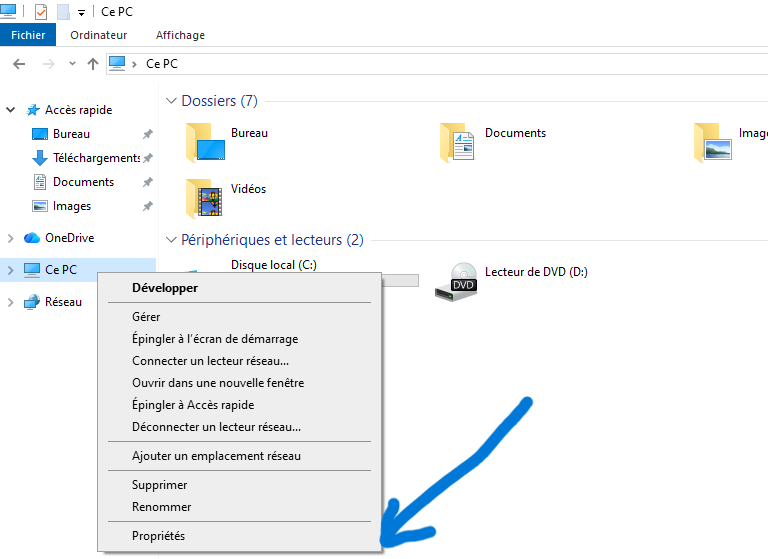

3. Select **Advanced system settings**
   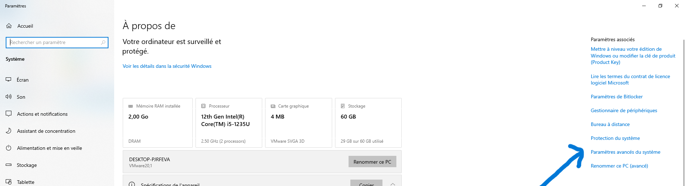

4. Go to the **Computer Name** tab
   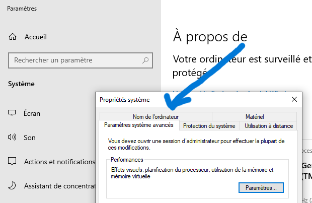

5. Click **Change**
   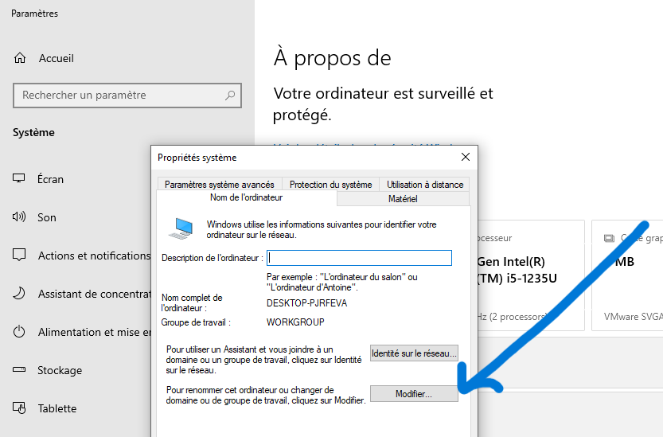

6. Select **Domain** and enter: evilcorp.local
   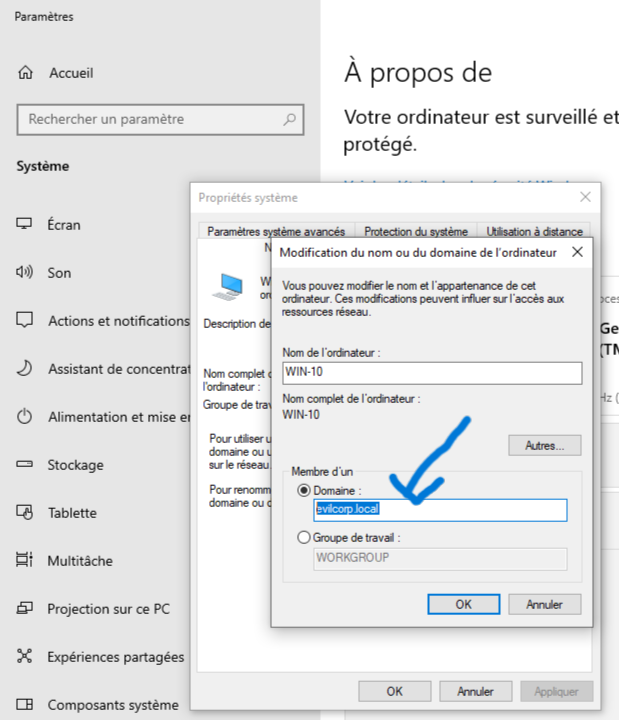

7. Provide domain administrator credentials

8. Restart the machine
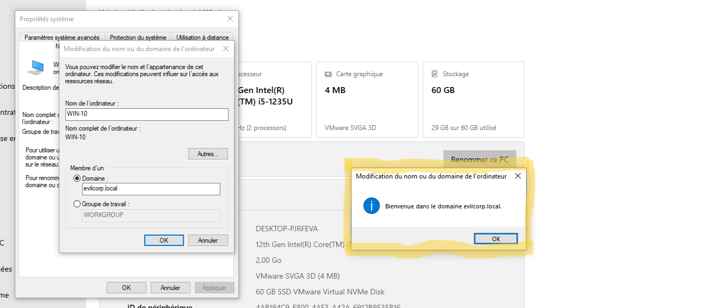  
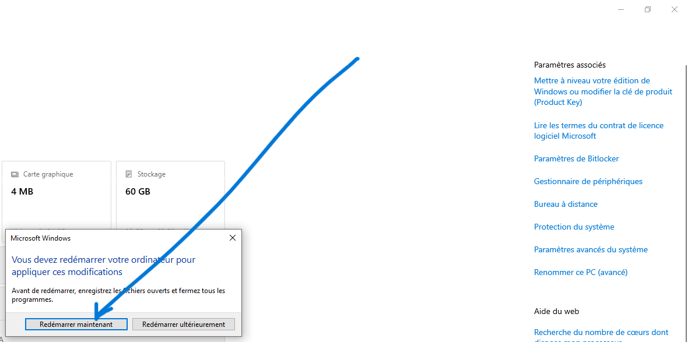

After successful authentication and reboot, the machine becomes a domain member.

### 📷 Confirmation
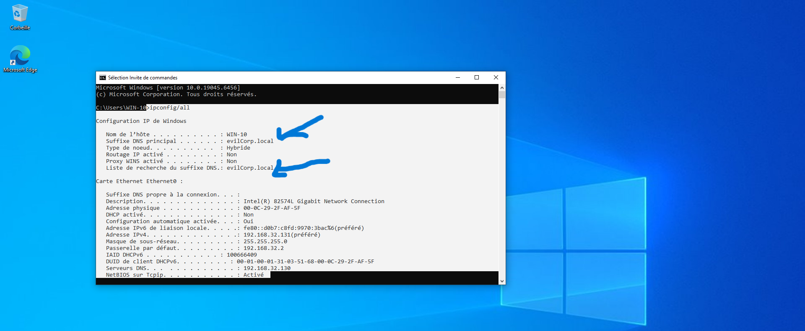

---

## ✅ Step 4 - Verification in Active Directory

After reboot:

- Open **Active Directory Users and Computers**
- Confirm the computer object appears under the default **Computers** container.

### 📷 Screenshot
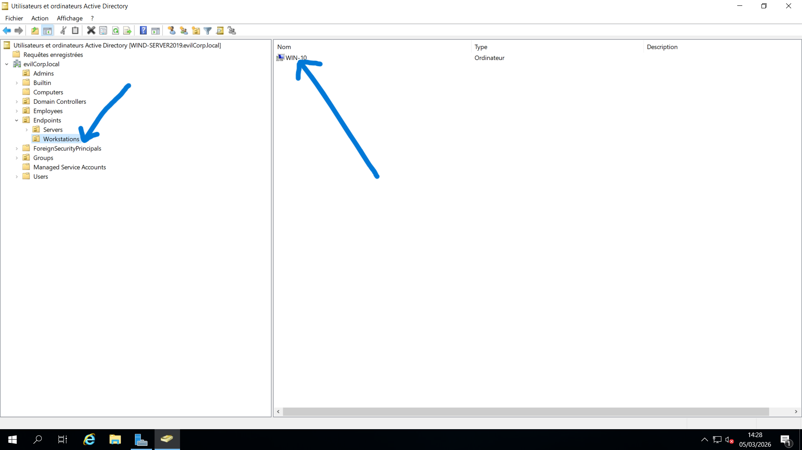

This confirms the machine has successfully joined the domain.

---

## 📂 Step 5 - Moving the Computer Object to the Correct OU

By default, newly joined machines are placed inside the **Computers** container.

However:

- The default container is not an Organizational Unit
- Group Policies cannot be linked directly to it
- It does not align with structured administrative design

The computer object was moved to:
OU=Endpoints
└── OU=Workstations

This ensures:

- Proper Group Policy application  
- Logical asset organization  
- Structured administrative management  
- Separation between workstations and servers  

---

## 🧠 Key Takeaways

- DNS configuration is critical for domain operations.  
- Static IP configuration ensures network stability.  
- Proper OU placement enables correct policy enforcement.  
- Structured organization simplifies administration and scalability.  
