# 06 - Intégration d’un poste Windows 10 au domaine

## 📌 Objectif

Intégrer un poste client **Windows 10** au domaine **`evilcorp.local`** et vérifier son intégration correcte au sein de l’infrastructure Active Directory.

---

## 🖥️ Détails de l’environnement

- **Adresse IP du contrôleur de domaine :** 192.168.32.130
- **Nom du domaine :** `evilcorp.local`
- **Machine cliente :** Windows 10
- **Adresse IP du client :** 192.168.32.131
- **Plage réseau :** 192.168.32.0/24

---

## 🌐 Étape 1 - Configuration réseau du poste client

Le poste Windows 10 a été configuré avec une adresse IP statique :

- **Adresse IP :** 192.168.32.131
- **Masque de sous-réseau :** 255.255.255.0
- **Serveur DNS préféré :** 192.168.32.130

> ⚠️ **Important**
>
> Le serveur DNS doit obligatoirement pointer vers le contrôleur de domaine.
>
> Sans une configuration DNS correcte, le processus d’intégration au domaine échouera, car le client ne pourra pas localiser les services Active Directory.

### 📷 Capture d’écran

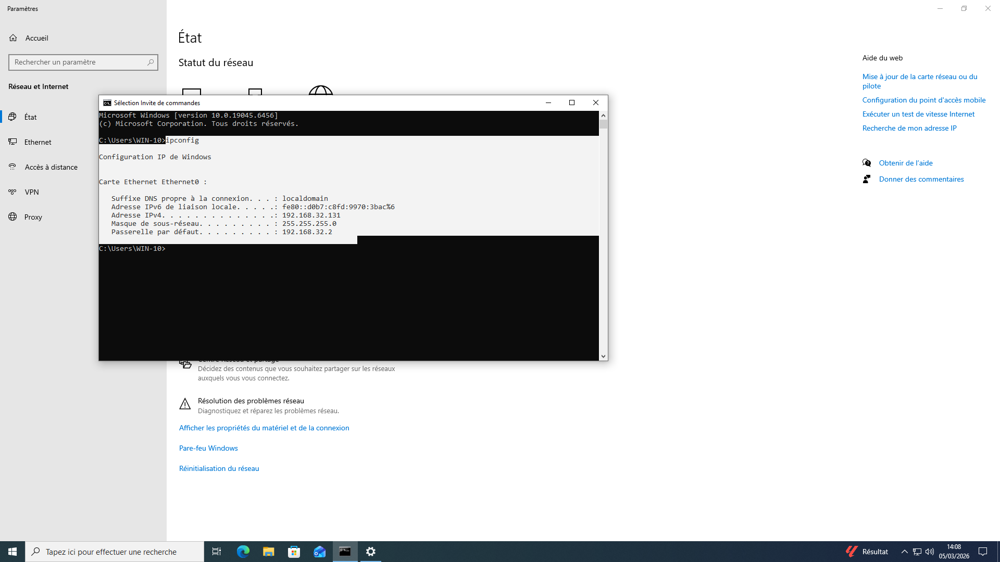

---

## 🔎 Étape 2 - Vérification de la résolution DNS

La configuration DNS a été vérifiée afin de s’assurer que le poste client peut résoudre correctement le domaine **`evilcorp.local`**.

### 📷 Captures d’écran

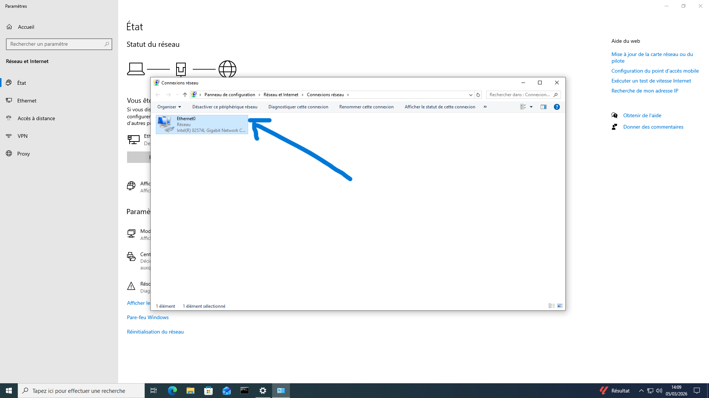

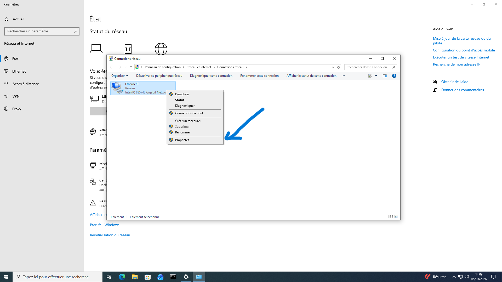

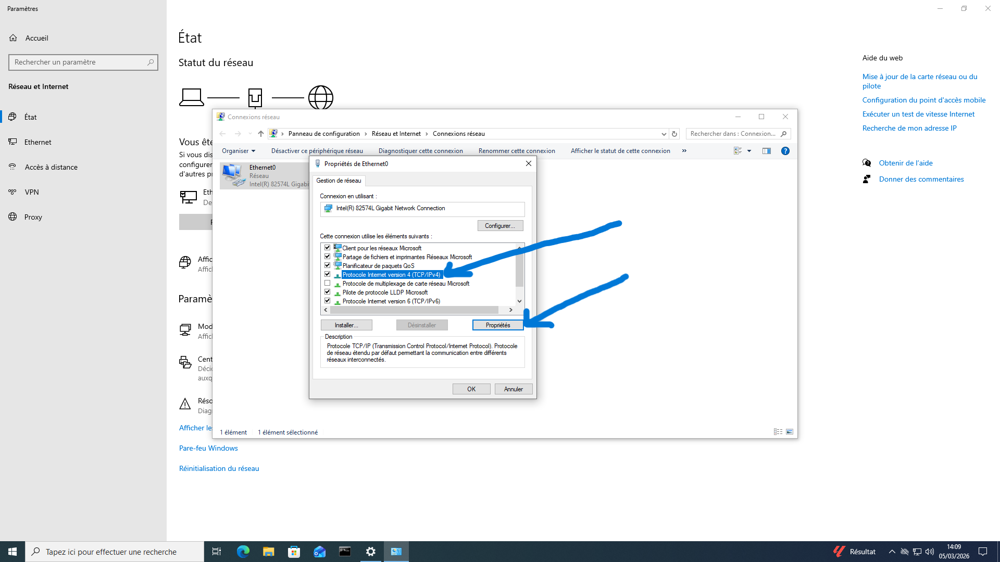

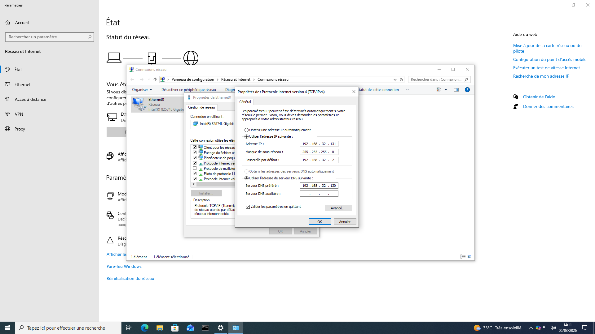

---

## 🔐 Étape 3 - Intégration au domaine

La procédure suivante a été réalisée :

### 1. Ouvrir **Ce PC**

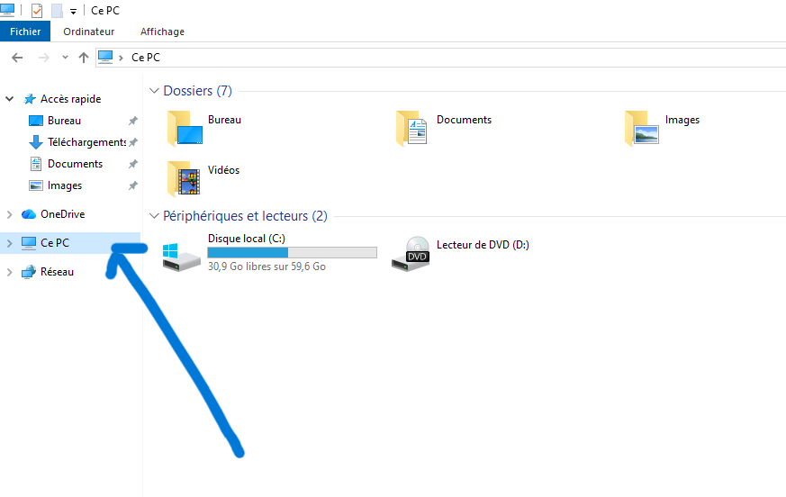

### 2. Cliquer sur **Propriétés**

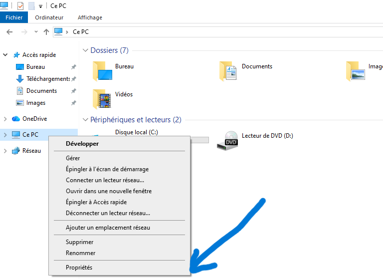

### 3. Sélectionner **Paramètres système avancés**

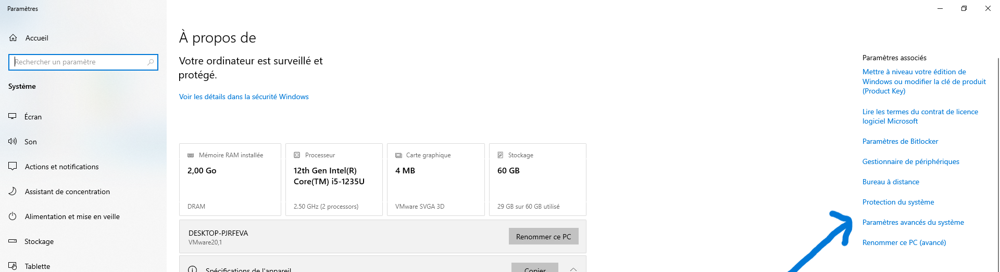

### 4. Accéder à l’onglet **Nom de l’ordinateur**

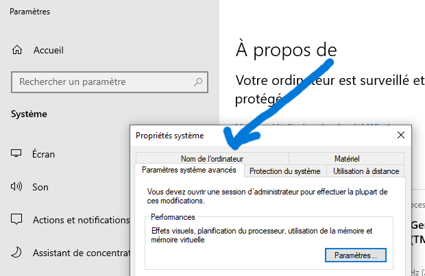

### 5. Cliquer sur **Modifier**

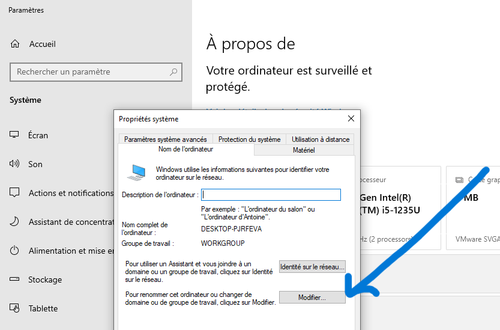

### 6. Sélectionner **Domaine** puis saisir :

```text
evilcorp.local
```

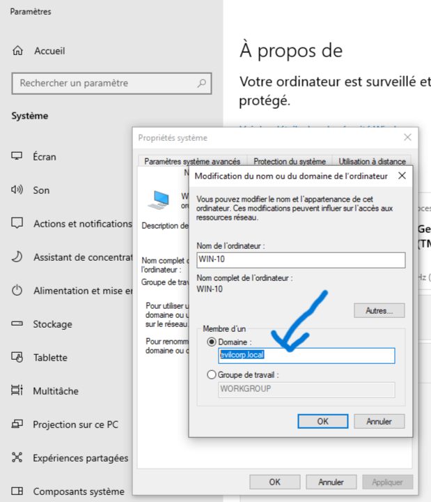

### 7. Fournir les identifiants d’un administrateur du domaine

### 8. Redémarrer la machine

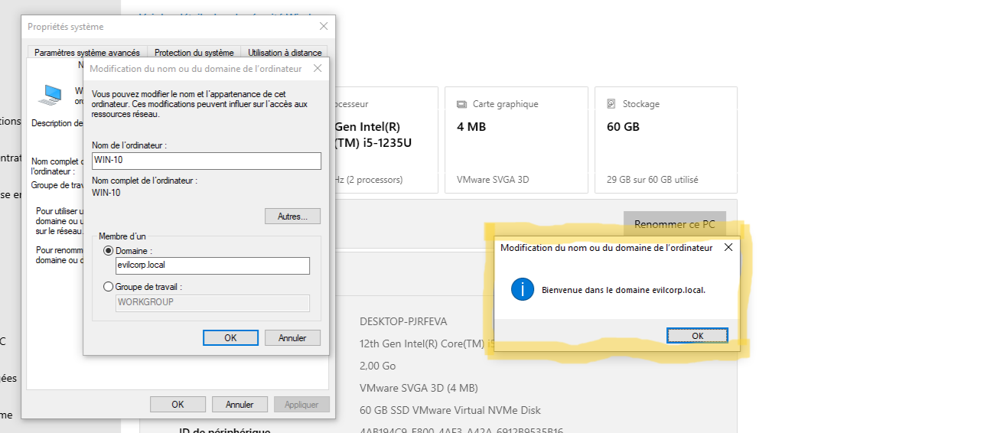

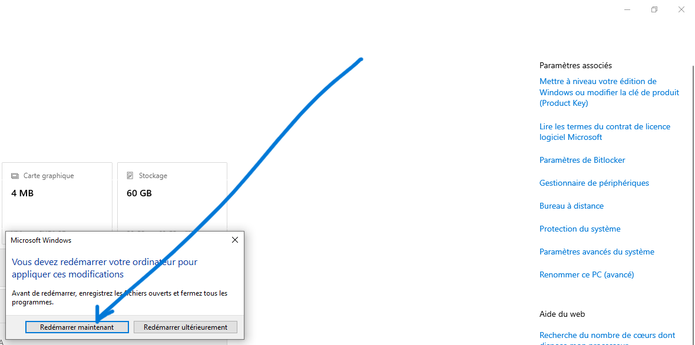

Après une authentification réussie et le redémarrage du système, le poste devient membre du domaine Active Directory.

### 📷 Confirmation

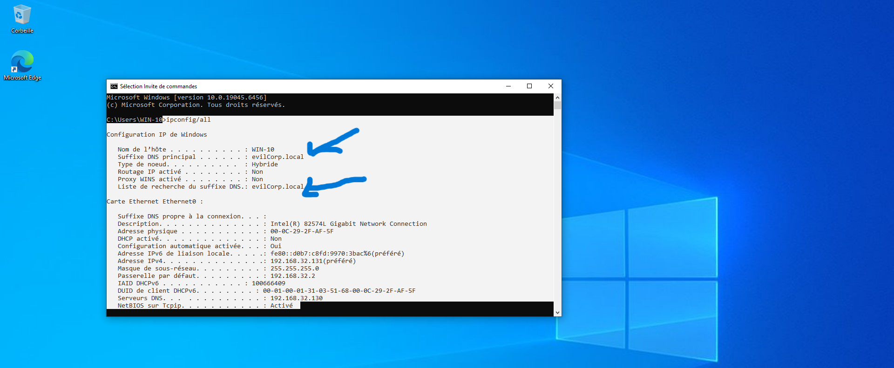

---

## ✅ Étape 4 - Vérification dans Active Directory

Après le redémarrage :

1. Ouvrir **Utilisateurs et ordinateurs Active Directory** (*Active Directory Users and Computers*)
2. Vérifier que l’objet ordinateur apparaît dans le conteneur **Computers**

### 📷 Capture d’écran

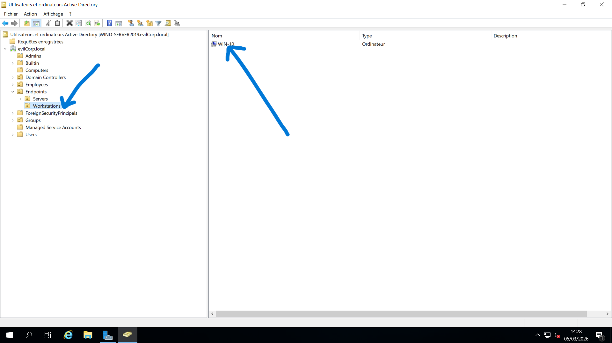

Cette vérification confirme que la machine a rejoint avec succès le domaine **`evilcorp.local`**.

---

## 📂 Étape 5 - Déplacement de l’objet ordinateur vers l’OU appropriée

Par défaut, les ordinateurs nouvellement intégrés au domaine sont placés dans le conteneur :

```text
CN=Computers
```

Cependant :

- Ce conteneur n’est pas une unité d’organisation (OU)
- Les stratégies de groupe (GPO) ne peuvent pas y être liées directement
- Il ne respecte pas l’organisation administrative définie pour l’environnement

L’objet ordinateur a donc été déplacé vers :

```text
OU=Endpoints
└── OU=Workstations
```

Cette organisation permet :

- L’application correcte des GPO
- Une gestion cohérente des équipements
- Une administration plus structurée
- Une séparation claire entre postes de travail et serveurs

---

## 🧠 Points essentiels à retenir

### DNS

- La configuration DNS est un élément critique du fonctionnement d’Active Directory.
- Le client doit utiliser le contrôleur de domaine comme serveur DNS principal.

### Configuration réseau

- Une adresse IP statique garantit la stabilité des communications réseau.
- Elle facilite le dépannage et l’administration des équipements.

### Organisation Active Directory

- Le placement correct des objets ordinateurs dans les OU permet l’application des stratégies appropriées.
- Une structure Active Directory organisée améliore la gestion et l’évolutivité de l’infrastructure.

---

## 🎯 Résultat

Le poste **Windows 10** a été intégré avec succès au domaine **`evilcorp.local`**.

L’objet ordinateur a été déplacé dans l’OU appropriée afin de respecter l’architecture Active Directory définie et de permettre l’application future des stratégies de groupe et des politiques de sécurité.
