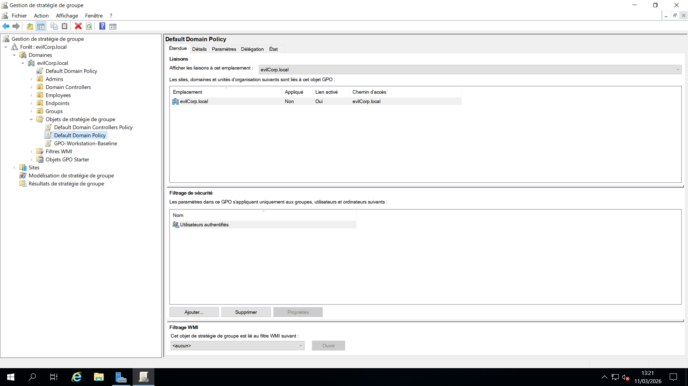
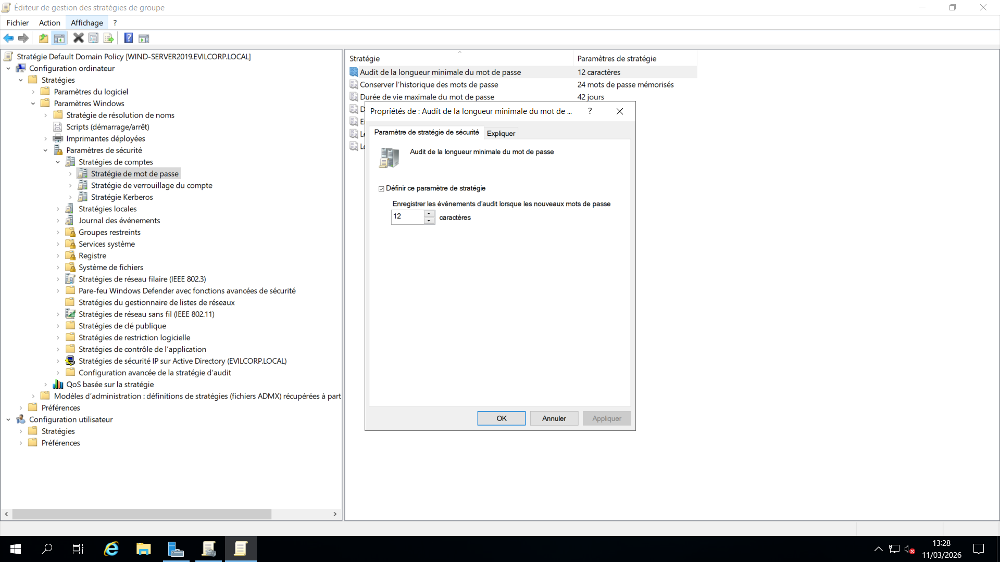
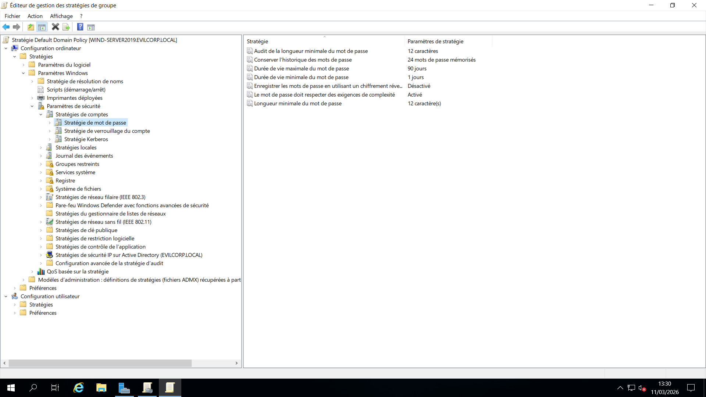
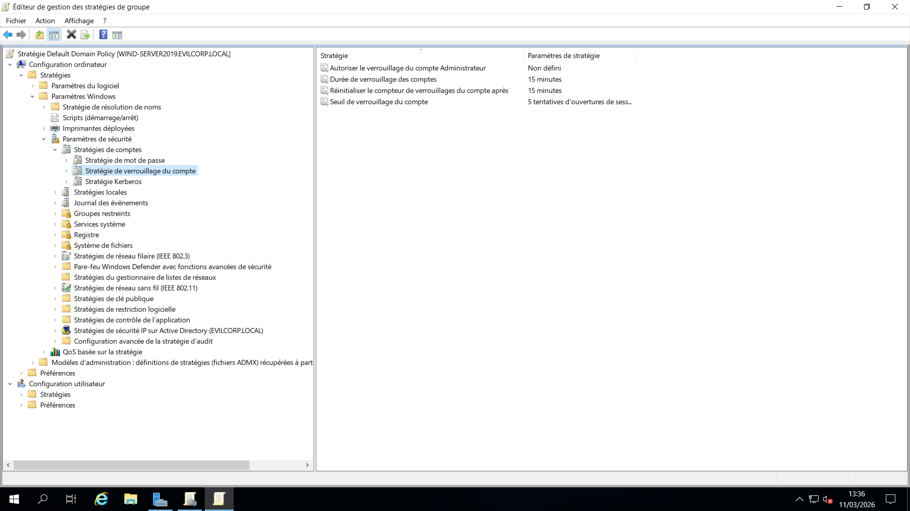
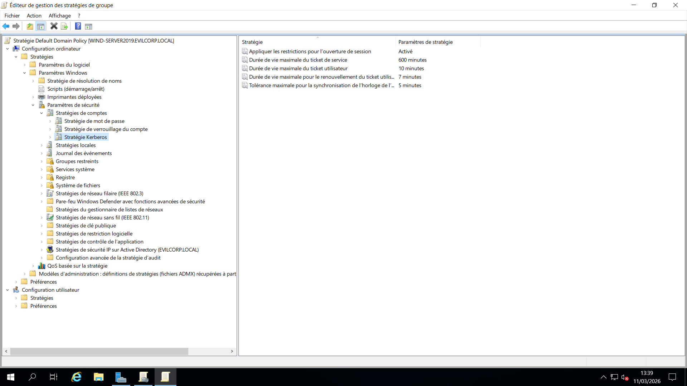

# 07 - Default Domain Policy


## 📌 Objective

Configure core **domain-level security policies** within the **Default Domain Policy** to enforce strong authentication standards and protect the Active Directory environment.

These policies apply to **all users within the domain** and define the baseline security requirements for password management, account protection, and authentication mechanisms.

---

# 🔐 Password Policy

Password policies enforce secure password practices across the domain.

They ensure that users create strong passwords and regularly update them to reduce the risk of credential compromise.

## Configuration

The following settings were configured:

* **Minimum password length:** 12 characters
* **Password complexity:** Enabled
* **Maximum password age:** 90 days
* **Enforce password history:** 24 passwords remembered

## 📷 Screenshots




### Purpose

These settings help protect against:

* Weak passwords
* Password reuse
* Credential stuffing attacks
* Long-term credential compromise

---

# 🔒 Account Lockout Policy

Account lockout policies help protect the domain against **brute-force login attempts**.

If multiple failed authentication attempts occur, the account is temporarily locked to prevent automated password guessing.

## Configuration

The following lockout settings were implemented:

* **Account lockout threshold:** 5 invalid logon attempts
* **Account lockout duration:** 15 minutes
* **Reset account lockout counter after:** 15 minutes

## 📷 Screenshots



### Purpose

These settings help mitigate:

* Password brute-force attacks
* Automated login attempts
* Unauthorized access attempts

---

# 🎫 Kerberos Policy

Kerberos is the primary authentication protocol used in Active Directory environments.

Kerberos policies control the behavior and lifetime of authentication tickets issued by the domain controller.

## Configuration

The following Kerberos settings were configured:

* **Maximum lifetime for service ticket:** 10 hours
* **Maximum lifetime for user ticket renewal:** 7 days

## 📷 Screenshots



### Purpose

These settings ensure secure authentication sessions while maintaining usability for domain users.

---

# 📍 Policy Location

All configurations were implemented in:

```
Default Domain Policy
```

Path within the Group Policy Management Editor:

```
Computer Configuration
   └ Policies
       └ Windows Settings
           └ Security Settings
               └ Account Policies
```

---

# 🧠 Key Takeaways

* Domain policies enforce centralized security rules for all domain users.
* Strong password requirements reduce the risk of credential compromise.
* Account lockout policies help defend against brute-force attacks.
* Kerberos policies manage authentication ticket lifetimes within the domain.

These configurations establish a **secure baseline authentication policy** for the Active Directory environment.

