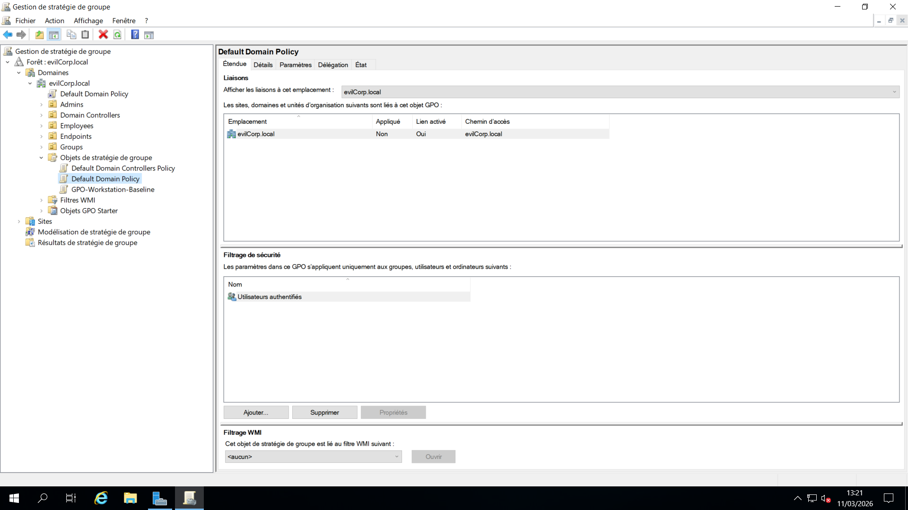
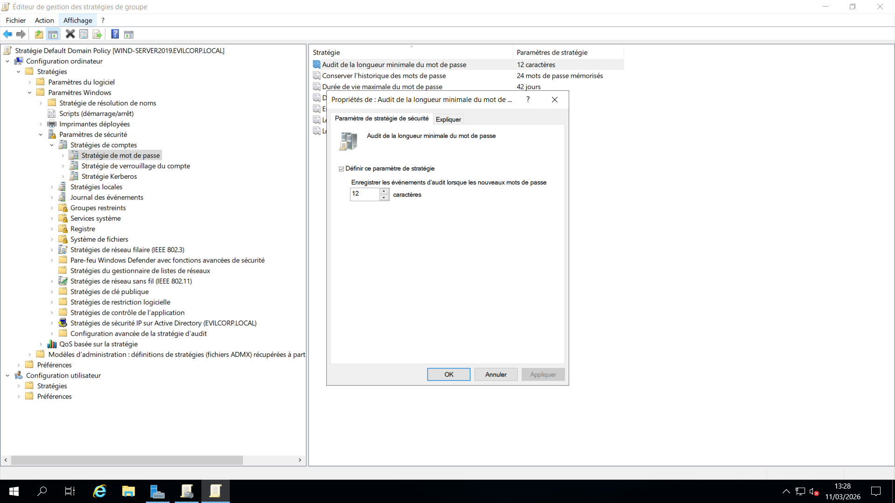
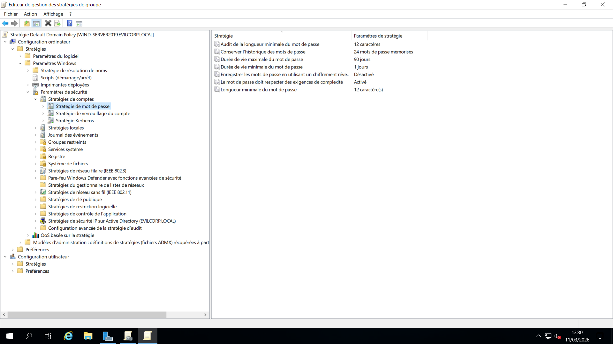
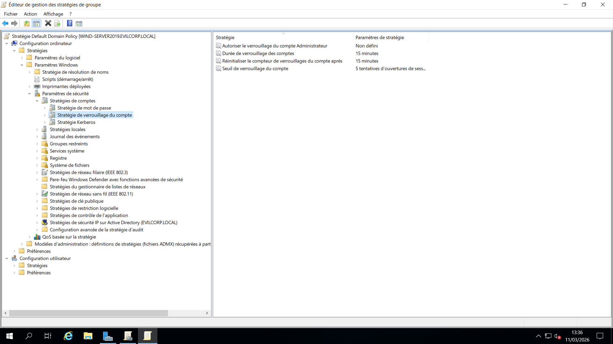
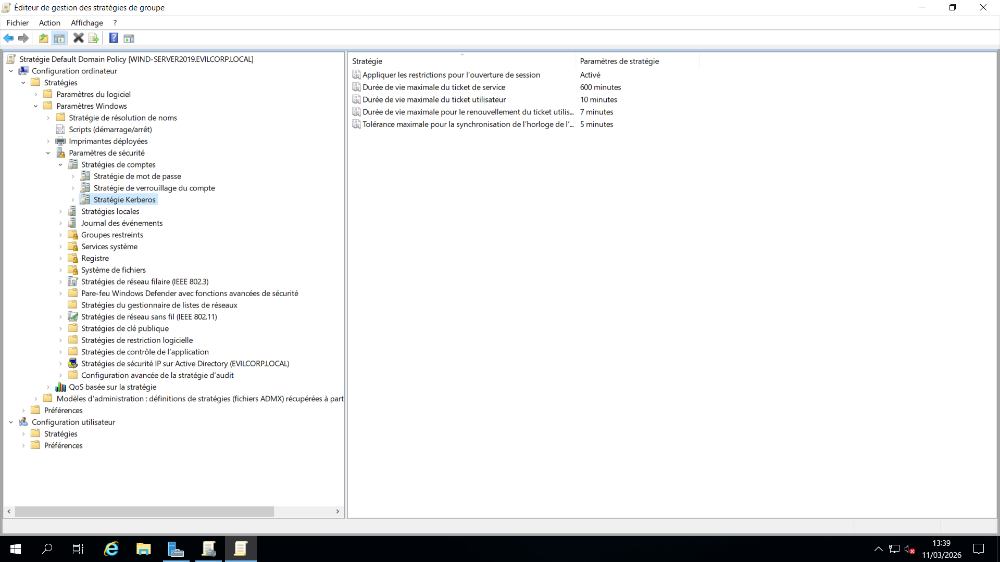

# 07 - Politique de domaine par défaut (Default Domain Policy)



## 📌 Objectif

Configurer les principales **politiques de sécurité au niveau du domaine** au sein de la **Default Domain Policy** afin d'appliquer des standards d'authentification robustes et de protéger l'environnement Active Directory.

Ces paramètres s'appliquent à **l'ensemble des utilisateurs du domaine** et définissent les exigences minimales en matière de gestion des mots de passe, de protection des comptes et d'authentification.

---

# 🔐 Politique de mot de passe

Les stratégies de mot de passe imposent des pratiques de sécurité communes à tous les utilisateurs du domaine.

Elles garantissent l'utilisation de mots de passe robustes et leur renouvellement régulier afin de réduire les risques de compromission des identifiants.

## Configuration

Les paramètres suivants ont été configurés :

- **Longueur minimale du mot de passe :** 12 caractères
- **Complexité du mot de passe :** Activée
- **Durée de vie maximale du mot de passe :** 90 jours
- **Historique des mots de passe :** 24 mots de passe mémorisés

## 📷 Captures d'écran





### Objectif

Ces paramètres contribuent à protéger l'environnement contre :

- Les mots de passe faibles
- La réutilisation des mots de passe
- Les attaques de type *Credential Stuffing*
- La compromission prolongée des identifiants

---

# 🔒 Politique de verrouillage des comptes

Les stratégies de verrouillage de compte permettent de protéger le domaine contre les tentatives d'authentification malveillantes par force brute.

Lorsqu'un nombre défini d'échecs d'authentification est atteint, le compte est temporairement verrouillé afin d'empêcher les tentatives automatisées de découverte de mot de passe.

## Configuration

Les paramètres suivants ont été appliqués :

- **Seuil de verrouillage du compte :** 5 tentatives de connexion invalides
- **Durée du verrouillage :** 15 minutes
- **Réinitialisation du compteur après :** 15 minutes

## 📷 Capture d'écran



### Objectif

Ces paramètres permettent de limiter :

- Les attaques par force brute
- Les tentatives de connexion automatisées
- Les accès non autorisés aux comptes utilisateurs

---

# 🎫 Politique Kerberos

**Kerberos** est le protocole d'authentification principal utilisé dans les environnements Active Directory.

Les stratégies Kerberos contrôlent le comportement ainsi que la durée de validité des tickets d'authentification délivrés par le contrôleur de domaine.

## Configuration

Les paramètres suivants ont été configurés :

- **Durée de vie maximale d'un ticket de service :** 10 heures
- **Durée maximale de renouvellement d'un ticket utilisateur :** 7 jours

## 📷 Capture d'écran



### Objectif

Ces paramètres permettent :

- De maintenir un niveau de sécurité élevé pour les sessions d'authentification
- De limiter l'exploitation de tickets compromis
- De conserver une expérience utilisateur acceptable tout en renforçant la sécurité

---

# 📍 Emplacement de la stratégie

L'ensemble des configurations a été appliqué dans :

```text
Default Domain Policy
```

Chemin dans l'éditeur de gestion des stratégies de groupe :

```text
Configuration ordinateur
└── Stratégies
    └── Paramètres Windows
        └── Paramètres de sécurité
            └── Stratégies de compte
```

---

# 🧠 Points clés à retenir

- Les stratégies de domaine appliquent des règles de sécurité centralisées à tous les utilisateurs.
- Des exigences de mot de passe renforcées réduisent le risque de compromission des identifiants.
- Les politiques de verrouillage protègent efficacement contre les attaques par force brute.
- Les paramètres Kerberos contrôlent la durée de validité des tickets d'authentification dans le domaine.
- Une stratégie de sécurité cohérente améliore considérablement la résilience de l'infrastructure Active Directory.

---

## 🎯 Résultat

La **Default Domain Policy** a été configurée avec succès afin d'établir une base de sécurité solide pour l'environnement **`evilcorp.local`**.

Les politiques mises en œuvre renforcent :

- L'authentification des utilisateurs
- La protection des comptes
- La gestion des mots de passe
- La sécurité globale de l'infrastructure Active Directory

Cette configuration constitue une première couche essentielle de défense dans un environnement d'entreprise sécurisé.
