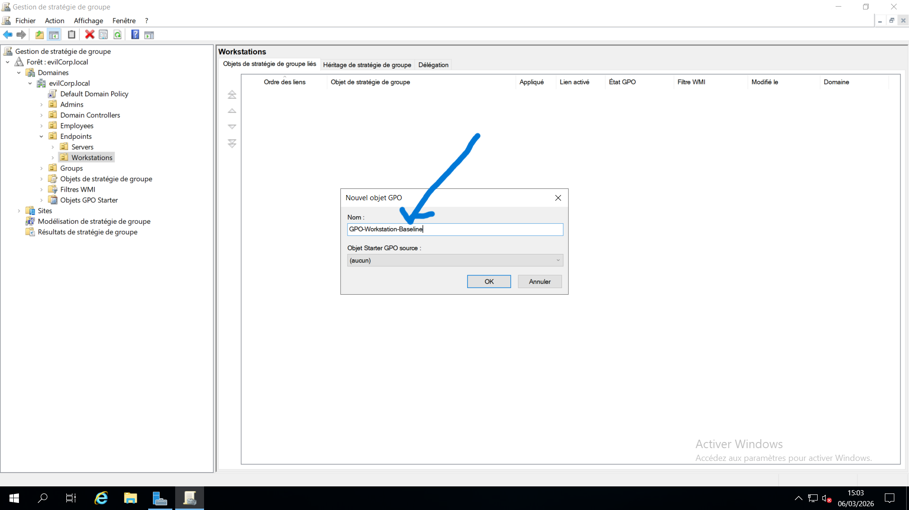
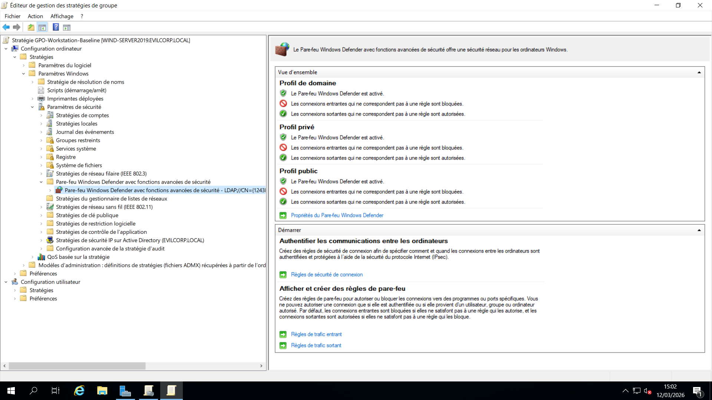
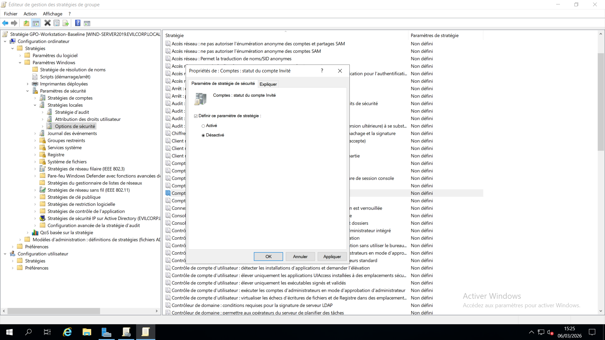
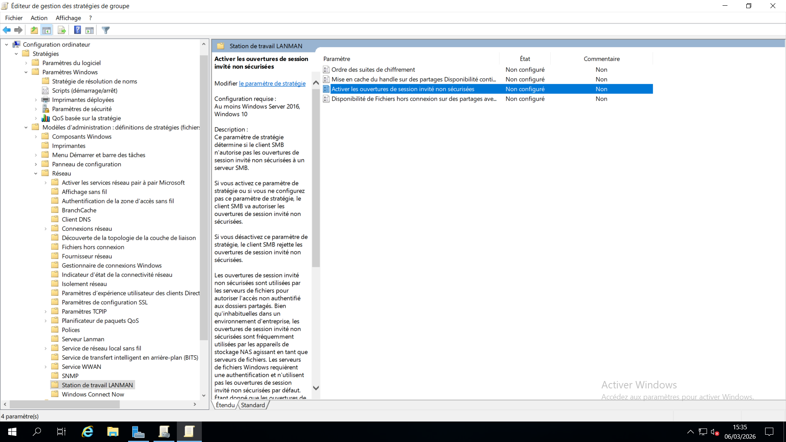
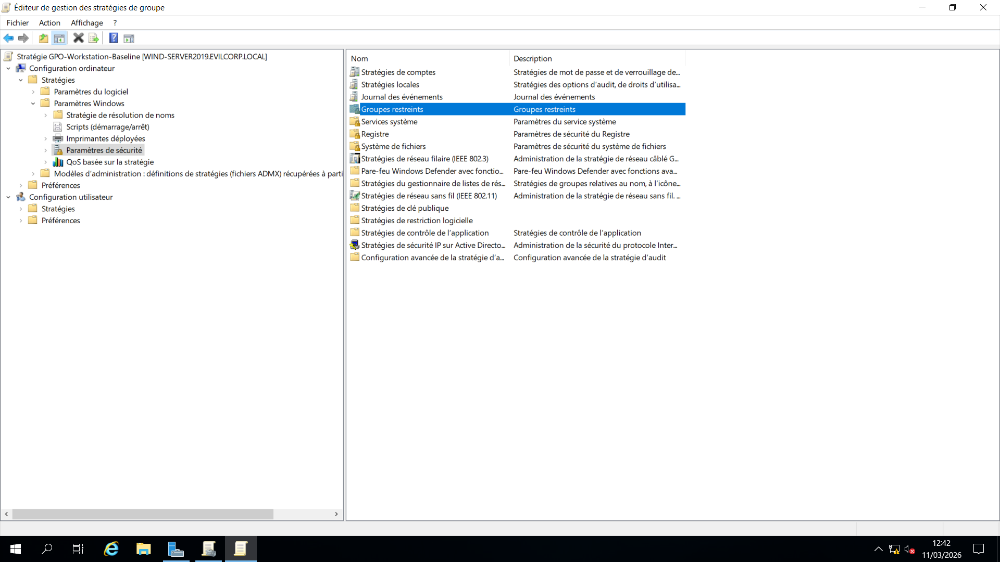
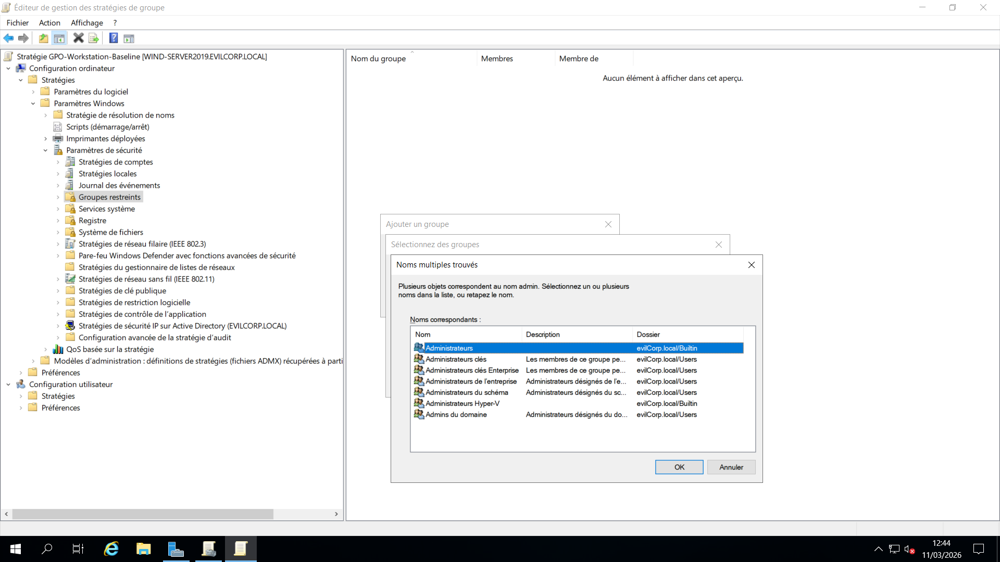
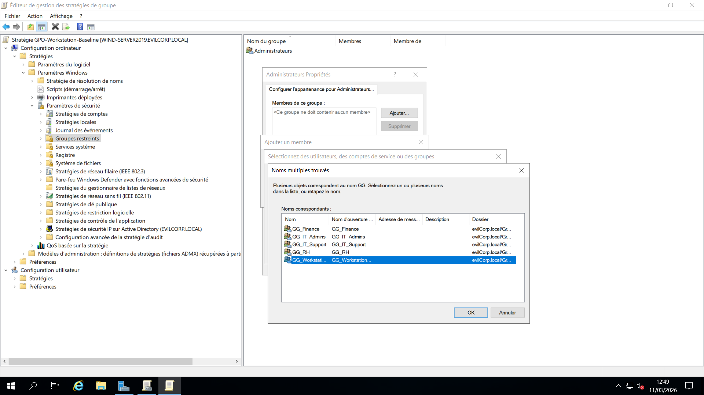
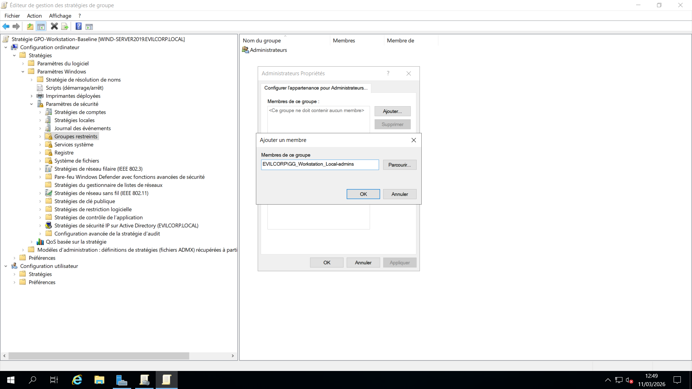

# 08 - Mise en place d’une stratégie de sécurité de base pour les postes de travail (GPO)

## 📌 Vue d’ensemble

Cette étape consiste à créer et configurer une **stratégie de groupe (GPO)** servant de référence de sécurité (*Security Baseline*) pour les postes de travail du domaine.

L'objectif est d'appliquer des paramètres de sécurité essentiels et une administration centralisée sur l'ensemble des postes clients intégrés au domaine.

La stratégie est appliquée à l'**unité d'organisation (OU) Workstations**, garantissant une configuration homogène pour tous les postes du domaine.

---

## 🎯 Périmètre d'application

La GPO est liée à l'unité d'organisation suivante :

```text
evilcorp.local
└── OU=Endpoints
    └── OU=Workstations
```

Tous les ordinateurs placés dans cette OU reçoivent automatiquement les paramètres définis par cette stratégie.

---

## 🔧 Procédure de création de la GPO

La stratégie a été créée à l'aide de la **Console de gestion des stratégies de groupe (GPMC)**.

### Étapes

1. Ouvrir **Gestion des stratégies de groupe** (*Group Policy Management*)
2. Naviguer jusqu'à l'emplacement suivant :

```text
Forêt : evilcorp.local
└── Domaines
    └── evilcorp.local
        └── OU=Endpoints
            └── OU=Workstations
```

3. Faire un clic droit sur **OU=Workstations**
4. Sélectionner **Créer un objet GPO dans ce domaine et le lier ici**
5. Nommer la stratégie :

```text
GPO-Workstation-Baseline
```

---

# 🔐 Configuration de sécurité

Les paramètres de sécurité ont été configurés dans :

```text
Configuration ordinateur
└── Stratégies
    └── Paramètres Windows
        └── Paramètres de sécurité
```

Cette stratégie regroupe plusieurs mesures destinées à renforcer la sécurité des postes de travail du domaine.

---

# 🛡️ Configuration du pare-feu Windows Defender

Le **pare-feu Windows Defender** a été configuré via la GPO afin de garantir une politique de sécurité réseau cohérente sur tous les postes du domaine.

### Emplacement de configuration

```text
Configuration ordinateur
└── Stratégies
    └── Paramètres Windows
        └── Paramètres de sécurité
            └── Pare-feu Windows Defender avec fonctions avancées de sécurité
```

### Paramètres appliqués

- Activation du pare-feu pour le **profil Domaine**
- Administration centralisée du pare-feu via les stratégies de groupe
- Protection contre les connexions entrantes non autorisées

### Objectif

Cette configuration garantit que tous les postes de travail appliquent une politique de sécurité réseau uniforme et conforme aux standards de l'entreprise.

---

# 🚫 Désactivation du compte Invité

Le compte intégré **Guest (Invité)** a été désactivé.

### Objectif

La désactivation de ce compte permet :

- De réduire la surface d'attaque
- D'empêcher les connexions anonymes
- De limiter les risques d'accès non autorisés
- De renforcer la sécurité globale des postes clients

Cette mesure fait partie des recommandations de sécurité Microsoft pour les environnements Active Directory.

---

# 🔑 Renforcement de l'authentification

Les mécanismes d'authentification considérés comme peu sécurisés ont été désactivés afin d'imposer des standards d'authentification plus robustes.

### Objectif

Cette configuration permet :

- De réduire les risques d'abus liés à l'authentification
- De limiter certaines techniques d'attaque sur les identifiants
- D'améliorer la posture de sécurité globale du domaine

---

# 👥 Configuration des groupes restreints (Restricted Groups)

Afin de centraliser la gestion des privilèges administratifs locaux, la fonctionnalité **Restricted Groups** a été mise en œuvre.

### Groupe Active Directory utilisé

```text
GG_Workstation_Local-Admins
```

Ce groupe est automatiquement ajouté au groupe local :

```text
Administrators
```

sur l'ensemble des postes de travail du domaine.

---

## ✅ Avantages

L'utilisation des groupes restreints permet :

- Une gestion centralisée des privilèges administratifs
- Une attribution cohérente des droits sur tous les postes
- Une réduction des risques liés aux privilèges excessifs
- Une simplification de l'administration
- Une meilleure traçabilité des accès privilégiés

### Bonne pratique

L'utilisation de **groupes de sécurité** plutôt que l'attribution directe de privilèges aux utilisateurs constitue une bonne pratique largement adoptée dans les environnements professionnels.

---

# 📷 Captures d'écran

## Création de la GPO



---

## Configuration du pare-feu



---

## Configuration des paramètres de sécurité





---

## Configuration des groupes restreints









---

# 🧠 Points clés à retenir

- Les stratégies de groupe permettent une administration centralisée des systèmes Windows.
- L'application des GPO aux unités d'organisation facilite une gestion structurée et évolutive.
- La désactivation des comptes inutiles réduit la surface d'attaque de l'environnement.
- La gestion des privilèges via des groupes de sécurité améliore la maîtrise des accès administratifs.
- L'application centralisée du pare-feu renforce la sécurité réseau des postes de travail.
- Une stratégie de sécurité de référence (*Security Baseline*) constitue une étape essentielle dans le durcissement d'un environnement Active Directory.

---

## 🎯 Résultat

La GPO **`GPO-Workstation-Baseline`** a été déployée avec succès sur l'OU **Workstations**.

Cette stratégie fournit un socle de sécurité homogène pour l'ensemble des postes de travail du domaine **`evilcorp.local`** et permet :

- Une administration centralisée
- Une meilleure gestion des privilèges
- Une réduction des risques de compromission
- Une application cohérente des standards de sécurité de l'entreprise

Elle servira également de base aux futures configurations de sécurité et au déploiement d'autres stratégies de groupe dans l'environnement Active Directory.
