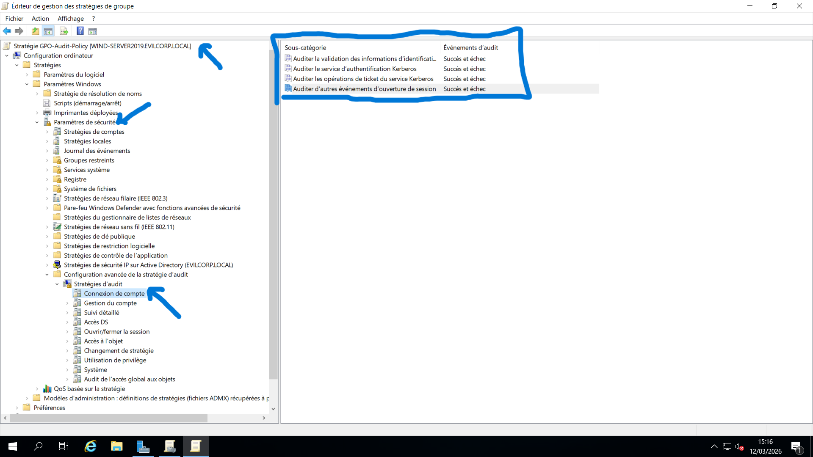
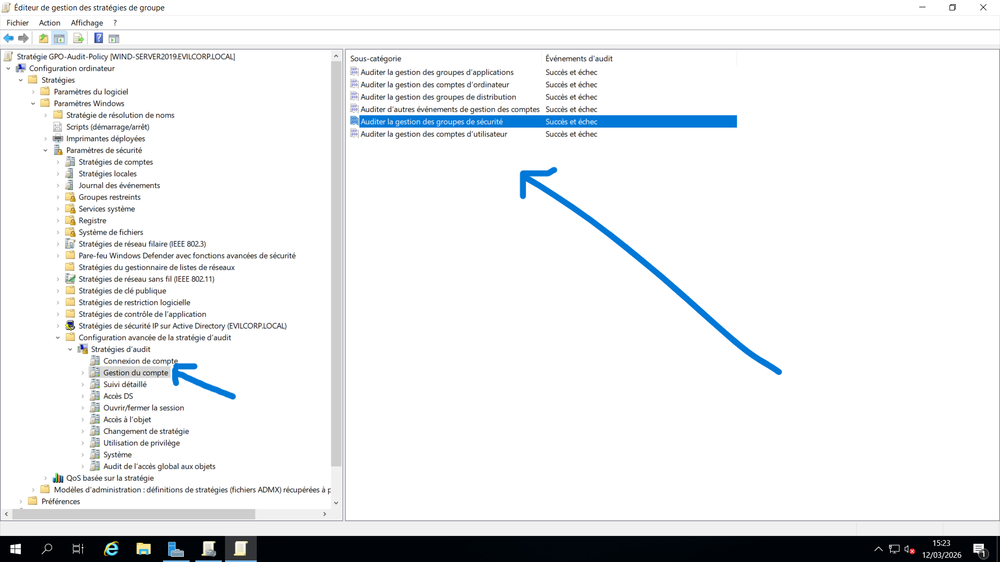
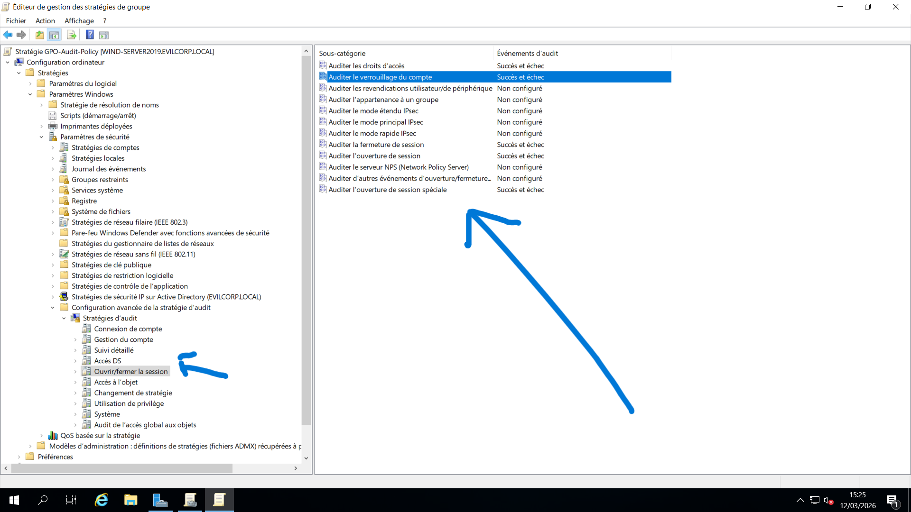
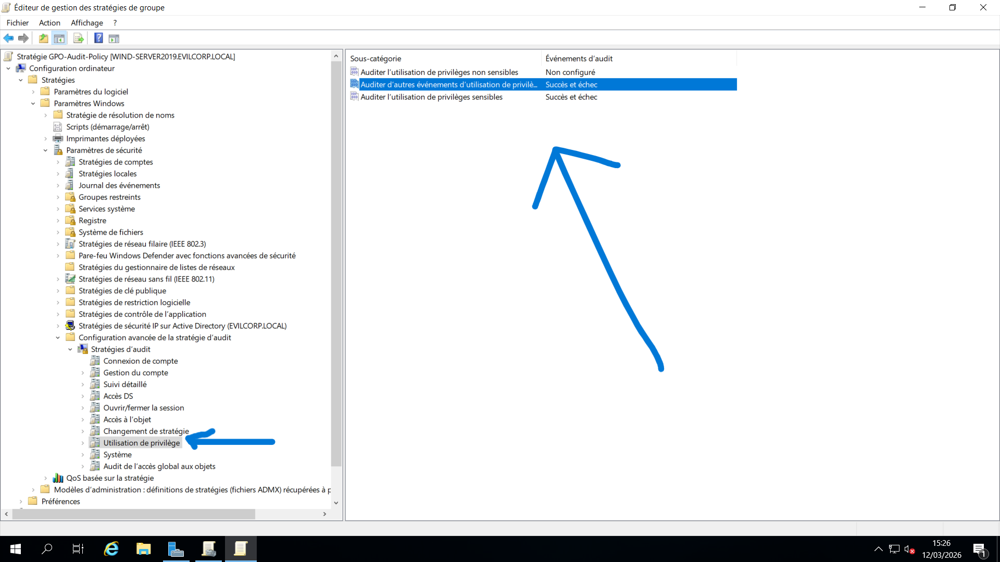
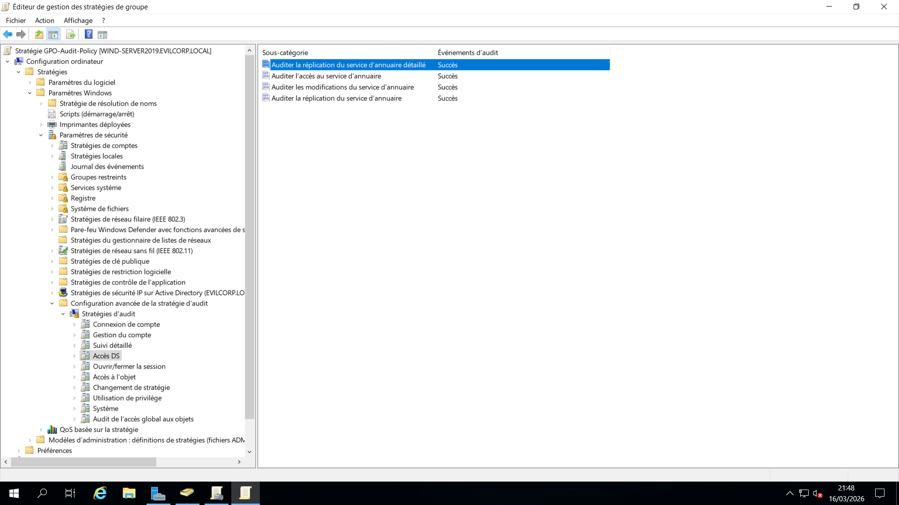
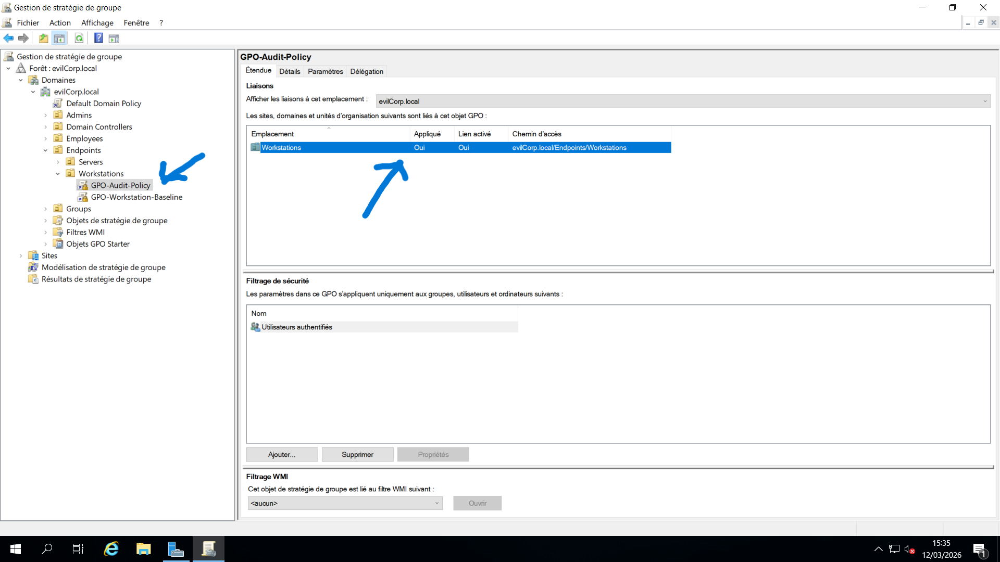
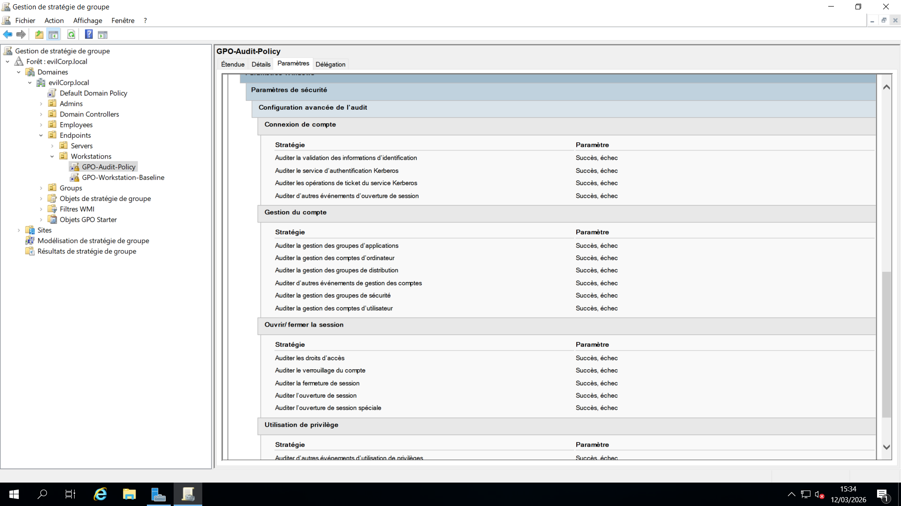
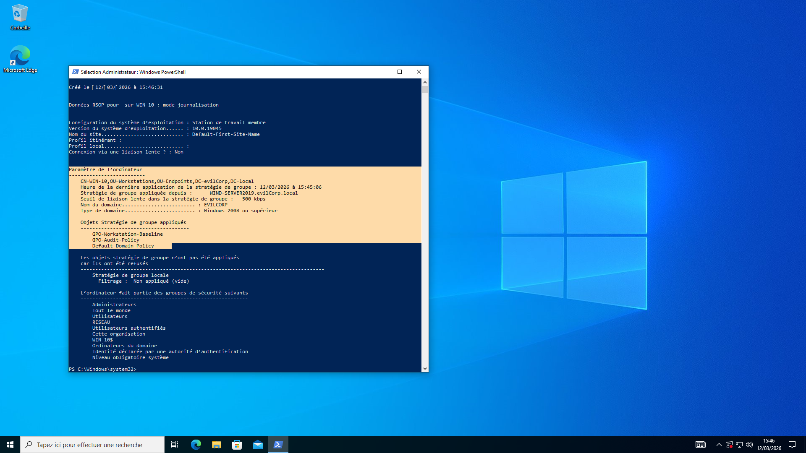

# 09 - Mise en place d’une stratégie d’audit avancée (GPO)

## 📌 Vue d’ensemble

Cette étape consiste à déployer une **stratégie d’audit avancée (Advanced Audit Policy)** à l’aide des stratégies de groupe (GPO) afin d’améliorer la visibilité et la supervision de l’environnement Active Directory.

Les stratégies d’audit permettent aux administrateurs de :

- Suivre les événements d’authentification
- Contrôler les modifications de comptes
- Surveiller l’utilisation des privilèges
- Détecter les comportements suspects
- Faciliter les investigations de sécurité

Les journaux générés constituent une source essentielle pour :

- La supervision de la sécurité (*Security Monitoring*)
- La réponse aux incidents (*Incident Response*)
- Les investigations numériques (*Forensic Analysis*)

La configuration a été déployée à l’aide d’une GPO dédiée.

---

## 🎯 Objectif

Cette configuration a pour but de :

- Surveiller les activités d’authentification
- Détecter les tentatives de connexion échouées
- Suivre les modifications des comptes utilisateurs
- Identifier les abus de privilèges
- Améliorer la visibilité de l’environnement Active Directory
- Contrôler les modifications des objets Active Directory

Les événements générés peuvent être analysés dans :

```text
Observateur d'événements (Event Viewer)
```

---

# 🔧 Création de la GPO

La configuration d'audit a été implémentée au travers d'un nouvel objet de stratégie de groupe.

### Étapes

1. Ouvrir la **Console de gestion des stratégies de groupe (GPMC)**
2. Naviguer jusqu'au domaine :

```text
Forêt : evilcorp.local
└── Domaines
    └── evilcorp.local
```

3. Effectuer un clic droit sur **Objets de stratégie de groupe**
4. Sélectionner **Nouveau**
5. Nommer la stratégie :

```text
GPO-Audit-Policy
```

---

# ⚙️ Modification de la GPO

Après sa création, la stratégie doit être configurée afin d'activer les différents paramètres d'audit.

### Étapes

1. Faire un clic droit sur **GPO-Audit-Policy**
2. Sélectionner **Modifier**
3. Naviguer jusqu'au chemin suivant :

```text
Configuration ordinateur
└── Stratégies
    └── Paramètres Windows
        └── Paramètres de sécurité
            └── Configuration avancée de la stratégie d’audit
                └── Stratégies d’audit
```

---

# 🔐 Audit des ouvertures de session de compte (Account Logon)

Cette catégorie surveille les activités d'authentification au sein du domaine.

Ces événements sont principalement enregistrés sur les **contrôleurs de domaine**.

### Chemin de configuration

```text
Stratégies d’audit
└── Ouverture de session de compte
```

### Paramètres configurés

Les événements suivants ont été activés :

- Validation des informations d'identification → **Succès et Échec**
- Service d'authentification Kerberos → **Succès et Échec**
- Opérations sur les tickets de service Kerberos → **Succès et Échec**
- Autres événements d'ouverture de session de compte → **Succès et Échec**

### 📷 Capture d'écran



### Bénéfices de sécurité

Cette configuration permet de détecter :

- Les échecs d'authentification
- Les abus liés aux tickets Kerberos
- Les tentatives de validation d'identifiants
- Les attaques par force brute

---

# 👤 Audit de la gestion des comptes

Cette stratégie surveille les modifications apportées aux comptes utilisateurs et aux groupes Active Directory.

### Chemin de configuration

```text
Stratégies d’audit
└── Gestion des comptes
```

### Paramètre configuré

- Gestion des comptes utilisateurs → **Succès**

### 📷 Capture d'écran



### Bénéfices de sécurité

Cette stratégie enregistre notamment :

- La création de comptes utilisateurs
- La suppression de comptes utilisateurs
- Les modifications d'appartenance aux groupes
- Les changements sur les comptes administratifs

---

# 🔑 Audit des ouvertures et fermetures de session

Cette configuration permet de suivre les connexions effectuées sur les systèmes du domaine.

### Chemin de configuration

```text
Stratégies d’audit
└── Ouverture/Fermeture de session
```

### Paramètre configuré

- Audit des ouvertures de session → **Succès et Échec**

### 📷 Capture d'écran



### Bénéfices de sécurité

Cette stratégie permet d'identifier :

- Les connexions réussies
- Les tentatives de connexion échouées
- Les comportements d'authentification inhabituels

---

# 🔒 Audit de l'utilisation des privilèges

Cette stratégie surveille l'utilisation des privilèges sensibles sur les systèmes du domaine.

### Chemin de configuration

```text
Stratégies d’audit
└── Utilisation des privilèges
```

### Paramètre configuré

- Utilisation des privilèges sensibles → **Succès et Échec**

### 📷 Capture d'écran



### Bénéfices de sécurité

Cette configuration permet de détecter :

- Les tentatives d'élévation de privilèges
- Les actions administratives non autorisées
- Les abus de permissions élevées

---

# 📂 Audit des modifications du service d'annuaire (Directory Service Changes)

Cette stratégie surveille les modifications apportées aux objets Active Directory.

Elle est particulièrement utile pour suivre les changements concernant :

- Les utilisateurs
- Les groupes
- Les unités d'organisation (OU)
- Les attributs de sécurité

### Chemin de configuration

```text
Stratégies d’audit
└── Accès au service d’annuaire (DS Access)
```

### Paramètre configuré

- Modifications du service d'annuaire → **Succès**

### 📷 Capture d'écran



### Bénéfices de sécurité

Cette configuration journalise notamment :

- Les modifications d'objets Active Directory
- Les changements de groupes de sécurité
- Les modifications d'attributs utilisateurs
- Les changements critiques de configuration du domaine

Elle fournit une visibilité précieuse pour les investigations de sécurité et les analyses post-incident.

---

# 📑 Identifiants d'événements importants

| ID Événement | Description |
|-------------|-------------|
| **4624** | Ouverture de session réussie |
| **4625** | Échec d'ouverture de session |
| **4672** | Attribution de privilèges spéciaux lors d'une connexion |
| **4720** | Création d'un compte utilisateur |
| **4726** | Suppression d'un compte utilisateur |
| **4732** | Ajout d'un utilisateur à un groupe de sécurité |
| **4768** | Demande de ticket d'authentification Kerberos |
| **4769** | Demande de ticket de service Kerberos |
| **5136** | Modification d'un objet Active Directory |

---

# 🧠 Points clés à retenir

- Les stratégies d'audit avancées offrent une visibilité approfondie sur les activités Active Directory.
- La surveillance des authentifications permet de détecter les attaques par force brute et les tentatives de compromission d'identifiants.
- L'audit de gestion des comptes permet de suivre les modifications des utilisateurs et groupes.
- L'audit des privilèges facilite l'identification des tentatives d'élévation de privilèges.
- L'audit du service d'annuaire permet de surveiller les changements critiques dans Active Directory.
- La centralisation des journaux d'audit constitue un élément essentiel de toute stratégie de supervision de sécurité en entreprise.

---

# 📷 Captures d'écran

## Vue d'ensemble de la stratégie d'audit



---

## Configuration de la stratégie



---

## Journaux d'événements générés



---

## 🎯 Résultat

La GPO **`GPO-Audit-Policy`** a été déployée avec succès afin d'améliorer la visibilité et la traçabilité des événements de sécurité au sein du domaine **`evilcorp.local`**.

Cette configuration permet désormais :

- La surveillance des authentifications
- Le suivi des modifications Active Directory
- Le contrôle des privilèges sensibles
- La détection d'activités suspectes
- Une meilleure capacité d'investigation en cas d'incident

Elle constitue une étape essentielle dans la mise en œuvre d'une stratégie de sécurité Active Directory mature et orientée détection.
