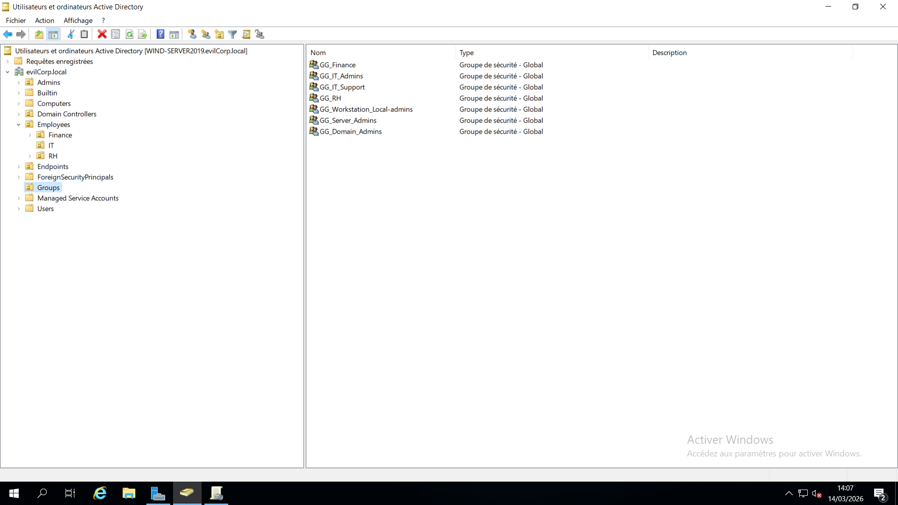
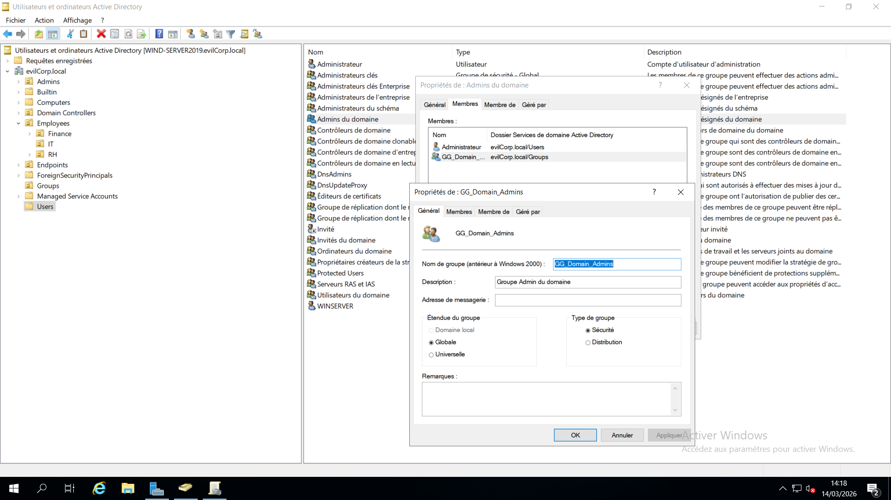
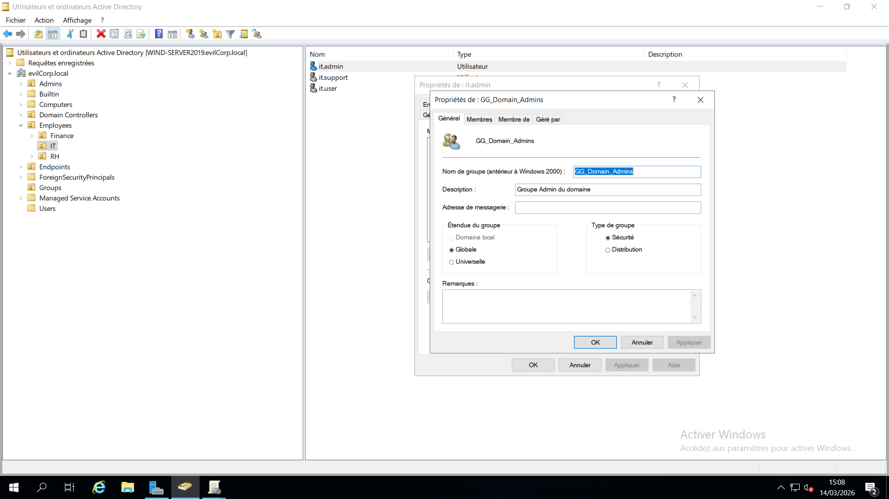
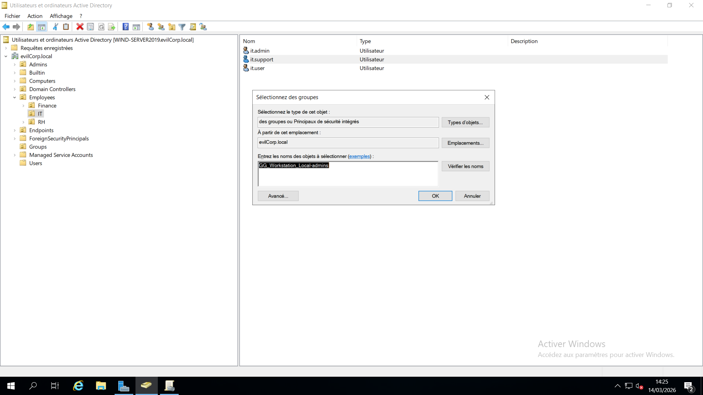
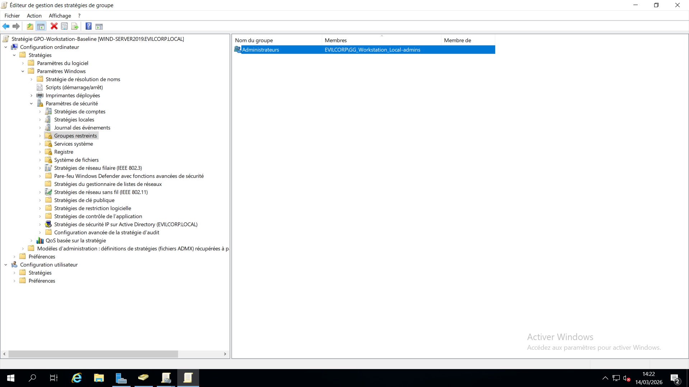

# 10 - Privileged Access Management

## Overview

This section focuses on implementing **Privileged Access Management (PAM)** within the Active Directory environment.

The objective is to ensure that administrative privileges are **centrally managed, controlled, and delegated using security groups** rather than assigning permissions directly to individual users.

This approach follows industry best practices and improves the overall security posture of the domain.

---

# Objective

The goals of this configuration are:

- Centralize administrator privilege management
- Avoid assigning privileges directly to users
- Implement a **group-based administrative model**
- Reduce the risk of privilege misuse
- Improve security and auditing of privileged accounts

The implemented model follows the **User → Group → Permission** principle.

```
User
 ↓
Security Group
 ↓
Administrative Permission
```

---

# Active Directory Structure

Administrative groups are stored in the following Organizational Unit:

```
evilcorp.local
└── OU=Groups
```

This OU centralizes security groups used for access control.

---

# Step 1 - Creating Administrative Groups

To manage privileged access, dedicated **security groups** were created.

## Groups Created

```
GG_Domain_Admins
GG_Server_Admins
GG_Workstation_Local-admins
GG_IT_Support
...
```

## Group Configuration

| Setting | Value |
|------|------|
| Group Type | Security |
| Group Scope | Global |

These groups allow administrators to delegate responsibilities while maintaining clear privilege boundaries.

### Screenshot



---

# Step 2 - Assigning Domain Administrative Privileges

A dedicated group was created to manage **domain administrator privileges**.

Instead of directly adding users to **Domain Admins**, the following delegation model was implemented.

```
GG_Domain_Admins
 ↓
Domain Admins
```

This approach ensures that domain-level privileges are **centrally managed through security groups**.

### Screenshot



---

# Step 3 - Adding the Domain Administrator User

The account **it.admin** was added to the domain administrator group.

```
User
it.admin
```

```
Group
GG_Domain_Admins
```

This membership grants **domain administrative privileges** through the following hierarchy:

```
it.admin
 ↓
GG_Domain_Admins
 ↓
Domain Admins
 ↓
Full Domain Administrative Privileges
```

### Screenshot



---

# Step 4 - Workstation Administrator Management

Administrative privileges for domain workstations are delegated to IT support.

The following group is used:

```
GG_Workstation_Local-admins
```

The user **it.support** was added to this group.

```
it.support
 ↓
GG_Workstation_Local-admins
 ↓
Local Administrators (Workstations)
```

This allows IT support staff to manage workstations **without requiring Domain Admin privileges**.

### Screenshot



---

# Step 5 - Assigning Local Administrator Rights via Group Policy

Administrative rights on workstations are applied using **Group Policy Restricted Groups**.

## Policy Used

```
GPO-Workstation-Baseline
```

## Configuration Path

```
Computer Configuration
└── Policies
    └── Windows Settings
        └── Security Settings
            └── Restricted Groups
```

## Configuration

```
Group Name
Administrators
```

```
Members
GG_Workstation_Local-admins
```

This configuration ensures that members of **GG_Workstation_Local-admins** automatically become **local administrators** on all workstations.

### Screenshot



---

# Result

After applying this configuration:

- **it.admin** has **Domain Administrator privileges**
- **it.support** has **local administrator privileges on workstations**
- administrative roles are **centrally managed through security groups**

Example:

```
User: it.admin
Role: Domain Administrator
Scope: Active Directory Domain
```

```
User: it.support
Role: Workstation Administrator
Scope: Domain Workstations
```

---

# Security Benefits

This privileged access model provides several advantages:

- Centralized privilege management
- Reduced attack surface
- Easier auditing of administrator roles
- Clear separation of responsibilities
- Improved domain security

Using **security groups instead of individual user assignments** follows enterprise Active Directory security practices.

---

---
# Key Takeaways

- Privileged access should always be managed through **security groups**
- Direct user privilege assignment should be avoided
- Group Policy enables centralized enforcement of administrative roles
- Delegating workstation administration reduces the need for Domain Admin access
- Structured privilege management improves Active Directory security
