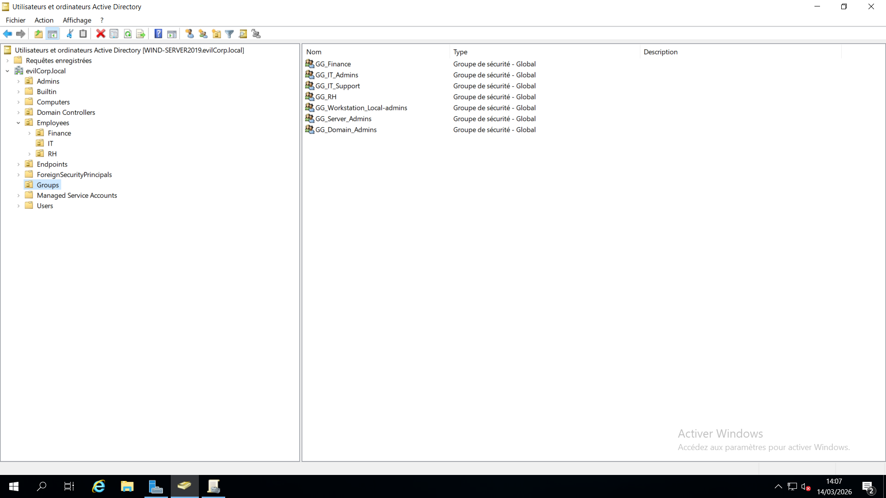
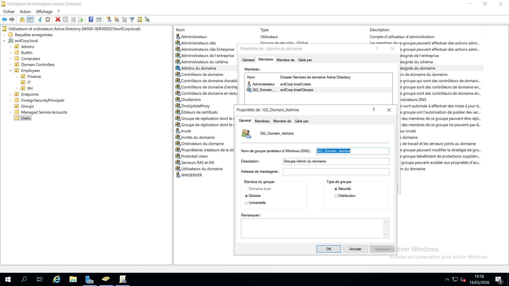
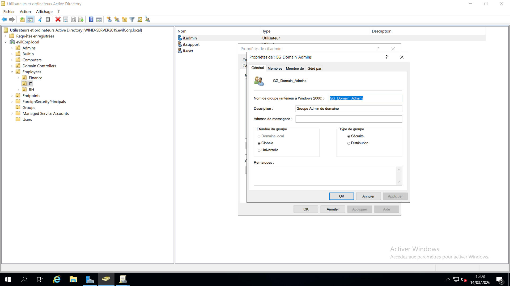
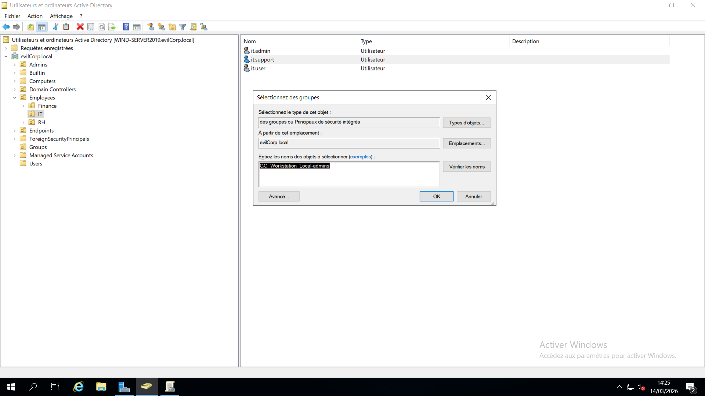
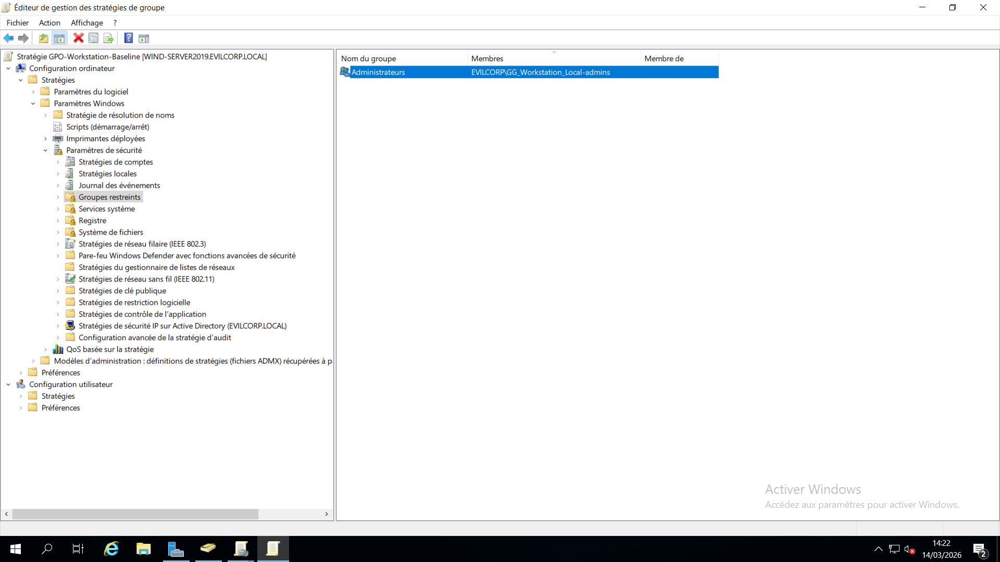

# 10 - Gestion des accès privilégiés (Privileged Access Management)

## 📌 Vue d’ensemble

Cette étape consiste à mettre en œuvre un modèle de **gestion des accès privilégiés (Privileged Access Management - PAM)** au sein de l’environnement Active Directory.

L’objectif est de garantir que les privilèges administratifs soient **gérés, contrôlés et délégués de manière centralisée à l’aide de groupes de sécurité**, plutôt que d’être attribués directement aux utilisateurs.

Cette approche respecte les bonnes pratiques de sécurité recommandées pour les environnements Active Directory et contribue à réduire les risques liés aux comptes privilégiés.

---

# 🎯 Objectif

Les objectifs de cette configuration sont les suivants :

- Centraliser la gestion des privilèges administratifs
- Éviter l’attribution directe de permissions aux utilisateurs
- Mettre en œuvre un modèle d’administration basé sur les groupes
- Réduire les risques d’abus de privilèges
- Améliorer la traçabilité et l’audit des comptes administratifs

Le modèle retenu repose sur le principe :

```text
Utilisateur
     ↓
Groupe de sécurité
     ↓
Permission administrative
```

Cette méthode permet de simplifier la gestion des accès tout en améliorant la sécurité globale du domaine.

---

# 🏢 Structure Active Directory

Les groupes administratifs sont stockés dans l’unité d’organisation suivante :

```text
evilcorp.local
└── OU=Groups
```

Cette OU centralise l’ensemble des groupes de sécurité utilisés pour le contrôle d’accès.

---

# 👥 Étape 1 - Création des groupes administratifs

Afin de gérer les accès privilégiés, plusieurs groupes de sécurité dédiés ont été créés.

## Groupes créés

```text
GG_Domain_Admins
GG_Server_Admins
GG_Workstation_Local-admins
GG_IT_Support
...
```

## Configuration des groupes

| Paramètre | Valeur |
|------------|---------|
| Type de groupe | Sécurité |
| Étendue du groupe | Globale |

Ces groupes permettent de déléguer des responsabilités administratives tout en maintenant une séparation claire des privilèges.

### 📷 Capture d’écran



---

# 👑 Étape 2 - Attribution des privilèges d’administration du domaine

Un groupe dédié a été créé afin de gérer les privilèges d’administration du domaine.

Plutôt que d’ajouter directement les utilisateurs au groupe intégré **Domain Admins**, le modèle suivant a été mis en place :

```text
GG_Domain_Admins
        ↓
Domain Admins
```

Cette approche permet de centraliser la gestion des privilèges d’administration du domaine et facilite les audits.

### 📷 Capture d’écran



---

# 👤 Étape 3 - Ajout de l’administrateur du domaine

Le compte suivant a été ajouté au groupe d’administration du domaine :

```text
Utilisateur
it.admin
```

```text
Groupe
GG_Domain_Admins
```

Cette appartenance lui confère les privilèges suivants :

```text
it.admin
    ↓
GG_Domain_Admins
    ↓
Domain Admins
    ↓
Privilèges complets d’administration du domaine
```

### 📷 Capture d’écran



---

# 🖥️ Étape 4 - Gestion des administrateurs de postes de travail

Les privilèges administratifs sur les postes de travail ont été délégués à l’équipe de support informatique.

Le groupe utilisé est :

```text
GG_Workstation_Local-admins
```

L’utilisateur suivant a été ajouté à ce groupe :

```text
it.support
```

Hiérarchie des privilèges :

```text
it.support
    ↓
GG_Workstation_Local-admins
    ↓
Administrateurs locaux des postes de travail
```

Cette configuration permet aux techniciens support d’administrer les postes clients sans nécessiter de privilèges **Domain Admin**.

### 📷 Capture d’écran



---

# ⚙️ Étape 5 - Attribution des droits administratifs locaux via GPO

Les privilèges administratifs locaux sur les postes de travail sont appliqués automatiquement à l’aide des **Restricted Groups** dans une stratégie de groupe.

## GPO utilisée

```text
GPO-Workstation-Baseline
```

## Chemin de configuration

```text
Configuration ordinateur
└── Stratégies
    └── Paramètres Windows
        └── Paramètres de sécurité
            └── Groupes restreints (Restricted Groups)
```

## Configuration appliquée

```text
Nom du groupe local
Administrators
```

```text
Membres
GG_Workstation_Local-admins
```

Grâce à cette configuration, tous les membres du groupe **GG_Workstation_Local-admins** deviennent automatiquement administrateurs locaux sur l’ensemble des postes de travail du domaine.

### 📷 Capture d’écran



---

# ✅ Résultat

Après application de cette configuration :

- **it.admin** dispose des privilèges **Domain Administrator**
- **it.support** dispose des privilèges **Administrateur local des postes de travail**
- Les rôles administratifs sont gérés de manière centralisée via les groupes de sécurité

### Exemple

```text
Utilisateur : it.admin
Rôle : Administrateur du domaine
Portée : Domaine Active Directory
```

```text
Utilisateur : it.support
Rôle : Administrateur des postes de travail
Portée : Postes Windows du domaine
```

---

# 🔐 Bénéfices de sécurité

Ce modèle de gestion des accès privilégiés offre plusieurs avantages :

- Gestion centralisée des privilèges
- Réduction de la surface d’attaque
- Audit simplifié des rôles administratifs
- Séparation claire des responsabilités
- Réduction des privilèges excessifs
- Amélioration de la sécurité globale du domaine

L’utilisation de groupes de sécurité plutôt que l’attribution directe de privilèges aux utilisateurs constitue une bonne pratique essentielle dans les environnements Active Directory d’entreprise.

---

# 🧠 Points clés à retenir

- Les accès privilégiés doivent être gérés via des **groupes de sécurité**.
- L’attribution directe de privilèges aux utilisateurs doit être évitée.
- Les stratégies de groupe permettent une application centralisée des rôles administratifs.
- La délégation de l’administration des postes de travail réduit le recours aux privilèges **Domain Admin**.
- Une gestion structurée des privilèges améliore considérablement la sécurité Active Directory.
- Le principe du **moindre privilège (Least Privilege)** doit être appliqué autant que possible.

---

## 🎯 Conclusion

La mise en œuvre de ce modèle de **Privileged Access Management (PAM)** permet d'établir une gestion des privilèges cohérente, évolutive et conforme aux bonnes pratiques de sécurité Active Directory.

L'environnement **`evilcorp.local`** dispose désormais d'une structure d'administration claire où les privilèges sont attribués via des groupes de sécurité, facilitant ainsi la gestion quotidienne, les audits de sécurité et la réduction des risques liés aux comptes administratifs.
