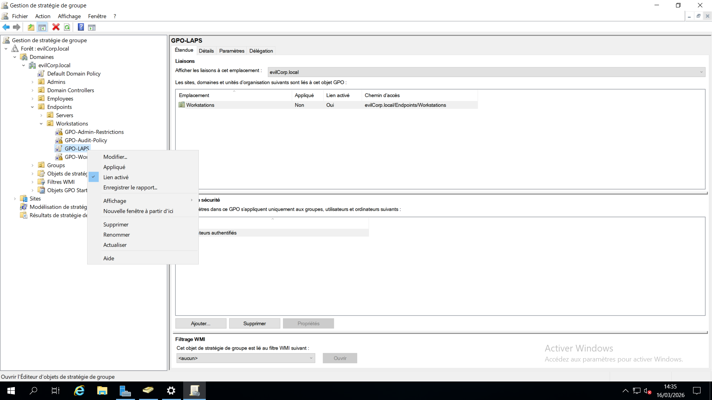
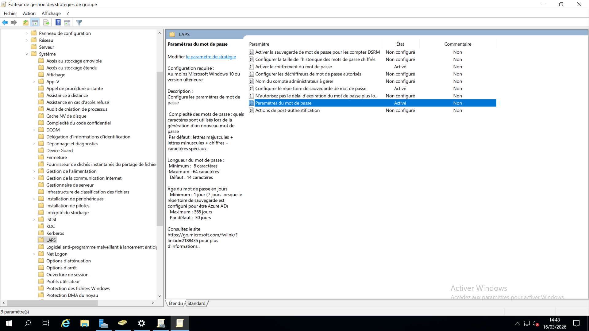

# 11 - Windows LAPS (Local Administrator Password Solution)

## Overview

This step focuses on implementing **Windows LAPS** in the Active Directory environment.

Windows LAPS automatically manages the **local administrator password** for domain-joined machines by generating unique passwords and securely storing them in Active Directory.

This prevents the use of identical local administrator passwords across multiple systems and significantly reduces the risk of **lateral movement attacks** within the domain.

---

# Objective

The objectives of this configuration are:

- Generate a **unique local administrator password** for each workstation
- Store the password securely in **Active Directory**
- Allow authorized administrators to retrieve passwords when necessary
- Reduce the risk of credential reuse and lateral movement

---

# Environment

```
Domain: evilcorp.local
```

Target Organizational Unit:

```
evilcorp.local
└── OU=Endpoints
    └── OU=Workstations
```

All workstations located in this OU will be managed by Windows LAPS.

---

# Step 1 - Verify Windows LAPS Availability

On the Domain Controller, verify that Windows LAPS is available.

Open **PowerShell as Administrator** and run:

```powershell
Get-Command *Laps*
```

Expected output includes commands similar to:

```
Update-LapsADSchema
Set-LapsADComputerSelfPermission
Set-LapsADReadPasswordPermission
Get-LapsADPassword
Invoke-LapsPolicyProcessing
```

This confirms that Windows LAPS is available on the server.

---

# Step 2 - Extend the Active Directory Schema

Windows LAPS requires additional attributes in Active Directory.

Run the following command:

```powershell
Update-LapsADSchema
```

This command extends the Active Directory schema to support LAPS password storage.

---

# Step 3 - Allow Computers to Store Their Passwords

Domain computers must have permission to write their password information into Active Directory.

Run:

```powershell
Set-LapsADComputerSelfPermission -Identity "OU=Workstations,OU=Endpoints,DC=evilcorp,DC=local"
```

This allows computers located in the **Workstations OU** to update their own LAPS password attributes.

---

# Step 4 - Allow IT Support to Read LAPS Passwords

Authorized administrators must be able to retrieve stored passwords.

In this lab environment, the **GG_IT_Support** group is granted permission to read LAPS passwords.

Run:

```powershell
Set-LapsADReadPasswordPermission -Identity "OU=Workstations,OU=Endpoints,DC=evilcorp,DC=local" -AllowedPrincipals "evilcorp\GG_IT_Support"
```

Members of this group can now retrieve local administrator passwords from Active Directory.

---

# Step 5 - Create the LAPS Group Policy

Open **Group Policy Management Console (GPMC)**.

Navigate to:

```
Forest: evilcorp.local
└── Domains
    └── evilcorp.local
        └── OU=Endpoints
            └── OU=Workstations
```

Then:

1. Right-click **Workstations**
2. Select **Create a GPO in this domain, and Link it here**
3. Name the policy:

```
GPO-LAPS
```

---


# Step 6 - Configure LAPS Policy Settings

Edit the newly created GPO.

Navigate to:

```
Computer Configuration
└── Policies
    └── Administrative Templates
        └── LAPS
```

Configure the following settings.

---

## Enable Local Admin Password Management

Set the following policy to:

```
Enabled
```

This activates local administrator password management.

---

## Configure Password Settings

Recommended enterprise configuration:

```
Password Length: 14
Password Complexity: Enabled
Password Age: 30 days
```

This ensures strong password generation and automatic password rotation.

---


# Step 7 - Apply the Policy on a Workstation

On a domain workstation, update Group Policy:

```powershell
gpupdate /force
```

Then force LAPS policy processing:

```powershell
Invoke-LapsPolicyProcessing
```

This triggers the generation and storage of the local administrator password.

---

# Step 8 - Retrieve the LAPS Password

Authorized administrators can retrieve the local administrator password using PowerShell.

Example command:

```powershell
Get-LapsADPassword WORKSTATION-NAME
```


# Result

After implementing Windows LAPS:

- Each workstation has a **unique local administrator password**
- Passwords are **automatically rotated**
- Passwords are **securely stored in Active Directory**
- Authorized administrators can retrieve passwords when required

---

# Security Benefits

Implementing Windows LAPS provides several advantages:

- Prevents password reuse across multiple machines
- Reduces the risk of **lateral movement attacks**
- Centralizes password management
- Improves the overall security posture of the Active Directory environment

---

# Screenshots

Configuration screenshots are stored in the **Images** directory.

include:

**LAPS PowerShell commands**


Group Policy configuration
- Password retrieval from Active Directory

---


