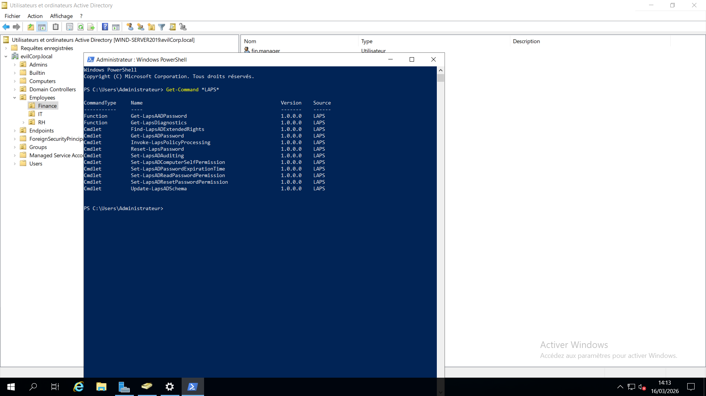
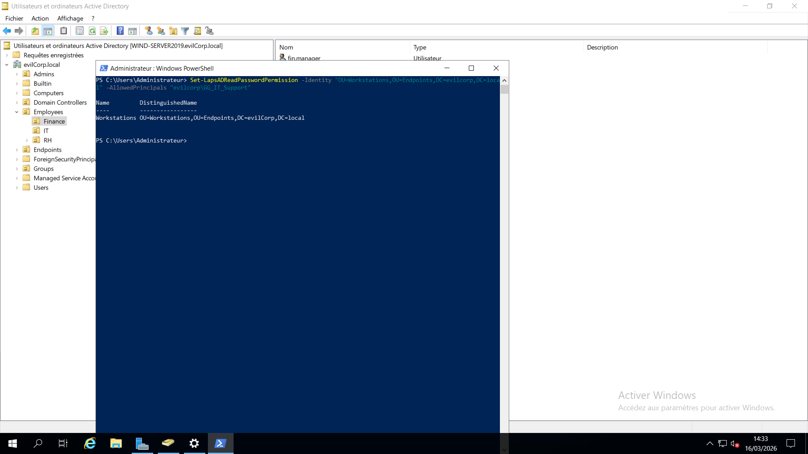
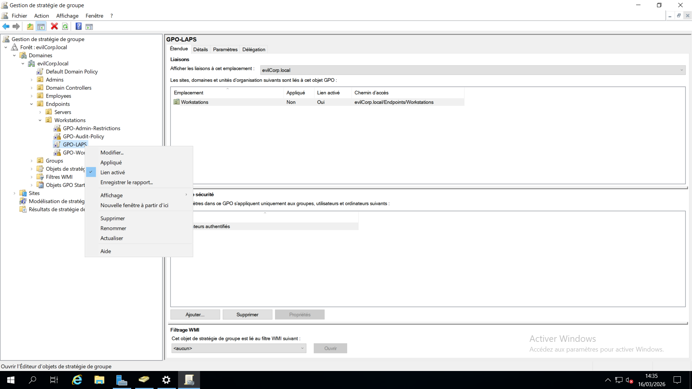
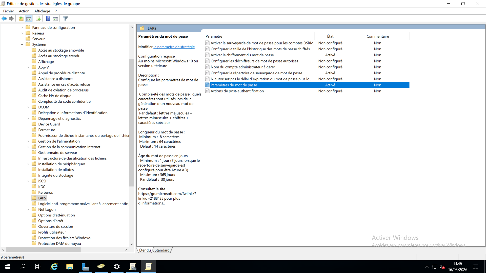

# 11 - Déploiement de Windows LAPS (Local Administrator Password Solution)

## 📌 Vue d’ensemble

Cette étape consiste à mettre en œuvre **Windows LAPS (Local Administrator Password Solution)** dans l’environnement Active Directory.

Windows LAPS permet de gérer automatiquement les mots de passe des comptes administrateurs locaux sur les machines intégrées au domaine en générant des mots de passe uniques et en les stockant de manière sécurisée dans Active Directory.

Cette solution élimine l’utilisation du même mot de passe administrateur local sur plusieurs machines et réduit considérablement les risques de **mouvement latéral (Lateral Movement)** lors d'une compromission.

---

# 🎯 Objectif

Les objectifs de cette configuration sont :

- Générer un mot de passe administrateur local unique pour chaque poste de travail
- Stocker les mots de passe de manière sécurisée dans Active Directory
- Permettre aux administrateurs autorisés de consulter les mots de passe lorsque cela est nécessaire
- Réduire les risques liés à la réutilisation des identifiants
- Limiter les possibilités de déplacement latéral dans le domaine

---

# 🏢 Environnement

```text
Domaine : evilcorp.local
```

OU cible :

```text
evilcorp.local
└── OU=Endpoints
    └── OU=Workstations
```

Tous les postes de travail présents dans cette unité d’organisation seront gérés par Windows LAPS.

---

# 🔍 Étape 1 - Vérification de la disponibilité de Windows LAPS

Sur le contrôleur de domaine, vérifier que les modules Windows LAPS sont disponibles.

Ouvrir **PowerShell en tant qu’administrateur** puis exécuter :

```powershell
Get-Command *Laps*
```

Le résultat attendu doit inclure des commandes similaires à :

```text
Update-LapsADSchema
Set-LapsADComputerSelfPermission
Set-LapsADReadPasswordPermission
Get-LapsADPassword
Invoke-LapsPolicyProcessing
```

La présence de ces commandes confirme que Windows LAPS est installé et disponible sur le serveur.

### 📷 Captures d’écran





---

# 🗄️ Étape 2 - Extension du schéma Active Directory

Windows LAPS nécessite l’ajout d’attributs spécifiques dans le schéma Active Directory.

Exécuter la commande suivante :

```powershell
Update-LapsADSchema
```

Cette commande ajoute les attributs nécessaires au stockage sécurisé des mots de passe LAPS.

---

# 🔐 Étape 3 - Autoriser les ordinateurs à stocker leurs mots de passe

Les ordinateurs du domaine doivent disposer des droits nécessaires pour écrire leurs informations LAPS dans Active Directory.

Exécuter :

```powershell
Set-LapsADComputerSelfPermission -Identity "OU=Workstations,OU=Endpoints,DC=evilcorp,DC=local"
```

Cette commande autorise les ordinateurs situés dans l’OU **Workstations** à mettre à jour leurs propres attributs LAPS.

---

# 👥 Étape 4 - Autoriser le support informatique à consulter les mots de passe

Les administrateurs autorisés doivent pouvoir récupérer les mots de passe stockés dans Active Directory.

Dans ce laboratoire, le groupe :

```text
GG_IT_Support
```

reçoit les autorisations de lecture des mots de passe LAPS.

Commande utilisée :

```powershell
Set-LapsADReadPasswordPermission -Identity "OU=Workstations,OU=Endpoints,DC=evilcorp,DC=local" -AllowedPrincipals "evilcorp\GG_IT_Support"
```

Les membres de ce groupe peuvent désormais consulter les mots de passe administrateur local des postes concernés.

---

# ⚙️ Étape 5 - Création de la stratégie de groupe LAPS

Ouvrir la **Console de gestion des stratégies de groupe (GPMC)**.

Naviguer vers :

```text
Forêt : evilcorp.local
└── Domaines
    └── evilcorp.local
        └── OU=Endpoints
            └── OU=Workstations
```

Puis :

1. Faire un clic droit sur **Workstations**
2. Sélectionner **Créer un objet GPO dans ce domaine et le lier ici**
3. Nommer la stratégie :

```text
GPO-LAPS
```

### 📷 Capture d’écran



---

# 🛠️ Étape 6 - Configuration des paramètres LAPS

Modifier la GPO nouvellement créée.

Chemin de configuration :

```text
Configuration ordinateur
└── Stratégies
    └── Modèles d'administration
        └── LAPS
```

---

## Activation de la gestion des mots de passe administrateur local

Configurer la stratégie suivante :

```text
Enable local admin password management
```

Valeur :

```text
Activé (Enabled)
```

Cette option active la gestion automatique des mots de passe administrateur local.

---

## Configuration de la politique de mot de passe

Configuration recommandée :

```text
Longueur du mot de passe : 14 caractères
Complexité : Activée
Âge maximum du mot de passe : 30 jours
```

Cette configuration garantit :

- Des mots de passe robustes
- Une rotation automatique
- Une meilleure protection contre les attaques basées sur les identifiants

### 📷 Capture d’écran



---

# 🖥️ Étape 7 - Application de la stratégie sur un poste de travail

Sur un poste membre du domaine, appliquer immédiatement la stratégie :

```powershell
gpupdate /force
```

Puis forcer l’exécution de la stratégie LAPS :

```powershell
Invoke-LapsPolicyProcessing
```

Cette commande déclenche :

- La génération d’un nouveau mot de passe
- Son stockage dans Active Directory
- L’application des paramètres configurés

---

# 🔑 Étape 8 - Consultation du mot de passe LAPS

Les administrateurs autorisés peuvent récupérer le mot de passe administrateur local directement depuis Active Directory.

Exemple :

```powershell
Get-LapsADPassword WORKSTATION-NAME
```

Cette commande affiche :

- Le mot de passe actuel
- Sa date d’expiration
- Les informations associées à l’objet ordinateur

---

# ✅ Résultat

Après le déploiement de Windows LAPS :

- Chaque poste possède un mot de passe administrateur local unique
- Les mots de passe sont renouvelés automatiquement
- Les mots de passe sont stockés de manière sécurisée dans Active Directory
- Seuls les groupes autorisés peuvent consulter les mots de passe
- La gestion des accès privilégiés est renforcée

---

# 🔐 Bénéfices de sécurité

La mise en œuvre de Windows LAPS apporte plusieurs avantages :

### Protection contre le mouvement latéral

Un attaquant ne peut plus réutiliser le mot de passe administrateur local d'une machine compromise sur d'autres postes du domaine.

### Réduction de la réutilisation des mots de passe

Chaque poste possède un mot de passe unique.

### Centralisation de la gestion

Les mots de passe sont gérés automatiquement et stockés dans Active Directory.

### Renforcement de la sécurité Active Directory

Les comptes administrateurs locaux deviennent beaucoup plus difficiles à exploiter dans le cadre d'une attaque interne.

### Conformité aux bonnes pratiques Microsoft

Windows LAPS est aujourd'hui considéré comme un composant essentiel du durcissement d'un environnement Active Directory.

---

# 📷 Captures d’écran

## Commandes PowerShell LAPS


---

## Configuration de la GPO LAPS


---

# 🧠 Points clés à retenir

- Chaque poste de travail dispose d’un mot de passe administrateur local unique.
- Les mots de passe sont automatiquement renouvelés selon la politique définie.
- Les mots de passe sont stockés de manière sécurisée dans Active Directory.
- Les accès aux mots de passe sont contrôlés via des groupes de sécurité.
- Windows LAPS réduit fortement les risques de mouvement latéral dans le domaine.
- LAPS constitue une mesure de sécurité essentielle pour tout environnement Active Directory moderne.

---

## 🎯 Conclusion

Le déploiement de **Windows LAPS** dans le domaine **`evilcorp.local`** permet de renforcer considérablement la sécurité des postes de travail en supprimant la problématique des mots de passe administrateur locaux partagés.

Cette solution s'intègre parfaitement à la stratégie de **Privileged Access Management (PAM)** mise en place précédemment et constitue une couche supplémentaire de protection contre les compromissions et les attaques internes.
