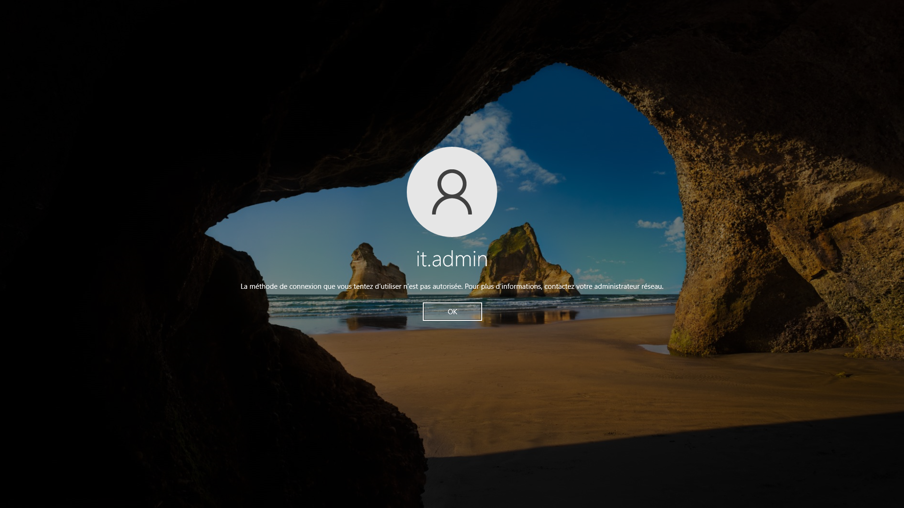
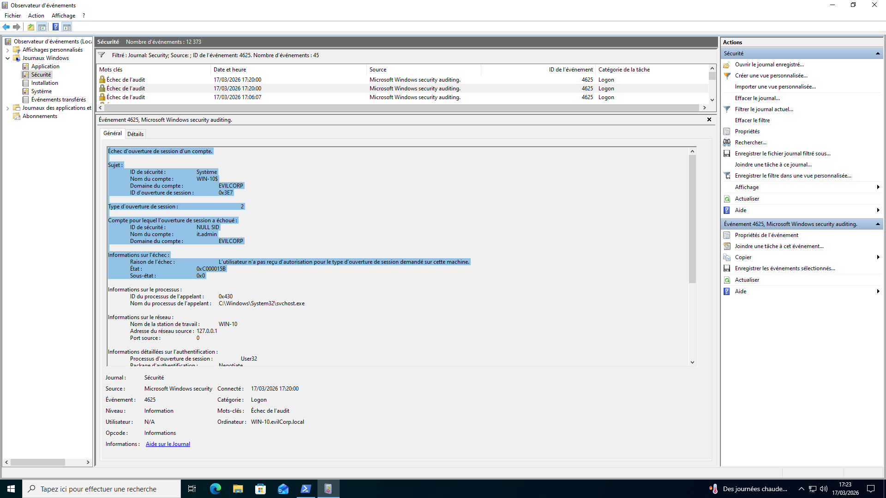
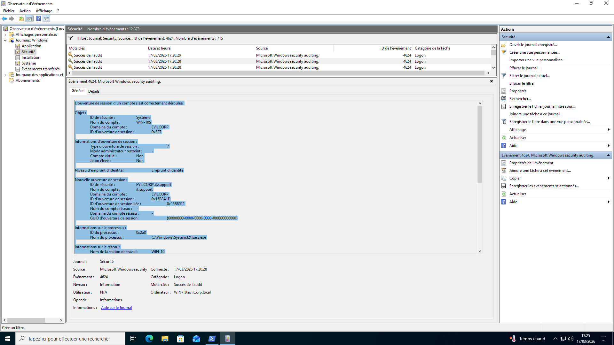
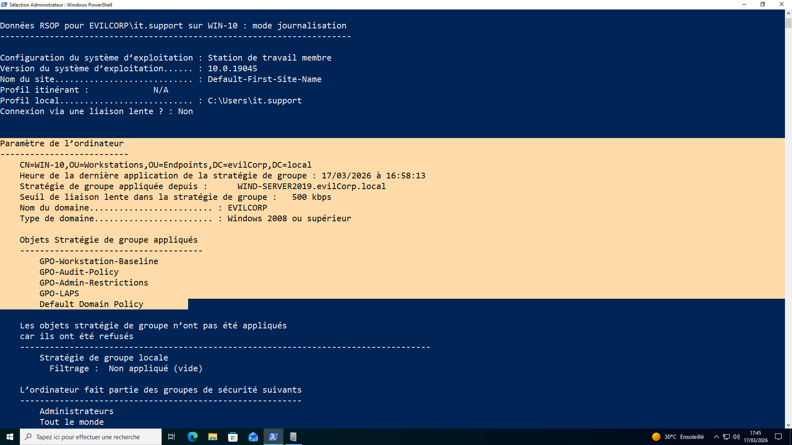
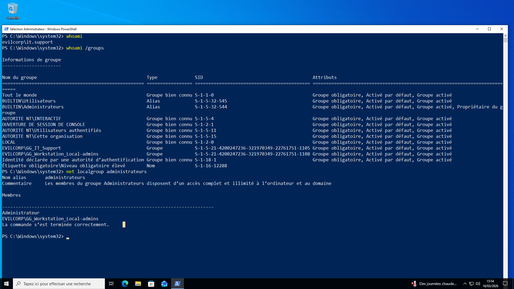
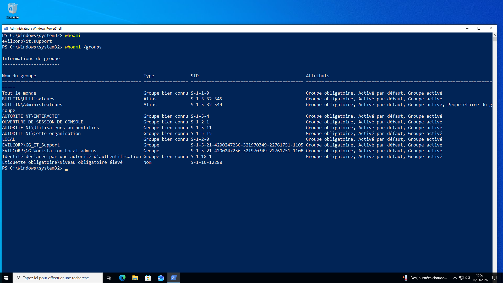
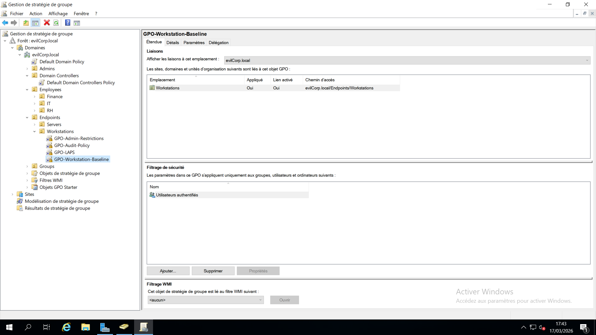

# 12 - Verification & Validation

## Overview

This step verifies that the Active Directory configuration is working as expected.

The goal is to confirm that:

- Group Policies are applied  
- Permissions are correctly configured  
- Security logs are generated  

---

## 1. Privileged Access Verification

### Failed Login (Domain Admin)

A failed login attempt was performed using a domain admin account on a workstation.


### Result

The failed authentication is recorded in the security logs.

### Screenshot



---

### Successful Login (IT Support)

A successful login was performed using the IT support account.

### Result

The login is successful and recorded in the logs.

### Screenshot



---

## 2. GPO Application Verification

To verify that Group Policies are correctly applied:

```powershell
gpresult /r
```

### Result

The workstation receives the following GPOs:

- GPO-Workstation-Baseline  
- GPO-Audit-Policy  
- GPO-Admin-Restrictions  
- GPO-LAPS  
- Default Domain Policy  

### Screenshot






---

## 3. Verification Summary

The following checks confirm that the lab is working correctly:

- Failed login attempts are logged  
- Successful logins are recorded  
- Group Policies are applied to the workstation
- etc...  

---

## Key Takeaway

This step confirms that the Active Directory environment is:

- Functional  
- Properly configured  
- Able to generate security logs  

Verification helps ensure that configurations are correctly applied and working as expected.
