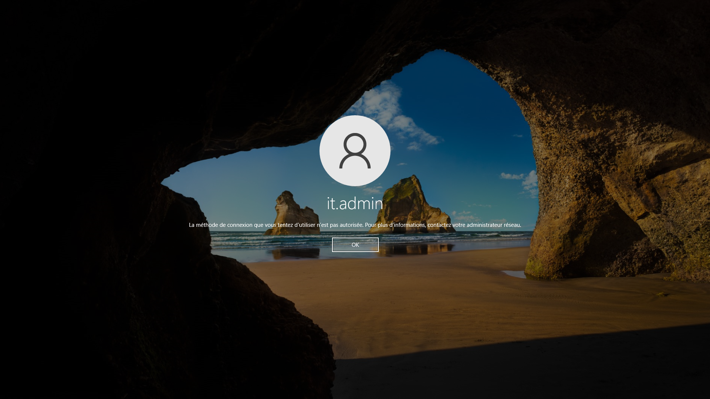
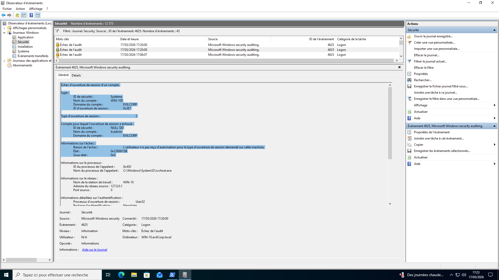
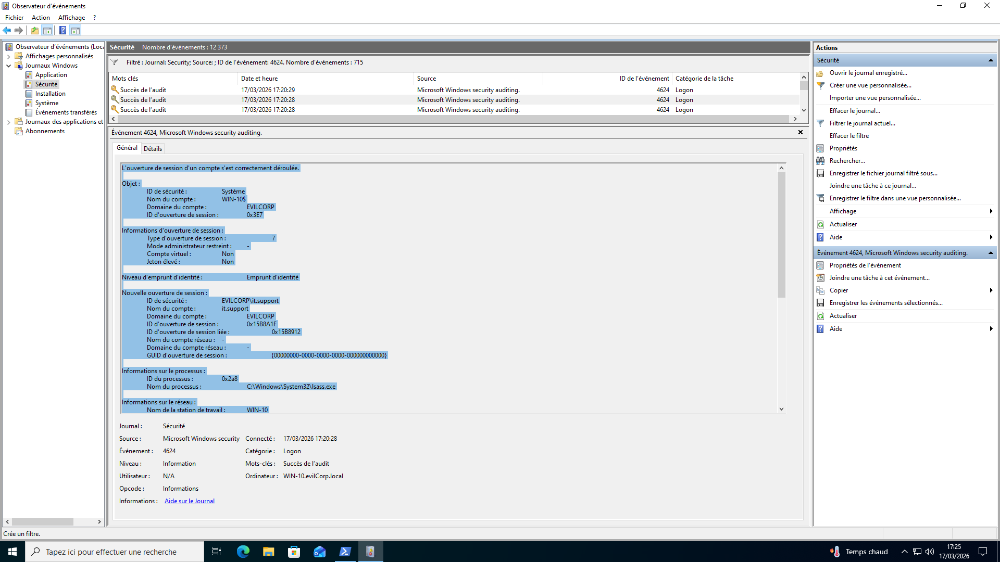
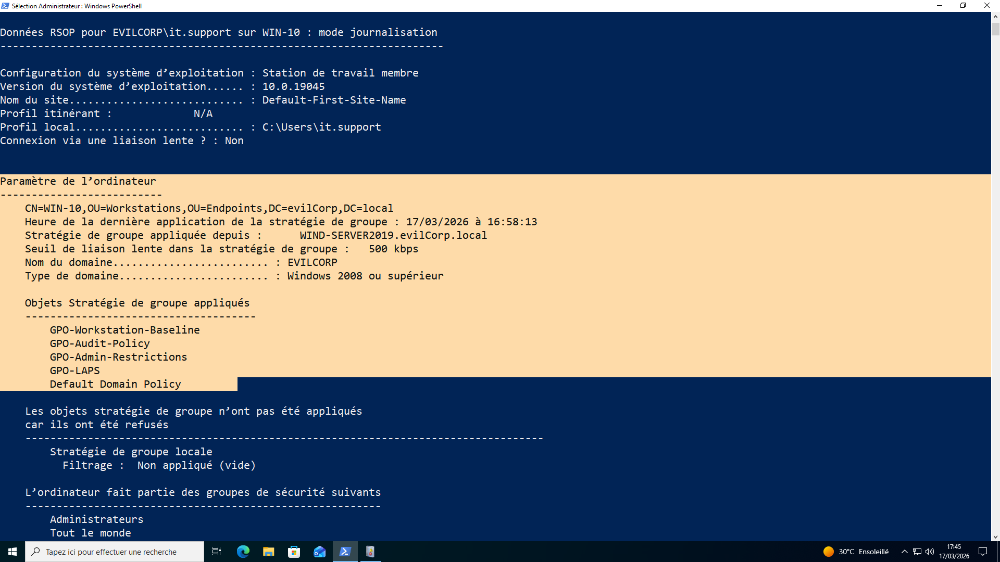
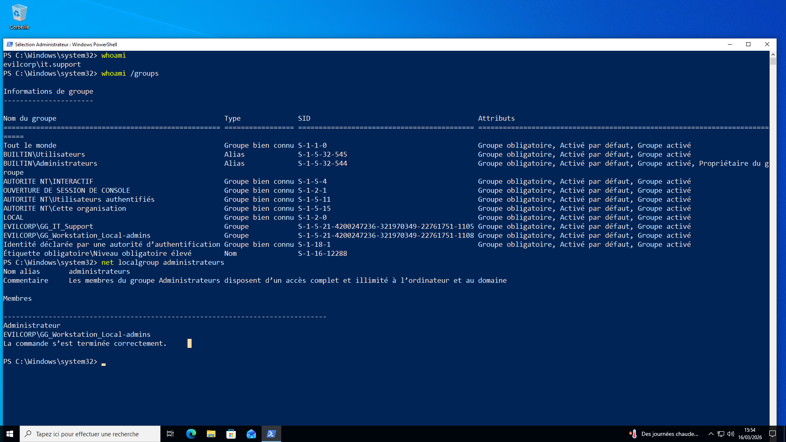
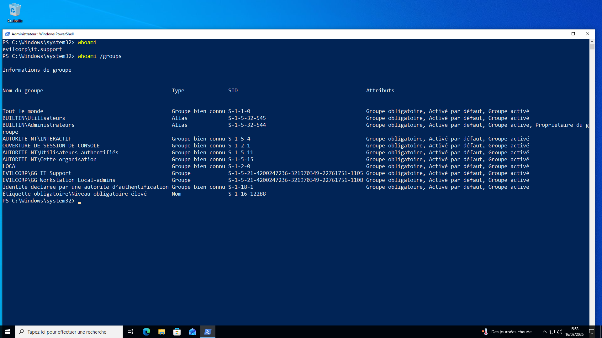
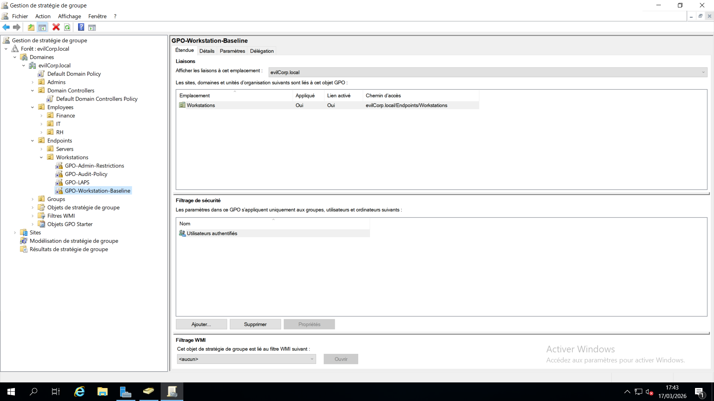

# 12 - Vérification et validation de l’environnement

## 📌 Vue d’ensemble

Cette étape a pour objectif de vérifier que l’environnement Active Directory fonctionne conformément aux attentes et que les différentes configurations mises en place sont correctement appliquées.

Les contrôles réalisés permettent de confirmer que :

- Les stratégies de groupe (GPO) sont correctement appliquées
- Les permissions et privilèges sont correctement configurés
- Les événements de sécurité sont générés et enregistrés
- Les mécanismes d’authentification fonctionnent correctement
- Les contrôles de sécurité déployés sont opérationnels

Cette phase constitue une étape essentielle de validation avant toute utilisation ou évolution de l’infrastructure.

---

# 🔐 1. Vérification des accès privilégiés

## Échec d’authentification (Compte administrateur du domaine)

Un test d’authentification a été effectué à partir d’un poste de travail en utilisant un compte disposant de privilèges d’administration du domaine avec des informations d’identification incorrectes.

### 📷 Capture d’écran



### Résultat

La tentative de connexion échoue comme prévu et l’événement est enregistré dans les journaux de sécurité Windows.

### 📷 Capture d’écran



### Validation

Cette vérification confirme que :

- Les tentatives d’authentification échouées sont correctement journalisées
- La stratégie d’audit est fonctionnelle
- Les événements de sécurité sont enregistrés dans l’Observateur d’événements

---

## Connexion réussie (Compte IT Support)

Une authentification valide a ensuite été réalisée à l’aide du compte :

```text
it.support
```

### Résultat

La connexion est acceptée et l’événement correspondant est enregistré dans les journaux de sécurité.

### 📷 Capture d’écran



### Validation

Cette vérification confirme que :

- Les comptes autorisés peuvent s’authentifier correctement
- Les événements de connexion réussie sont journalisés
- Les stratégies d’audit fonctionnent comme prévu

---

# 📋 2. Vérification de l’application des GPO

Afin de confirmer que les stratégies de groupe sont correctement appliquées sur le poste de travail, la commande suivante a été exécutée :

```powershell
gpresult /r
```

Cette commande permet d'afficher les stratégies utilisateur et ordinateur effectivement appliquées sur le système.

---

## Résultat

Le poste reçoit correctement les stratégies suivantes :

- GPO-Workstation-Baseline
- GPO-Audit-Policy
- GPO-Admin-Restrictions
- GPO-LAPS
- Default Domain Policy

### 📷 Captures d’écran









---

## Validation

Cette vérification confirme que :

- Les GPO sont correctement liées aux unités d’organisation concernées
- Les stratégies sont distribuées par Active Directory
- Les postes de travail appliquent les paramètres de sécurité définis
- Les mécanismes de gestion centralisée fonctionnent correctement

---

# ✅ 3. Résumé des vérifications

Les différents tests réalisés permettent de confirmer le bon fonctionnement du laboratoire Active Directory.

### Contrôles validés

- ✔ Les tentatives de connexion échouées sont enregistrées
- ✔ Les connexions réussies sont journalisées
- ✔ Les stratégies de groupe sont appliquées aux postes clients
- ✔ Les paramètres de sécurité sont distribués via les GPO
- ✔ Les événements d’audit sont générés correctement
- ✔ Les privilèges administratifs sont fonctionnels
- ✔ Les mécanismes de supervision et de journalisation sont opérationnels
- ✔ Les postes de travail communiquent correctement avec le contrôleur de domaine

---

# 📊 Résultat global

L’environnement Active Directory **evilcorp.local** est désormais pleinement opérationnel.

Les composants suivants ont été validés :

| Élément | Statut |
|----------|---------|
| Contrôleur de domaine | ✅ Fonctionnel |
| DNS Active Directory | ✅ Fonctionnel |
| Authentification Kerberos | ✅ Fonctionnelle |
| Stratégies de groupe (GPO) | ✅ Appliquées |
| Audit avancé | ✅ Opérationnel |
| Gestion des privilèges | ✅ Configurée |
| Windows LAPS | ✅ Déployé |
| Journalisation des événements | ✅ Fonctionnelle |

---

# 🧠 Points clés à retenir

- La phase de validation permet de confirmer que les configurations sont correctement appliquées.
- Les journaux d’audit fournissent une visibilité essentielle sur les activités du domaine.
- La commande `gpresult /r` est un outil incontournable pour diagnostiquer l’application des stratégies de groupe.
- Les événements de sécurité démontrent le bon fonctionnement des politiques d’audit avancées.
- La validation régulière des configurations contribue à maintenir un environnement Active Directory fiable et sécurisé.

---

## 🎯 Conclusion

Les tests réalisés démontrent que l’infrastructure **Active Directory `evilcorp.local`** est correctement configurée et opérationnelle.

L’environnement dispose désormais :

- D’une authentification centralisée fonctionnelle
- D’une gestion des privilèges structurée
- D’une stratégie de sécurité appliquée via les GPO
- D’un système d’audit avancé permettant la supervision des événements critiques
- D’un mécanisme sécurisé de gestion des mots de passe locaux grâce à Windows LAPS

Cette phase de vérification confirme que l’ensemble des composants déployés fonctionne conformément aux objectifs définis et constitue une base solide pour les futures évolutions du laboratoire.
