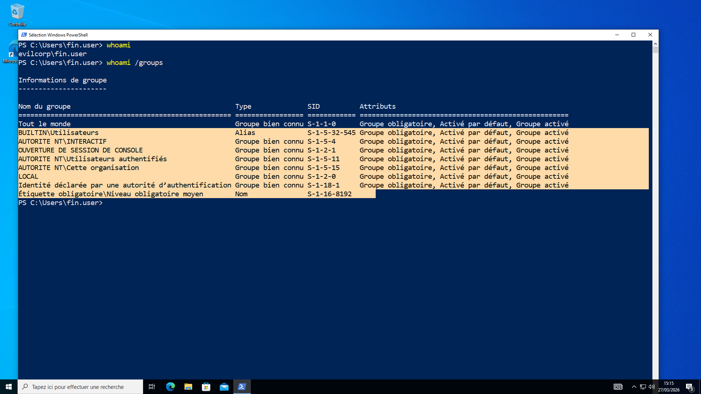
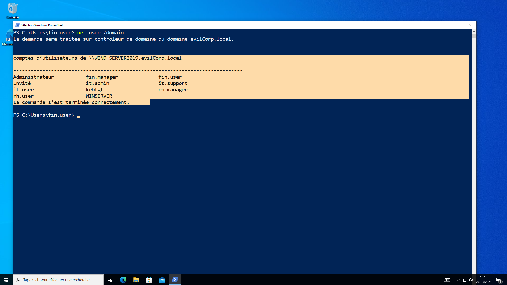
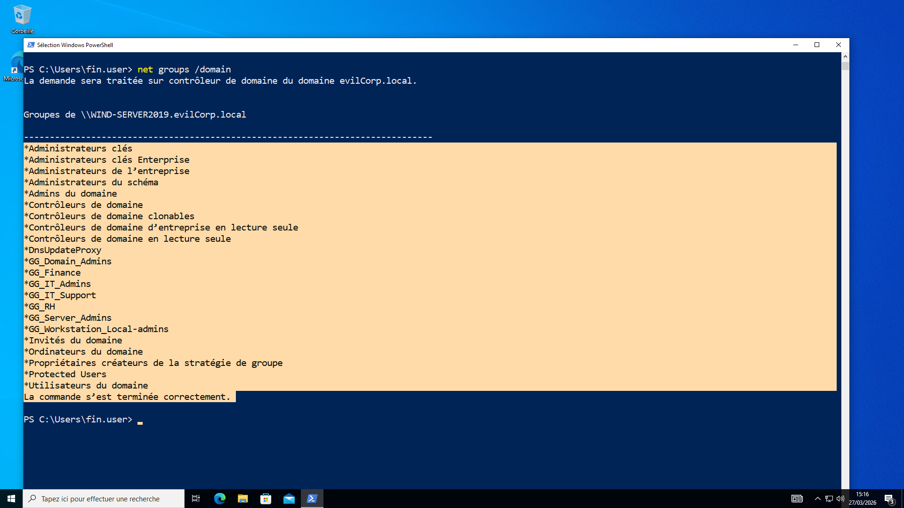
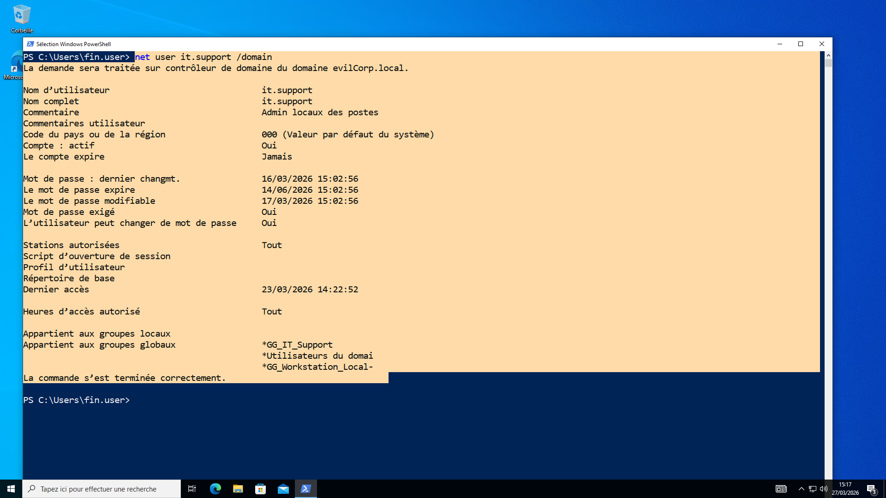

# 01 - Active Directory Enumeration (Initial Access)

## Overview

This step represents the **initial phase of an Active Directory attack**, where a low-privileged user attempts to gather information about the domain.

The objective is to understand what information is accessible **without administrative privileges**, using only native Windows tools.

---

## Scenario

The attack simulation starts from a standard domain user:

```
evilcorp\fin.user
```

This account has no administrative privileges.

---

## Objective

The goal is to:

- Identify domain users  
- Discover security groups  
- Detect privileged accounts  
- Understand the domain structure  

---

## Tools Used

No external tools were used during this phase.

Only native Windows commands were executed:

- Command Prompt (cmd)
- PowerShell

---

## Enumeration Commands

### Identify Current User

```powershell
whoami
```

This confirms the identity of the current user.

---

### List User Groups

```powershell
whoami /groups
```

This command shows the groups the current user belongs to.

---

### List Domain Users

```powershell
net user /domain
```

This command retrieves all user accounts in the domain.

---

### List Domain Groups

```powershell
net group /domain
```

This command lists all security groups in the domain.

---

### Inspect Specific User

```powershell
net user it.support /domain
```

This allows gathering information about a specific account.

---

## Key Findings

From this enumeration phase, the following information was discovered:

- Multiple domain users are visible  
- Security groups are accessible  
- Privileged accounts such as:
  - `it.admin`
  - `it.support`  
  can be identified  

---

## Security Insight

This demonstrates that even a **low-privileged user** can enumerate valuable information within an Active Directory environment.

Such information can be used by an attacker to:

- Identify high-value targets  
- Plan privilege escalation attacks  
- Map the structure of the domain  

---

## Screenshots

Below are the key screenshots captured during this phase:

### User Groups



---

### Domain Users



---

### Domain Groups



---

### User Details (it.support)



---

## Risk

If enumeration is not controlled:

- Attackers gain visibility of the environment  
- Sensitive accounts can be targeted  
- Attack paths can be prepared  

---

## Mitigation

To reduce enumeration risks:

- Apply the **principle of least privilege**  
- Limit unnecessary permissions  
- Monitor enumeration-related activities through logging  

---

## Conclusion

This phase highlights the importance of understanding what information is exposed in an Active Directory environment.

Even without advanced tools, an attacker can gather critical data that may lead to further compromise.
