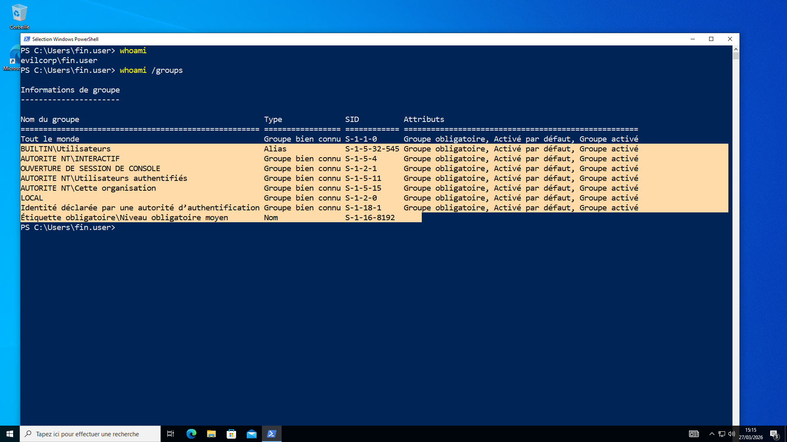
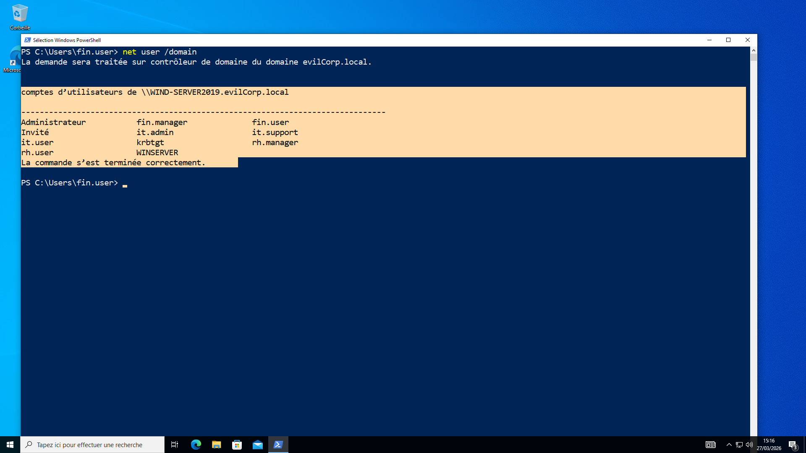
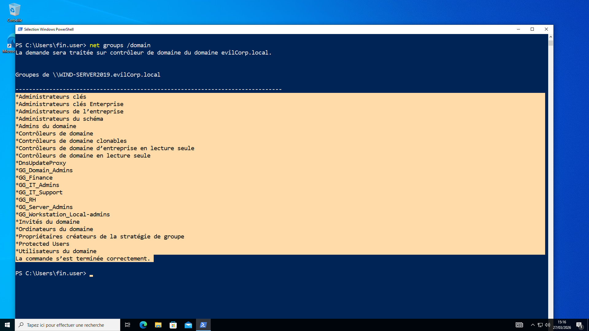
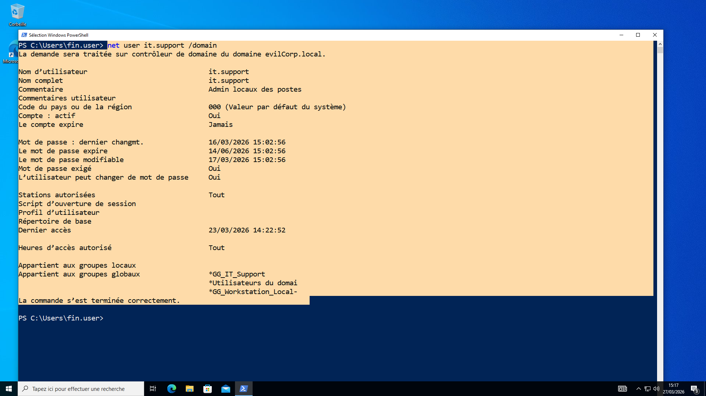

# 01 - Énumération Active Directory (Accès initial)

## 📌 Vue d’ensemble

Cette étape représente la **phase initiale d’une attaque Active Directory**, durant laquelle un utilisateur disposant de privilèges limités tente de collecter des informations sur le domaine.

L’objectif est d’identifier quelles informations sont accessibles **sans privilèges administratifs**, en utilisant uniquement les outils natifs disponibles sous Windows.

Cette phase de reconnaissance constitue souvent la première étape d’une attaque visant à compromettre un environnement Active Directory.

---

## 🎭 Scénario

La simulation débute à partir d’un compte utilisateur standard du domaine :

```text
evilcorp\fin.user
```

Ce compte ne possède aucun privilège administratif.

---

## 🎯 Objectif

L’objectif de cette phase est de :

- Identifier les utilisateurs du domaine
- Découvrir les groupes de sécurité
- Repérer les comptes privilégiés
- Comprendre la structure du domaine

---

## 🛠️ Outils utilisés

Aucun outil tiers n’a été utilisé lors de cette phase.

Seuls les outils natifs de Windows ont été employés :

- Invite de commandes (cmd)
- PowerShell

Cette approche démontre qu’une quantité importante d’informations peut être obtenue sans recourir à des outils offensifs spécialisés.

---

# 🔍 Commandes d’énumération

## Identifier l’utilisateur courant

```powershell
whoami
```

Cette commande permet de confirmer l’identité du compte actuellement connecté.

---

## Lister les groupes de l’utilisateur

```powershell
whoami /groups
```

Cette commande affiche tous les groupes auxquels appartient l’utilisateur.

Elle permet notamment d’identifier :

- Les groupes de sécurité
- Les privilèges associés
- Les rôles attribués au compte

---

## Lister les utilisateurs du domaine

```powershell
net user /domain
```

Cette commande récupère la liste complète des comptes utilisateurs présents dans le domaine.

---

## Lister les groupes du domaine

```powershell
net group /domain
```

Cette commande affiche les groupes de sécurité disponibles dans Active Directory.

Elle permet d’identifier :

- Les groupes administratifs
- Les groupes métiers
- Les groupes potentiellement sensibles

---

## Examiner un utilisateur spécifique

```powershell
net user it.support /domain
```

Cette commande permet d’obtenir des informations détaillées sur un compte particulier.

Les informations récupérées peuvent inclure :

- L’appartenance aux groupes
- Les dates de connexion
- Les informations de compte
- Les propriétés Active Directory exposées

---

# 📋 Résultats de l’énumération

Les informations suivantes ont pu être collectées lors de cette phase :

- Les utilisateurs du domaine sont visibles
- Les groupes de sécurité peuvent être énumérés
- Des comptes à privilèges élevés ont été identifiés

Comptes remarquables découverts :

- `it.admin`
- `it.support`

Ces comptes représentent des cibles potentielles pour un attaquant cherchant à obtenir des privilèges supplémentaires.

---

# 🔐 Analyse de sécurité

Cette phase démontre qu’un utilisateur disposant de privilèges très limités peut néanmoins obtenir de nombreuses informations sur l’environnement Active Directory.

Ces informations peuvent être utilisées pour :

- Identifier des cibles à forte valeur
- Préparer une attaque d’escalade de privilèges
- Cartographier la structure du domaine
- Rechercher des erreurs de configuration
- Développer des scénarios d’attaque plus avancés

Cette étape est généralement appelée :

```text
Active Directory Enumeration
```

ou

```text
Domain Reconnaissance
```

---

# 📷 Captures d’écran

Les captures suivantes illustrent les principales phases de l’énumération.

## Groupes de l’utilisateur



---

## Utilisateurs du domaine



---

## Groupes du domaine



---

## Détails du compte it.support



---

# ⚠️ Risques identifiés

Lorsque l’énumération n’est pas surveillée ou limitée, un attaquant peut :

- Obtenir une visibilité importante sur l’environnement
- Identifier les comptes sensibles
- Préparer des chemins d’attaque
- Cartographier les ressources du domaine
- Sélectionner des cibles privilégiées

Même sans vulnérabilité technique, l’exposition d’informations facilite considérablement les phases suivantes d’une attaque.

---

# 🛡️ Mesures de réduction du risque

Afin de limiter les risques liés à l’énumération Active Directory, plusieurs bonnes pratiques peuvent être mises en œuvre :

- Appliquer le principe du moindre privilège (*Least Privilege*)
- Limiter les permissions inutiles accordées aux utilisateurs
- Surveiller les activités d’énumération via les journaux d’audit
- Mettre en place des alertes sur les comportements suspects
- Segmenter correctement les privilèges administratifs
- Réaliser régulièrement des revues de permissions

Il est également recommandé d’utiliser les stratégies d’audit avancées afin de détecter les activités de reconnaissance anormales.

---

# 🧠 Points clés à retenir

- Un utilisateur standard peut obtenir de nombreuses informations sur Active Directory.
- Les outils natifs Windows suffisent souvent pour réaliser une reconnaissance efficace.
- Les comptes privilégiés peuvent être identifiés sans accès administrateur.
- La phase d’énumération constitue généralement la première étape d’une attaque Active Directory.
- Une surveillance adéquate permet d’améliorer la détection des activités suspectes.

---

## 🎯 Conclusion

Cette phase met en évidence l’importance de comprendre quelles informations sont exposées au sein d’un environnement Active Directory.

Même sans privilèges élevés et sans utiliser d’outils spécialisés, un attaquant peut collecter des données critiques sur les utilisateurs, les groupes et l’organisation du domaine.

Cette reconnaissance constitue souvent la base des attaques ultérieures et souligne l’importance d’une stratégie de surveillance, d’audit et de gestion des privilèges adaptée aux environnements Active Directory modernes.
