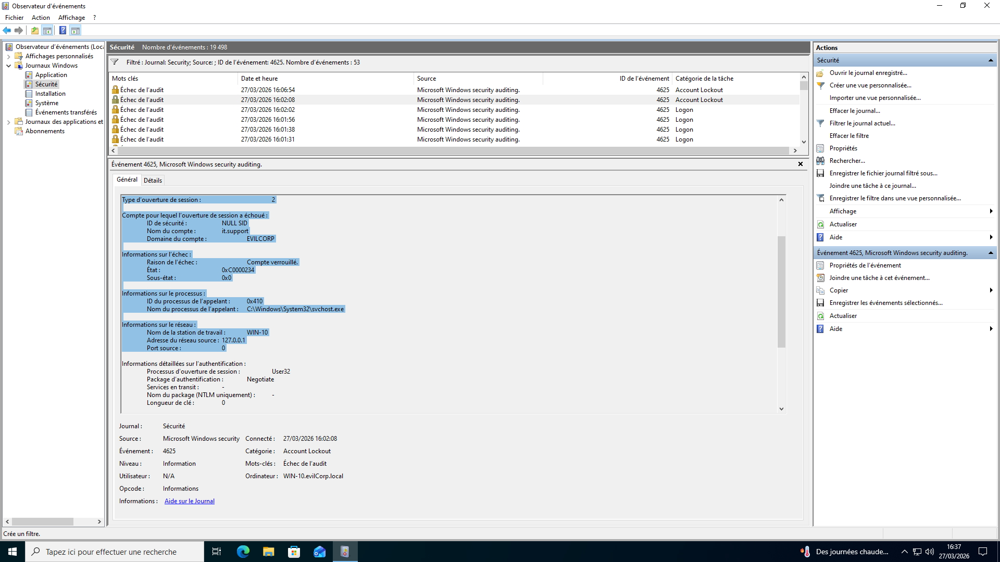
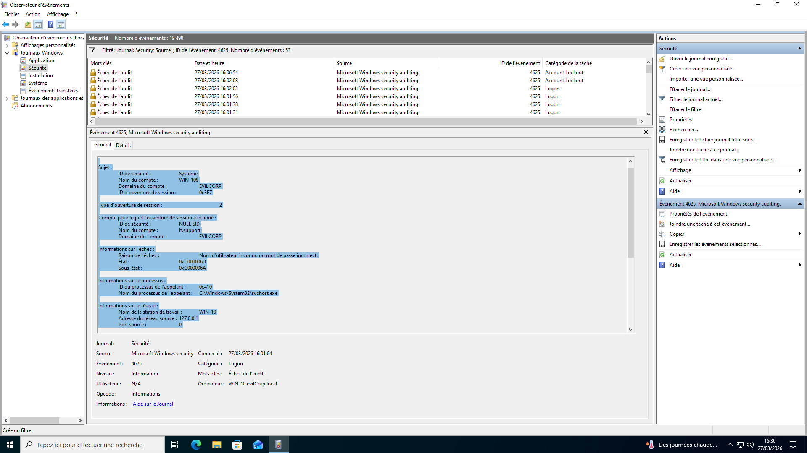

# 02 - Attaques par mot de passe (Tests d’authentification)

## 📌 Vue d’ensemble

Cette étape consiste à simuler des attaques basiques par mot de passe contre des comptes Active Directory.

L’objectif est d’évaluer l’efficacité des mécanismes de sécurité mis en place, notamment :

- Les politiques de mots de passe
- Les mécanismes de verrouillage de compte
- La journalisation des événements de sécurité
- La détection des tentatives d’authentification suspectes

Cette phase permet de vérifier que l’environnement est capable de détecter et de réagir aux tentatives d’accès non autorisées.

---

## 🎭 Scénario

L’attaque a été réalisée depuis un poste de travail intégré au domaine à l’aide du compte suivant :

```text
evilcorp\it.support
```

Ce compte dispose uniquement des privilèges nécessaires à l’administration des postes de travail.

---

## 🎯 Objectif

L’objectif de cette phase est de :

- Simuler des attaques par devinette de mot de passe (*Password Guessing*)
- Générer des échecs d’authentification
- Vérifier la génération des journaux d’audit
- Déclencher les mécanismes de verrouillage de compte
- Valider le bon fonctionnement des contrôles de sécurité du domaine

---

# 🔐 Méthode d’attaque

Une attaque simple par devinette de mot de passe a été simulée à l’aide de mots de passe couramment utilisés.

Ce type d’attaque représente un scénario fréquent dans lequel un attaquant tente d’accéder à un compte en utilisant des identifiants faibles ou largement répandus.

---

## Mots de passe testés

Les mots de passe suivants ont été volontairement utilisés :

```text
Password123
Welcome123
Test123
```

Plusieurs tentatives de connexion ont été effectuées sur un compte du domaine avec des mots de passe incorrects.

---

# ⚙️ Exécution de l’attaque

La simulation a été réalisée à l’aide de l’interface de connexion Windows.

## Méthode — Écran de connexion Windows

Les étapes suivantes ont été réalisées :

- Verrouillage du poste avec la combinaison :

```text
Win + L
```

- Saisie répétée de mots de passe incorrects
- Génération de plusieurs échecs d’authentification consécutifs

L’objectif était de provoquer suffisamment d’échecs pour déclencher la stratégie de verrouillage de compte configurée dans la politique du domaine.

---

# 📋 Vérification des journaux

Les événements de sécurité ont ensuite été analysés sur le contrôleur de domaine à l’aide de :

```text
Observateur d’événements
└── Journaux Windows
    └── Sécurité
```

Cette vérification permet de confirmer que les événements générés lors de l’attaque sont correctement enregistrés.

---

# 📑 Identifiants d’événements surveillés

| Event ID | Description |
|-----------|-------------|
| 4625 | Échec d’ouverture de session |
| 4624 | Ouverture de session réussie |
| 4740 | Verrouillage d’un compte utilisateur |

> **Remarque :** L’événement associé au verrouillage d’un compte Active Directory est généralement l’**Event ID 4740**.

---

# 🔍 Résultats observés

Les observations suivantes ont été réalisées :

- Chaque tentative de connexion échouée a généré un **Event ID 4625**
- Le compte ciblé est clairement identifiable dans les journaux
- Les multiples échecs d’authentification ont déclenché la stratégie de verrouillage configurée
- Le verrouillage du compte a été enregistré dans les journaux de sécurité

Ces résultats confirment que les mécanismes de détection et de protection fonctionnent correctement.

---

# 🔐 Analyse de sécurité

Ce test démontre que :

- Les tentatives d’authentification sont correctement surveillées
- Les stratégies d’audit sont opérationnelles
- Les mécanismes de verrouillage protègent efficacement contre les attaques par force brute
- Les événements de sécurité fournissent une visibilité suffisante pour les investigations

Ces contrôles constituent une couche de défense essentielle contre les attaques visant les identifiants utilisateurs.

---

# 📷 Captures d’écran

Les captures suivantes illustrent les différentes étapes du test.

## Tentatives de connexion échouées (Event ID 4625)


---

## Verrouillage du compte


---

## Détails des événements





---

# ⚠️ Risques identifiés

Sans ces mécanismes de sécurité :

- Les attaques par force brute pourraient aboutir
- Les mots de passe faibles seraient plus facilement compromis
- Les tentatives d’accès non autorisées pourraient passer inaperçues
- Les attaquants disposeraient de davantage de temps pour compromettre des comptes du domaine

---

# 🛡️ Mesures de protection recommandées

Pour renforcer davantage la sécurité :

- Imposer des politiques de mots de passe robustes
- Configurer des seuils de verrouillage adaptés
- Surveiller régulièrement les journaux d’authentification
- Mettre en place des alertes de sécurité automatisées
- Déployer l’authentification multifacteur (MFA) dans les environnements de production
- Sensibiliser les utilisateurs aux bonnes pratiques de gestion des mots de passe

---

# 🧠 Points clés à retenir

- Les échecs d’authentification doivent être systématiquement journalisés.
- Les stratégies de verrouillage constituent une protection efficace contre les attaques par force brute.
- Les journaux de sécurité permettent de détecter rapidement les activités suspectes.
- Une politique de mot de passe robuste reste l’un des piliers de la sécurité Active Directory.
- La surveillance régulière des événements d’authentification améliore considérablement les capacités de détection.

---

## 🎯 Conclusion

Cette phase valide le bon fonctionnement des mécanismes de sécurité liés à l’authentification au sein de l’environnement Active Directory.

Les tentatives de connexion échouées ont été correctement enregistrées, les événements de sécurité ont été générés comme attendu et la politique de verrouillage des comptes a efficacement limité les tentatives répétées d’authentification.

Ces contrôles jouent un rôle essentiel dans la protection du domaine contre les attaques par force brute et les tentatives d’accès non autorisées.
