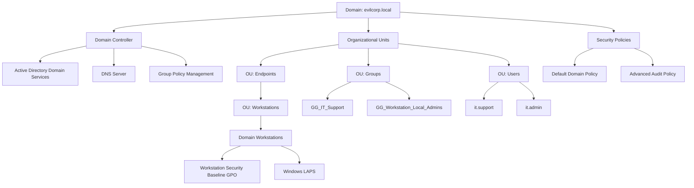

# Active Directory Security Lab


A hands-on lab project demonstrating the deployment and hardening of a **secure Active Directory infrastructure** using enterprise security practices.

This repository documents the complete setup of a **Windows Active Directory environment**, including security hardening, access management, and auditing.

The goal of this project is to simulate a **realistic enterprise Active Directory environment** while applying security best practices used by system administrators and cybersecurity professionals.

---

# Project Objectives

This lab was created to practice and demonstrate skills in:

- Active Directory infrastructure deployment
- Organizational Unit design
- Group Policy security hardening
- Privileged access management
- Windows LAPS implementation
- Security auditing and monitoring

This project serves as a **portfolio demonstration for system administration and cybersecurity roles**.

---

# Lab Environment

Domain Name:

```
evilcorp.local
```

Infrastructure components include:

- Domain Controller
- Active Directory Domain Services
- DNS Server
- Domain-joined workstations
- Group Policy security configuration

---

# Architecture Diagram



---

# Project Structure

The repository is organized into multiple configuration stages.

```
active-directory-security-lab
│
├── 01-Network-Configuration
├── 02-Domain-Controller-Setup
├── 03-OU-Structure-Design
├── 04-Group-Management
├── 05-User-Account-Management
├── 06-Domain-Join-Configuration
├── 07-Default-Domain-Policy
├── 08-GPO-Workstations-Baseline
├── 09-GPO-Audit-Policy
├── 10-Privileged-Access-Management
├── 11-Windows-LAPS
```

Each directory contains documentation, configuration procedures, and screenshots.

---

# Security Controls Implemented

## Password Policy

Configured through the **Default Domain Policy**.

Security settings include:

- Password complexity enforcement
- Minimum password length
- Password history configuration
- Maximum password age

---

## Account Lockout Protection

To protect against brute-force attacks, account lockout policies were implemented.

Configuration includes:

- Lockout threshold
- Lockout duration
- Reset counter configuration

---

## Workstation Security Baseline

A dedicated Group Policy Object was created to enforce security settings on domain workstations.

Security measures include:

- Guest account disabled
- Secure logon configuration
- Restricted Groups configuration

Administrative access is controlled through Active Directory security groups.

---

## Privileged Access Management

Administrative privileges are managed using dedicated security groups instead of individual user accounts.

Examples:

```
GG_IT_Support
GG_Workstation_Local_Admins
```

This approach improves security by ensuring:

- Centralized privilege management
- Reduced administrative risk
- Controlled privilege escalation

---

## Windows LAPS

Local administrator passwords are managed using **Windows LAPS**.

Benefits include:

- Unique local administrator password per machine
- Automatic password rotation
- Secure storage in Active Directory

This prevents **lateral movement attacks using shared local administrator credentials**.

---

## Advanced Security Auditing

Advanced Audit Policies are enabled to monitor important security events.

Audited activities include:

- Authentication events
- Account management changes
- Privilege usage
- Active Directory object modifications

---

# Important Security Event IDs

| Event ID | Description |
|--------|-------------|
| 4624 | Successful logon |
| 4625 | Failed logon |
| 4672 | Special privileges assigned |
| 4720 | User account created |
| 4726 | User account deleted |
| 4732 | User added to security group |
| 4768 | Kerberos authentication ticket |
| 4769 | Kerberos service ticket |
| 5136 | Active Directory object modified |

---

# Technologies Used

- Windows Server 2019
- Active Directory Domain Services
- DNS Server
- Group Policy Management
- Windows LAPS
- Windows Event Logging

---

# Learning Outcomes

This project demonstrates practical knowledge of:

- Active Directory infrastructure design
- Enterprise security configuration
- Privileged access management
- Security monitoring and auditing

---

# Author

This project was created as part of a **hands-on Active Directory security lab** to develop real-world system administration and cybersecurity skills.
