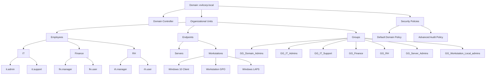

# Active Directory Security Lab


A hands-on lab project demonstrating the deployment and basic hardening of a **Windows Active Directory environment**.

This project documents the setup of a domain, user and group management, and the implementation of common security configurations using Group Policy.

The goal is to build a **realistic lab environment** and practice core system administration and security concepts.

---

# Project Objectives

This lab was created to practice:

- Active Directory deployment
- Organizational Unit (OU) design
- User and group management
- Group Policy configuration
- Privileged access management
- Windows LAPS implementation
- Security auditing basics

---

# Lab Environment

Domain Name:

```
evilcorp.local
```

Main components:

- Windows Server 2019 Domain Controller
- Active Directory Domain Services
- DNS Server
- Domain-joined Windows 10 workstation
- Group Policy Management

---

# Architecture Overview



---

# Active Directory Structure

The domain is organized using a structured OU model.

```
evilcorp.local
│
├── OU=Employees
│     ├── OU=IT
│     │     ├── it.admin
│     │     └── it.support
│     │
│     ├── OU=Finance
│     │     ├── fin.manager
│     │     └── fin.user
│     │
│     └── OU=RH
│           ├── rh.manager
│           └── rh.user
│
├── OU=Endpoints
│     ├── OU=Servers
│     └── OU=Workstations
│           └── Windows 10 client
│
└── OU=Groups
      ├── GG_Domain_Admins
      ├── GG_Finance
      ├── GG_IT_Admins
      ├── GG_IT_Support
      ├── GG_RH
      ├── GG_Server_Admins
      └── GG_Workstation_Local_admins
```

---

# Privileged Access Model

Administrative privileges are assigned using security groups.

- **it.admin**
  - Member of **GG_Domain_Admins**
  - Used for domain administration

- **it.support**
  - Member of **GG_Workstation_Local_admins**
  - Used for local administration on workstations

This approach allows:

- Centralized permission management  
- Easier administration  
- Reduced risk of misconfiguration  

---

# Project Structure

The repository is organized into multiple steps:

```
active-directory-security-lab
│
├── 01-Network-Configuration
├── 02-Domain-Controller-Setup
├── 03-OU-Structure-Design
├── 04-Group-Management
├── 05-User-Account-Management
├── 06-Domain-Join-Configuration
├── 07-Default-Domain-Policy
├── 08-GPO-Workstations-Baseline
├── 09-GPO-Audit-Policy
├── 10-Privileged-Access-Management
├── 11-Windows-LAPS
```

Each directory contains documentation and screenshots of the configuration process.

---

# Security Controls Implemented

## Password Policy

Configured through the Default Domain Policy:

- Password complexity enabled
- Minimum password length
- Password history
- Maximum password age

---

## Account Lockout Policy

To reduce brute-force risks:

- Account lockout threshold
- Lockout duration
- Reset counter

---

## Workstation Security Baseline

A GPO is applied to workstations to enforce:

- Guest account disabled
- Restricted Groups configuration
- Controlled local administrator access

---

## Windows LAPS

Used to manage local administrator passwords:

- Unique password per machine
- Automatic rotation
- Stored in Active Directory

---

## Security Auditing

Advanced audit policies are configured to monitor:

- Logon events
- Account management
- Privilege usage
- Directory changes

---

# Important Event IDs

| Event ID | Description |
|--------|-------------|
| 4624 | Successful logon |
| 4625 | Failed logon |
| 4672 | Special privileges assigned |
| 4720 | User account created |
| 4726 | User account deleted |
| 4732 | User added to group |
| 4768 | Kerberos ticket request |
| 4769 | Kerberos service ticket |
| 5136 | Directory object modified |

---

# Technologies Used

- Windows Server 2019
- Active Directory Domain Services
- DNS Server
- Group Policy Management
- Windows LAPS

---

# Learning Outcomes

This lab helped me practice:

- Active Directory administration
- OU and group design
- Group Policy configuration
- Basic security hardening
- Privileged access management
- Security auditing

---

# Author

Personal lab created to practice **Active Directory administration and security fundamentals**.
