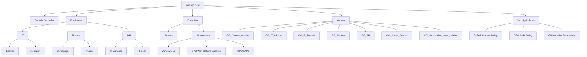

# Active Directory Security Lab

This project is a **hands-on Active Directory lab** built to practice system administration and basic security concepts.

It shows how to deploy a domain, organize users and computers, and apply security settings using Group Policy.

---

# Project Objectives

This lab was created to practice:

- Active Directory deployment
- OU (Organizational Unit) structure
- User and group management
- Group Policy configuration
- Privileged access management
- Windows LAPS
- Basic security auditing

---

# Lab Environment

Domain:

```
evilcorp.local
```

Main components:

- Windows Server 2019 (Domain Controller)
- Active Directory Domain Services
- DNS Server
- Windows 10 workstation (joined to domain)

---

# Architecture Overview



---

# Active Directory Structure

```
evilcorp.local
│
├── OU=Employees
│     ├── OU=IT
│     │     ├── it.admin
│     │     └── it.support
│     │
│     ├── OU=Finance
│     │     ├── fin.manager
│     │     └── fin.user
│     │
│     └── OU=RH
│           ├── rh.manager
│           └── rh.user
│
├── OU=Endpoints
│     ├── OU=Servers
│     └── OU=Workstations
│           └── Windows 10
│
└── OU=Groups
      ├── GG_Domain_Admins
      ├── GG_Finance
      ├── GG_IT_Admins
      ├── GG_IT_Support
      ├── GG_RH
      ├── GG_Server_Admins
      └── GG_Workstation_Local_admins
```

---

# GPO Configuration

Several Group Policy Objects were created to manage security and configuration.

```
Default Domain Policy
GPO-Workstations-Baseline
GPO-Audit-Policy
GPO-Admins-Restrictions
GPO-LAPS
```

### Description

- **Default Domain Policy**
  - Password policy and basic security settings

- **GPO-Workstations-Baseline**
  - Basic security configuration for workstations
  - Disable guest account
  - Manage local administrators
  - etc.

- **GPO-Audit-Policy**
  - Enable audit logs (logon, account changes, etc.)

- **GPO-Admins-Restrictions**
  - Restrict administrative privileges

- **GPO-LAPS**
  - Manage local administrator passwords

---

# Privileged Access

- **it.admin**
  - Domain administrator (via `GG_Domain_Admins`)

- **it.support**
  - Local administrator on workstations (via `GG_Workstation_Local_admins`)

Permissions are assigned through groups instead of directly to users.

---

# Security Features

This lab includes basic security configurations:

- Password policy
- Account lockout
- Workstation security baseline
- LAPS (local admin password management)
- Audit logging
- etc.

---

# Important Event IDs

| Event ID | Description |
|--------|-------------|
| 4624 | Successful logon |
| 4625 | Failed logon |
| 4720 | User created |
| 4726 | User deleted |
| 4732 | User added to group |
etc.

---

# Technologies Used

- Windows Server 2019
- Active Directory
- DNS
- Group Policy
- Windows LAPS

---

# Learning Outcomes

This lab helped me understand:

- How Active Directory works
- How to organize users and computers
- How to use Group Policy
- Basic security configuration

---

# Author

Personal lab built to practice **Active Directory administration and security basics**.
